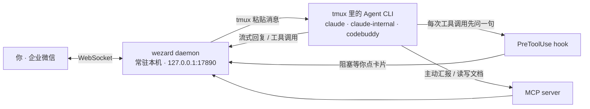
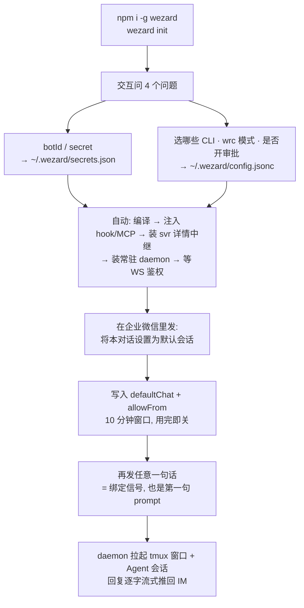
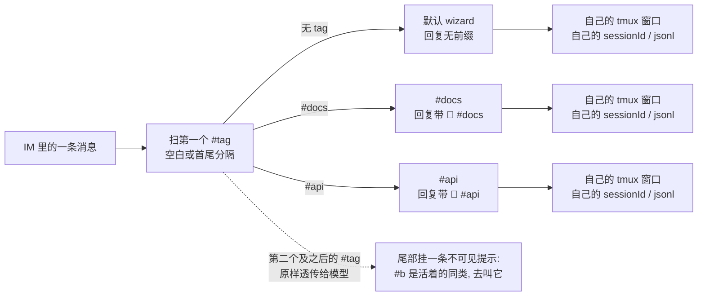
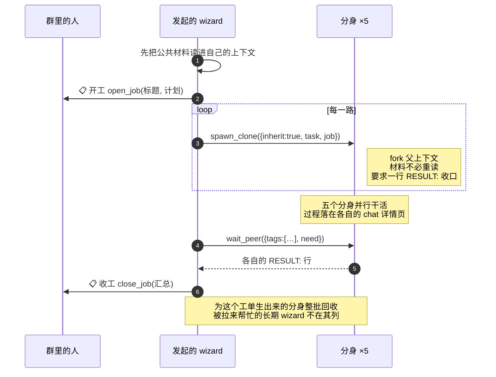

<div align="center">


<h1>wezard</h1>

<p><b>把 AI 编程 Agent 装进企业微信。</b><br/>在地铁上、被窝里、开会摸鱼时，照样能跟你电脑上的 Agent 干活。</p>

<p>
  <a href="https://www.npmjs.com/package/wezard"></a>
  <a href="https://www.npmjs.com/package/wezard"></a>
  <a href="https://github.com/guxi11/wezard/stargazers"></a>
  <a href="LICENSE"></a>
  
  
</p>

</div>


三个进程，一条 WebSocket。daemon 常驻在你的电脑上，是唯一和企业微信说话的那个；hook 与 MCP 都只是它的本地 HTTP 客户端：



| 功能 | 说明 |
| --- | --- |
| 🛎 **远程审批** | Agent 要跑 `Bash` / `Edit`？审批卡片直推 IM，点 `✅` 放行一次、`⏱` 开一段自动放行窗口、`✅总是` 写回规则、`❌` 拒绝。危险操作（`rm` / 强推 / `DROP` / 敏感路径）只给 `❌` 与 `✅ 确认执行`，逐次单独确认。 |
| 📋 **计划审批** | Agent 在 plan mode 结束（`ExitPlanMode`）时，把计划摘要 + 审批卡推到 IM：点 ✅同意 退出 plan mode 开始执行，或 ✏️继续改 留在 plan mode 继续完善。`AskUserQuestion` 多选题也镜像为投票卡。 |
| 🪞 **会话镜像** | 你电脑上跑的 Agent 流式打字、tool_use、思考过程，实时同步到企业微信；IM 里发消息原样落进 CLI 输入框。 |
| 🖼 **图片直贴** | 企业微信发图，自动走 macOS 剪贴板 + tmux 粘贴，Agent 当贴图处理（不走 Read，不耗 token）。 |
| 🔍 **细节页** | 工具调用 / 审批请求都生成本地 HTML 详情页，IM 里点链接看完整 input / result / git diff。 |
| 📡 **MCP 主动推送** | Agent 通过 `wecom__send_markdown` / `wecom__send_card` / `wecom__ask_user` 主动汇报或问询。 |
| 📄 **文档读写** | Agent 通过 `wecom_doc_list_tools` / `wecom_doc_call` 直接调企业微信智能机器人的 doc / smartsheet / smartpage MCP，新建在线文档、写 Markdown、读链接、操作智能表格——全程在内网，不需要 corp access_token。 |
| 🗂 **多会话发现/切换** | Agent 通过 `list_claude_sessions` / `switch_claude_session` / `new_claude_session` 列出本机 tmux 内所有在跑的会话（带摘要 + 稳定动物 emoji 标签）、切换 IM 镜像、或在指定路径新开会话。审批卡标题也带同一枚 emoji，多会话兜底到同一 IM 时一眼区分。 |
| 🧙 **多 wizard 协同** | 一个聊天里住着多个有名字、有职责、有记忆的 wizard（`#tag` 寻址）。`spawn_clone` fork 上下文出分身，`open_job` / `wait_peer({tags})` / `close_job` 把一次 fan-out 收成群里两条气泡，干完整批回收。 |
| 🔄 **重启即续** | 电脑重启 / tmux 全没了 / daemon 崩了都不掉档：IM ↔ 会话绑定持久化在 `~/.wezard/mirror-attachments.json`，下一条 IM 消息自动 `claude --resume` 拉起新 tmux pane，历史完整继承；`tmux attach -t wezard` 接管即可。 |

<details>
<summary><b>目录</b></summary>

- [快速开始](#快速开始)
- [镜像模式](#镜像模式)
- [体验是什么样](#体验是什么样)
- [文档 / 智能表格 / 智能文档](#文档--智能表格--智能文档)
- [定时任务 / 跨群通知](#定时任务--跨群通知)
- [一个聊天里住着多个 wizard（`#tag` 路由）](#一个聊天里住着多个-wizardtag-路由)
- [编排：读完材料才知道要分几路](#编排读完材料才知道要分几路)
- [跨聊天：给聊天命名](#跨聊天给聊天命名)
- [多 CLI 后端](#多-cli-后端claude--claude-internal--codebuddy)
- [Prompt-cache 保活（省钱心跳）](#prompt-cache-保活省钱心跳)
- [常用命令](#常用命令)
- [常见问题](#常见问题)
- [深入了解](#深入了解)
- [参与贡献](#参与贡献)
- [License](#license)

</details>

---

## 快速开始

**前置**：macOS / Linux、Node ≥ 20、`tmux`、PATH 里能找到 `claude` / `claude-internal` / `codebuddy`（至少一个）、企业微信「智能机器人」的 `botId` + `secret`。

```bash
npm install -g wezard
wezard init
```



`init` 问的 4 个问题与落点：

| 问什么 | 落到哪 |
| --- | --- |
| botId / secret | `~/.wezard/secrets.json` |
| 用哪些 Claude agent（`claude` / `claude-internal` / `codebuddy`，可多选） | `~/.wezard/config.jsonc` |
| wrc 模式（`mirror` 推荐 / `headless`） | `~/.wezard/config.jsonc` |
| 是否开启 PreToolUse 远程审批 | `~/.wezard/config.jsonc` |

已装过的凭证默认复用，所选 CLI 的 `permissions` 会一次性导入审批规则（`allow` → 免审直行，`ask` → 强制发卡，`deny` → 直接拒绝）。

**最后一步：绑定默认会话。** CLI 提示后，**在企业微信里**给机器人发那句认领口令。它带 10 分钟窗口，消费完立刻关；此后所有消息都按白名单鉴权。全新安装（`allowFrom` 还是空的）时，第一个**单聊**发消息的人会被直接提升为超级管理员，不需要口令——群聊不走这条路，免得机器人被拉进群就被人接管。

**绑定之后，按这个顺序把会话跑起来**（mirror 模式）：

1. **发首条消息**：在企微里随便说句话（比如 `hi`）。它既是绑定信号也是第一句 prompt——daemon 自动拉起 tmux 窗口 + Agent 会话，回复逐字流式推回 IM。
2. **切到你的项目**：新会话默认落在 `~/.wezard/workspace`，直接对 AI 说「切到 /path/to/proj」——它调 `set_workspace` MCP 一步换目录重开会话，收到 📂 项目回执即切换完成，`/pwd` 随时确认。
3. **第一次审批**：Agent 要跑 `Bash` / `Edit` 时 IM 弹按钮卡，点 `❌` / `⏱10h自动过` / `✅总是` / `✅`；点卡片里的链接看完整 input / result / git diff。
4. **`/h` 拉出命令表**：`/new` 开新会话、`/clear` 清上下文、`/sessions` 切换、`#tag` 并行多会话、`/usage` `/cost` 查额度——全部命令一屏可查。

---

## 镜像模式

IM 来消息 → tmux 粘进活的 TUI，CLI 里像你自己敲进去的一样；Agent 的回应、调用了哪些工具、思考过程都逐字流式推回 IM。一对一绑定 IM 聊天 ↔ tmux 窗口，原地累计上下文——真·远程结对编程。

IM 里发 `/new` 开新 tmux 窗口 + 新 Agent 会话，`/clear` 清当前上下文，带图消息自动注入剪贴板。所有 IM 聊天共享一个 tmux session（默认名 `wezard`），每个聊天一个独立 window。

**关 tmux / daemon 崩了 / 整机重启都能自愈**：

- IM ↔ 会话绑定 write-through 落到 `~/.wezard/mirror-attachments.json`，daemon 起来就 eager restore；
- 重启后 pane 全死，下一条 IM 消息触发 `claude --resume <sid>` 拉起新 pane；
- `--resume` fork 出的新 jsonl 由 watcher 从 EOF 无缝接管，不会把整段历史再推一遍到 IM；
- 中途在别处 `/clear` 把 jsonl rotate 掉也不丢绑定，会自愈到同项目目录下最新的 jsonl。

> 💡 **不必先在 CLI 里开 tmux**：首次发任意消息就会自动 spawn + 绑定。回家 `tmux attach -t wezard` 接管即可。

---

## 体验是什么样

**审批场景**：你在地铁上，电脑上的 Agent 想 `rm -rf node_modules` 重装。企业微信叮一声弹卡片：

> 🛎 授权请求: Bash
> `rm -rf node_modules`
> ⚠️ 命中危险名单：删除目录 rm
> [❌] [✅ 确认执行]

你点 ✅，卡片立刻刷新成 `✅ 已通过`，电脑上的 Agent 解除阻塞继续跑。

**镜像场景**：你 tmux 里开着 Agent 在写代码。出门后给机器人发：

> 把刚才那个函数改成异步的

这条消息自动粘进 CLI 输入框 + 回车提交。Agent 的回应、调了哪些工具、改了哪些文件，逐字流式推回 IM。回家打开终端，对话一字不少都在那里。

**文档场景**：你说「周报给我整理成一篇企业微信文档」。Agent 自己调 `wecom_doc_list_tools` 看可用方法，再调 `wecom_doc_call` 新建文档、写入 Markdown，最后把链接贴回会话——全程不离开会话，文档归属到你的 userid，每日 20 篇限额按 userid 计。

---

## 文档 / 智能表格 / 智能文档

`wezard` 把企业微信智能机器人的远端 MCP（doc / smartsheet / contact）桥接到本地 Agent，**全程内网、不走 corp access_token**。Agent 先调 `wecom_doc_list_tools` 看某 category 有哪些方法，再调 `wecom_doc_call` 执行——新建在线文档、写 Markdown、读链接、操作智能表格。首次用需在「工作台 - 智能机器人 - 可使用权限」里勾选「文档」「智能表格」。

桥接机制、curl 验证、`requesterUserId` 解析规则见 [技术说明](技术说明.md#文档-mcp-如何桥接)。

---

## 定时任务 / 跨群通知

**定时任务**：到点把一句话说给某个 wizard 听——等价于那一刻有人在群里对它说了这句话，所以它**真的会去干活**，产出照常落在群里。它活在守护进程里，跨 CLI 重启、`/clear`、会话结束都还在；目标 pane 死了会被自动拉起来。定时表落在 `~/.wezard/config.jsonc` 的 `schedules`，`wezard reload` 后自动恢复。

`when` 用人话说就行，不用翻译成 cron：

| 说 | 工具 | 干什么 |
| --- | --- | --- |
| 「每个工作日晚上 9:30 跑一遍回归」 | `schedule_task(when, prompt, tag?)` | 排给某个 wizard（省略 `tag` = 排给自己） |
| 「我设了什么定时」 | `list_tasks()` | 列出 id / 人话回显的 when / 下次触发时刻 / 目标 |
| 「取消那个定时」 | `cancel_task(id)` | 按 id 删 |

认得的说法：`每天 8:00`、`每个工作日晚上9:30`、`每周三下午3点`、`每隔两小时`、`每 30 分钟`、`20 分钟后`、`明早 9 点`。

**跨群通知**：`notify(to?, markdown)` 把一段 markdown 贴进指定聊天**给人看**——和 `send_peer` 正好相反，它不驱动任何 agent、不触发一轮对话。`to` 写聊天名（见[给聊天命名](#跨聊天给聊天命名)），省略就是自己所在的群；跨群时气泡头自动写成 `源聊天#你` 并挂上详情页链接。

典型用法：一个长活在 `build` 群跑完，`notify(["ops"], "🔴 回归挂了 3 例…")` 把结论送到该看的人那里。

## 一个聊天里住着多个 wizard（`#tag` 路由）

一个绑定了聊天的会话，在 wezard 里叫一个 **wizard**：有自己的终端、工作区、名字和职责，知道群里还有谁，也叫得动它们。同一个 WeCom 聊天里可以住着多个 wizard，靠消息里的 `#tag` 路由；不带 tag 就是默认那个，与旧行为一致。


**创建 & 切换**

```
/new #docs        让一个叫 docs 的 wizard 就位（tmux 窗口名也叫 docs）
/new #api         再来一个,与 #docs 完全独立(独立 sessionId / jsonl / cwd)
/new              默认那个,老玩法
```

**消息路由**

只要消息文本里任意位置带 `#tag`（空白/句首/句尾分隔），就路由到那个 wizard：



三者共用聊天绑定的那一个 cwd，其余各自独立：

```
#docs 帮我把 README 的目录补一下
帮我看下这个报错 #api
/pwd #docs        → 只看 docs 的工作区
/stop #api        → 只打断 api
/clear #docs      → 只清 docs 的上下文
```

不带 tag 的消息始终落到默认那个。

**回复标识**

带 tag 的 wizard 每条回复自带 `emoji #tag` 前缀（emoji 由 tag 名 hash 决定，稳定），一眼分辨是谁在说话——在群里引用它的气泡，就等于跟它说话：

```
🦊 `#docs`

（这里是 docs 这个 wizard 的回复……）
```

默认 session 无前缀，视觉上保持简洁。

**tag 语法**：`[\p{L}\p{N}_-]{1,32}`，支持中英文数字与 `_`、`-`；一条消息里只识别**第一个** `#tag`，后续的 `#foo` 原样透传给 Agent（不会误伤代码里的 `#include` 或 issue 引用）。

**身份、记忆与分身**

每个 wizard 的身份（名字、工作区、职责、记忆、家谱）在启动时以**系统提示**压进进程——不占一轮对话、群里看不见、`/clear` 也抹不掉。它一睁眼就知道自己是谁、群里还有谁、自己能做什么：

```
你叫什么 / 你负责什么          → 它调 wizard_whoami
以后你就叫 sanitizer          → wizard_identity，默认会话会连带给聊天起名
记住：发版前必须更新 CHANGELOG  → wizard_remember，跨 /clear 活着，每次重开重新入场
还有谁在跑 / 谁在弄那个项目     → wizard_roster（名字、职责、忙闲、谁是谁的分身）
分个身去把这三个目录都扫一遍     → spawn_clone ×3，干完 stop_wizard 收掉
上下文快满了                   → 它自己 wizard_handoff_self：写简报、原地重开、把简报贴回去
```

**分身（clone）默认继承上下文**：`spawn_clone({inherit:true})` 用 `--resume <父> --fork-session` 起 pane，CLI 把父亲的 transcript 复制一份再往下写——分身开局就带着父亲读过的材料，父亲毫发无损。于是「先把公共文档读进一个基座，再分出 N 个干活的」成立：材料只读一遍，却进了 N 份上下文。要白纸一张传 `inherit:false`（那时才能顺便换工作区）。分身自己也能再分身，层级不限；名下同时活着的分身有上限（`wrc.mirror.cloneMax`，默认 8）——一次跑飞的递归编排足以把 fd 吃光。

**模型是 wizard 的属性**，不是 spawn 那一瞬的开关：`/new [cli] [model]`、`new_claude_session({model})`、`spawn_clone({model})`、`run_agent_graph` 的节点都能挑，挑了就写进绑定记录。pane 死了自愈重生仍在那个模型上，名册每一行也看得见谁跑在什么模型上——要判断的给 opus、跑腿的给 haiku，这句话得看得见才执行得了。

**关键往返留痕，催促不留**：派活、分身出生、收尾、跨群结论会以 `A → B` 的气泡留在群里，中间的来回只落进 chat 详情页。

**名册会自己更新，不必去问**：charter 里那份「出生时群里有谁」只是快照，只会越来越假。谁出生、谁收工、谁改了职责，会以一行 `<system-reminder>` 挂在**下一次**进到它的任何文本尾巴上——不占一轮、不进气泡、不进 transcript。感知 = spawn 时的快照 + turn 时的增量。要当下完整的名册仍然是 `wizard_roster`，它按 `query` / `cwd` / `chat` / `alive` 过滤（「谁在这个目录里干活」问得出来）。

**cwd 是聊天级的，不是 session 级**：同一聊天里所有 tagged / 默认 session **共用**一个 cwd，`/new #foo` 在当前聊天绑定的 cwd 下起 pane。换项目直接对 AI 说「切到 /path/to/proj」，它调 `set_workspace` 一步到位：杀掉当前 pane、在新 cwd 重开新会话，以新会话的 📂 项目回执为准，上下文不延续。多 session 因此天然对齐到同一个项目根，切 tag 不用重新指路径。

---

## 编排：读完材料才知道要分几路

点对点（`send_peer` + `wait_peer`）和静态流水线（`run_agent_graph`）之间空着的，正是「读完材料才知道有 5 个模块要改」的那一种活——分几路是**想出来**的，不是声明出来的。**控制流因此留在发起的那个 wizard 手里**：它自己分路、自己派、自己等、自己汇总，守护进程只做账本与执行器。剧本固定五步：



每一步存在的理由：

| 原语 | 它解决的问题 |
| --- | --- |
| **工单** `open_job` / `close_job` / `list_jobs` | 五路 fan-out 原本要刷十条交叉气泡，人读不出结构。带 `job` 的派活只在群里留「开工 / 收工」两条，过程照旧在各自的详情页；收工那条把成员与各自那段活一并交代。`close_job` 还把**为这个工单生出来的**分身整批回收——忘记收是常态，而每个分身都占一个 pane 和一份上下文。 |
| **一次等一组** `wait_peer({tags, need})` | 分身本来就在并行干活。一个一个等，墙钟是所有人之和；一起等只花最慢那一个的时间。`need` 决定满几个就返回（`1` = 谁先完事就先处理谁），法定人数一满剩下的等待立刻撤掉，它们照常继续干。 |
| **收口行** `RESULT: …` | join 的载荷本来是「对方最后一条 assistant 文本」——可能是「好的我开始了」，也可能是八百字散文，两种都没法直接汇总。改不了 CLI 的输出格式，就在派活的提示里要求收口：`wait_peer` 摘最后一个 `RESULT:`（或「结论：」）行放进 `result`，摘不到就是空串，照旧读 `lastText`。 |
| **投递时机** `send_peer({when:"idle"})` | 两个 wizard 同时找第三个时，两段文本会挤进同一个输入框被当成一轮读掉——这在协同网络里是常态而非边角。`idle` 先等对方闲下来再投；「回答它的提问」「打断它」仍用默认的 `now`。返回一律带 `wasBusy`。 |

**预先就声明得出来**的循环（几个 agent 互相评审、迭代到收敛）用 `run_agent_graph`：`nodes` 是参与的 wizard，`steps` 是有序管线，整张表走 `rounds` 遍，`{{last}}` / `` / `{{round}}` 把上一步的产出喂给下一步，回复里出现 `until` 哨兵就提前收工。`graph_status` 查、`stop_graph` 停。图只活在守护进程内存里，`reload` 会把它清掉（wizard 本身还活着）。

---

## 跨聊天：给聊天命名

一个 WeCom 聊天的身份是 `chat:wrkS…` 这种既读不出也打不进去的 id。起名之前，跨聊天叫人只有一条路：**赌 tag 全局唯一**——两个群各有一个 `#fix`，谁也叫不动谁，出路只剩回去改别人的 tag。起个名字，这个聊天就有了能写进消息、也能传给工具的地址。

```
/name daily        给本聊天起名为 daily
/name              查看当前名字
/name -            取消命名
/chats             列出所有已知聊天、各自跑着哪些 wizard（名字 / 职责 / 工作区）
```

**名字规则**：1–32 个字符，字母 / 数字 / `_` / `-`（不能有空格、`#`、`/`、`:`）。全机唯一、大小写不敏感，重名会被拒；改名即覆盖，一个聊天只留一个名字。名字写在 `~/.wezard/config.jsonc` 的 `chats` 里，手改也行。

**地址空间**随之变成两级，老写法一字不改：

| 写法 | 指向 |
|---|---|
| `fix` | 本聊天的 `#fix`；本聊天没有，才回退去找全机唯一的 `#fix` |
| `daily#fix` | daily 这个聊天的 `#fix`——不问 tag 全不全局唯一 |
| `daily#` | daily 的默认（无 tag）会话 |
| `chat:wr…#fix` | 全量 key，`/chats`、`wizard_roster` 吐出来的原样也能用 |

起完名之后，在**别的群**里直接说人话即可：

```
让 daily#fix 看一眼这个报错          → AI 调 send_peer("daily#fix", …)
在 daily 里开个 #ingest 跑 ~/repo    → AI 调 new_claude_session({ chat: "daily", tag: "ingest", cwd })
别的群还有谁在跑                      → AI 调 list_chats
```

最后一块是**跨群造 wizard**：`new_claude_session` 的 `chat` 参数直接在另一个已命名的聊天里让一个 wizard 就位，不必拉个人去那边手打 `/new`。跨群派活时被叫的那侧会收到 relay 气泡，不会莫名其妙冒出一句话；它的回答只推回给**问的人**那个群。

**没名字的聊天会自动补一个**。名字就是地址，而「等人想起来去 `/name`」是等不到的。每个聊天本来就带着一个可读的标识——它在干哪个项目：`~/develop/Guxi11/weclaude` → `weclaude`，撞名加序号（`lisct` / `lisct-2`），非法字符折成 `-`。补名发生在「**要把名字交给模型**」的那一刻：各 MCP 的收件解析，以及渲染 charter 时——后者最要紧，系统提示随进程终身，一个在聊天还没名字时出生的 wizard 会一辈子以为自己住在「(未命名)」的地方。只填空，**永不覆盖你起过的名字**；工作区为空推不出名字的原样留着——宁可没名字，也不造一个同样不可读的 `chat-wr4`。

> 自动命名只是兜底。名字是写进别人消息里的地址，你自己起的那个永远比目录名好读——想让某个群被准确叫到，在那个群里发一次 `/name`。

---

## 多 CLI 后端（`claude` / `claude-internal` / `codebuddy`）

daemon 同时挂载所有已安装的 CLI，不是二选一：一个 tmux 窗口跑 `claude`、另一个跑 `codebuddy`，各自绑不同的 IM 聊天。**会话身份就是它的 jsonl 路径**，daemon 由路径反推是哪个 CLI 写的——`--resume` 用哪个二进制、jsonl 用哪套 schema、project-dir 怎么编码，全部由此派生。

```
/new                 沿用「当前会话」的 CLI 新开
/new codebuddy       换到 codebuddy 新开
/new claude-internal 换到 claude-internal 新开
```

默认后端由 `wrc.defaultCli` 决定（缺省 `claude`），二进制路径可用 `wrc.cliBackends.<name>.bin` 覆盖。

**和 `#tag` 完全正交**，两者可以任意组合、顺序不限：

```
/new codebuddy #docs    用 codebuddy 起一个 docs 标签会话
/new #docs codebuddy    等价写法
#docs 帮我改 README      → 路由到那个 codebuddy 会话
/clear #docs            → 只清它，且仍留在 codebuddy 上
```

切换 CLI 后 tag 路由的所有行为都保持不变：

- `/clear #tag` rotate 出的新 jsonl 仍落在该 CLI 的 projects 目录，watcher 按该后端的 dialect 迁移绑定；
- pane 挂了自愈 `--resume` 用的是**该会话所属**的二进制，不会串到 `defaultCli`；
- 首次 `/new #tag` 还没有自己的历史时，**继承本聊天基础会话的 CLI**（同 cwd 的聊天级继承规则），不会悄悄退回默认后端；
- `/sessions` 列表在混用多个 CLI 时，每行自动标注 `(codebuddy)` 之类的来源。

---

## Prompt-cache 保活（省钱心跳）

Anthropic 的 prompt cache 只活 ~5 分钟，且**写缓存 1.25x、读缓存 0.1x**。pane 一旦空闲（wizard 在等同伴回话、或后台任务在跑），整份上下文掉出缓存，下一轮真实对话得按 1.25x 重写一遍。保活在缓存**即将过期前**注入一次极小的 ping，逼出一次廉价请求（命中前缀走 0.1x 读）把 TTL 往前滑，真实那轮就只写增量。

- **不自我续命**：ping 刷新缓存温度，但**不算**真实活动。空闲落在 `[ttlSec - marginSec, ttlSec)`（缓存快过期）才 ping。
- **给的是预算，不是时限**：一次真实对话之后最多补 `rounds` 次（默认 6，节奏 255 秒，合计约 26 分钟），然后放手让缓存冷掉；真实对话一来预算清零。老会话不会因为「ping 刷新了时间戳」被误判成活跃而无限保活。
- **两道成本保险**：缓存已冷（距上次触碰 ≥ TTL）绝不 ping——那是为 no-op 付整份冷写；预算用尽直接放弃。
- **零污染**：ping 逼出一个约 1 token 的回复且禁止任何工具动作，该轮**完全不进聊天**，但**记入 chat detail 时间线**（ping 原文 + 真实回复 + cache-read usage），留痕可审计。
- **顺手救活断掉的一轮**：上一轮死在 API 报错 / 限额横幅上时，这一 ping 改发 `resumePing`（默认 `continue`）把活接上。纯按规则判定，不问模型自己的意见。
- **`/stop` 手动暂停**：IM 里发 `/stop` 同时暂停该会话的保活，下次有真实对话自动恢复。
- **只针对 mirror 模式的活 pane**：spawn 模式无 TTY、pane 已死、正在流式输出或会话轮换中的，一律跳过。

逐 tick 的完整判定见 [技术说明](技术说明.md#prompt-cache-保活省钱心跳)。

全部可配（`wrc.mirror.keepalive`）：

```jsonc
"keepalive": {
  "enabled": true,       // 总开关
  "ttlSec": 300,         // 缓存 TTL，Anthropic 默认 5min
  "marginSec": 45,       // 提前多少秒 ping（留出注入落地的余量）
  "rounds": 6,           // 一次真实对话后最多补几次 ping，之后让缓存冷掉
  "ping": "keepalive — reply with just \"pong\", take no other action",
  "resumeOnStall": true, // 上一轮死在报错/限额上时，改发 resumePing 续上
  "resumePing": "continue"
}
```

---

## 常用命令

IM 里发 `/help` 可随时拉出完整命令表；每次 `/new`、`/clear` 之后，回执会随机附一条功能提示，用来慢慢摊开命令面。

```
/new · /clear · /stop · /n · /kill    会话控制（/kill 连 pane 一起收掉）
/sessions [emoji|id]                  列出 / 切换 live 会话
/new <cli> [model] [#tag] [第一句]    切换 CLI 后端 / 挑模型 / 开并行会话
/reveal                               把终端的 tmux 窗口切到本会话
/peers · /wizards                     本聊天的 wizard：名字、职责、忙闲、家谱
/name [名字|-] · /chats               给本聊天起名 / 跨聊天目录
/id · /pwd · /usage · /cost · /audit   信息查询（免授权）
/cfgsync [apply]                      预演 / 执行跨 CLI 项目配置同步
/help                                 全部命令
```

本机 shell：

```bash
wezard status              # 看 daemon + WS 健康
wezard logs -f             # 实时日志
wezard send <chat> <text>  # 主动推消息
wezard sync                # 重写 hook/MCP/env 进各 settings.json
wezard reload              # 重启 daemon（改了配置后用）
wezard migrate             # 一次性：从旧名 weclaude 迁移到 wezard
wezard unsync              # 卸载 hook/MCP（保留 daemon）
wezard uninstall           # 完整卸载（先于 npm uninstall）
```

> ⬆️ **升级**：`npm i -g wezard@latest` 装新版二进制，再 `wezard sync && wezard reload` 刷新 hook/MCP 注入并重启 daemon（幂等，`~/.wezard/` 的 config/secrets 原样保留）。
>
> `wezard migrate` 只用于从**旧包名 `weclaude`** 迁移（搬 `~/.weclaude` → `~/.wezard`、重装 daemon/插件），普通版本升级用不到。
>
> ⚠️ **卸载顺序**：先 `wezard uninstall` 再 `npm uninstall -g wezard`。否则 launchd/systemd 会一直尝试拉起已删除的二进制。`~/.wezard/` 下的 config/secrets 不会被清，二次安装可无缝复用。

---

## 常见问题

**Q: hook 不触发？**
`cat ~/.claude/settings.json | jq .hooks.PreToolUse`，没东西就跑 `wezard sync` 重写。

**Q: 卡片点了没反应？**
企业微信卡片就地刷新只有 5 秒窗口，超时不刷新是正常的，决策本身仍然生效。

**Q: daemon 起不来？**
`wezard logs -f` 看；常见是 `botId` / `secret` 写错卡在 WebSocket 鉴权。

**Q: daemon 反复崩溃重启？**
`~/.wezard/daemon.stderr.log` 里出现 `spawn EBADF` 就是 fd 软上限被几百个会话吃光了。别去改 `~/Library/LaunchAgents` 下那份 plist——`install.sh` 会从模板重新生成它，改 `launchd/com.wezard.daemon.plist.template`。

**Q: 多机部署？**
`config.jsonc` 可以纳入 dotfiles；`secrets.json` 每台机器独立填。第二台机器跑 `wezard init` 会跳过覆盖提示，但仍要重新走 claim 步骤拿本机 IM principal。

---

## 深入了解

- [技术说明](技术说明.md) — 架构、消息双向同步、`#tag` 路由、wizard 网络（身份 / 分身 / 感知 / 编排）、保活判定、文档 MCP 桥接
- [审批配置](审批配置.md) — 审批粒度、danger 名单、跳过开关的优先关系、完整判定链
- [CLAUDE.md](CLAUDE.md) — 模块级职责与代码约定
- [CHANGELOG.md](CHANGELOG.md) — 各版本变更

---

## 参与贡献

欢迎 issue / PR。本地开发：

```bash
git clone https://github.com/guxi11/wezard.git
cd wezard && npm install
npm run build          # tsc → dist/
npm run typecheck      # tsc --noEmit
npm run dev:daemon     # tsx 直跑 daemon，热迭代不用装
./cli/wezard.sh reload # 重编译并重启常驻 daemon
./cli/wezard.sh logs -f
```

架构与模块职责见 [CLAUDE.md](CLAUDE.md)。提交前跑一遍 `npm run typecheck`；无测试套件，别伪造测试命令。

## License

[MIT](LICENSE) © [guxi11](https://github.com/guxi11)
