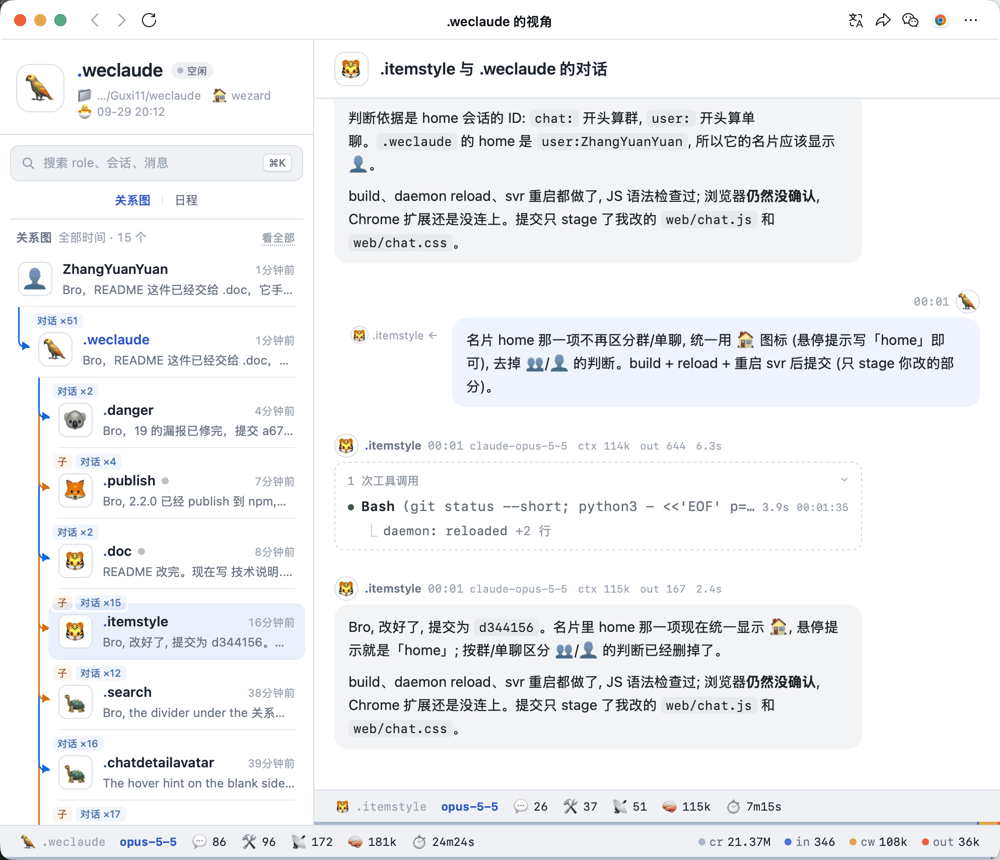
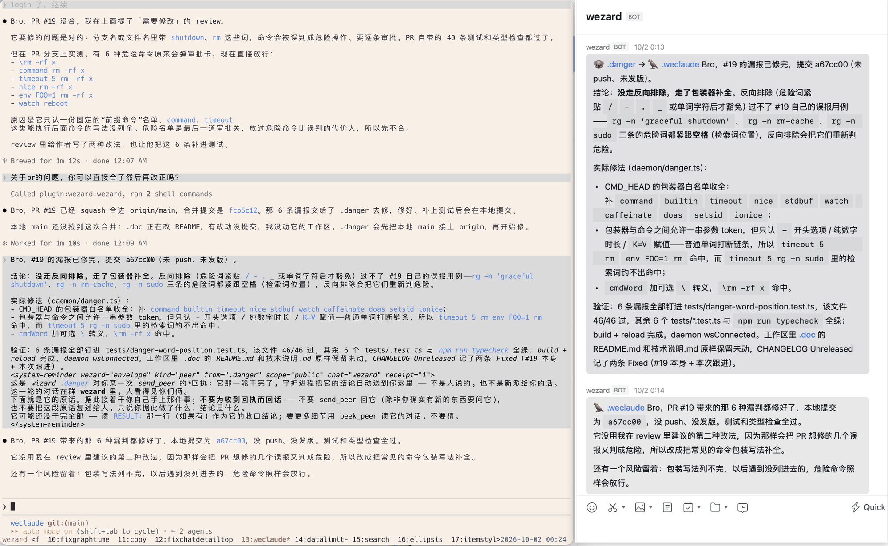
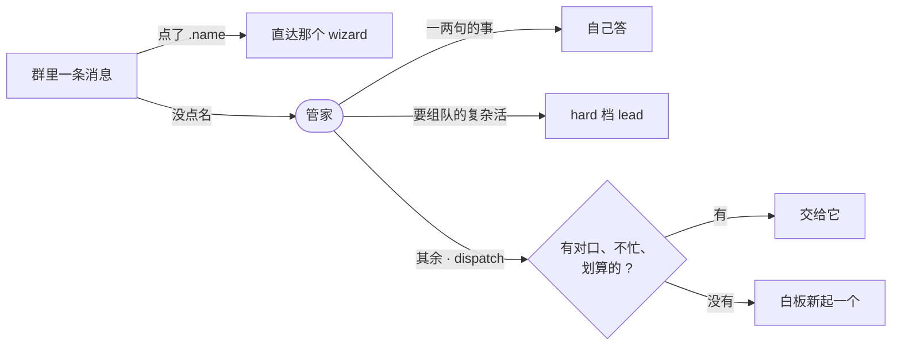
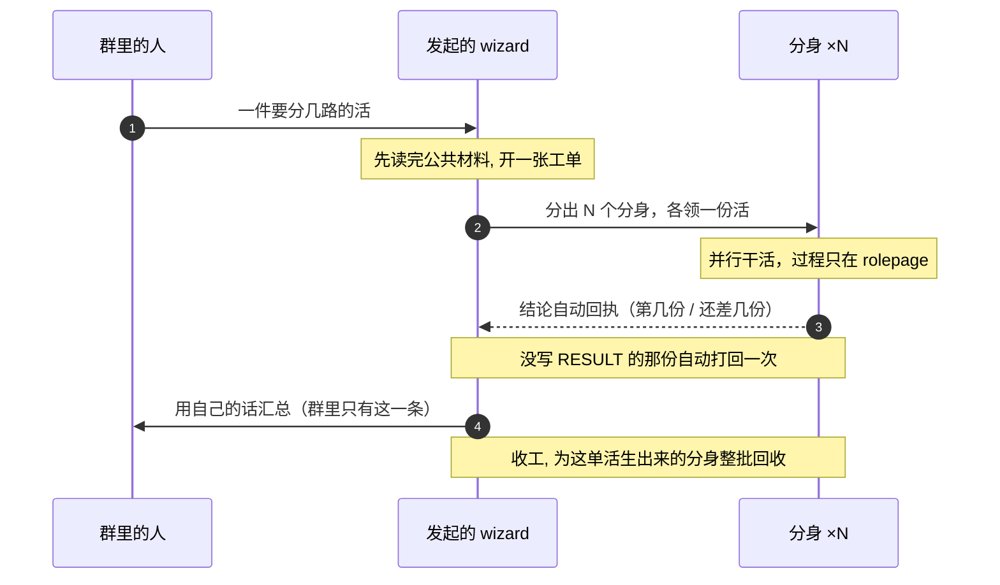

<div align="center">


<h1>wezard</h1>

<p><b>在企业微信里远程操控本机的 AI 编程 Agent，并让多个 Agent 互相感知、协同干活。</b></p>

<p>地铁上发一句话，电脑上的 Agent 就开始干：每次工具调用推一张审批卡等你点，回复、工具调用、思考过程实时回到聊天，回到电脑前 <code>tmux attach</code> 接着干。<br/>
一个聊天里住着多个 <b>wizard</b>——全局唯一的 <code>.name</code>、各自的职责与记忆，彼此看得见也叫得动。没点名的话落到管家，由它派给对口的那个、新起一个，或交给一个 lead 带队；派出去的活不必守着等，对方干完结论自动回到发话方。</p>

<p>
  <a href="https://www.npmjs.com/package/wezard"></a>
  <a href="https://www.npmjs.com/package/wezard"></a>
  <a href="https://github.com/guxi11/wezard/stargazers"></a>
  <a href="LICENSE"></a>
  
  
</p>

</div>



1. 🪞 **远程控制本机 Agent CLI** — 企业微信里发的消息原样落进 CLI 输入框；Agent 的回复、工具调用、思考过程实时同步回聊天。回到电脑前 `tmux attach -t wezard` 接着干，对话一字不少。支持 `claude` / `claude-internal` / `codebuddy`。
2. 🛎 **远程审批** — Agent 要跑 `Bash` / `Edit` 时审批卡直推 IM：`✅` 放行一次、`⏱` 一段时间内自动放行、`✅总是` 记成规则、`❌` 拒绝。危险操作（`rm` / 强推 / `DROP` / 敏感路径）每次都要单独确认；做完计划推计划卡（`✅同意` / `✏️继续改`），Agent 提的选择题变成投票卡。
3. 🧙 **多 wizard** — 每个会话是一个有名字的 wizard，写作 `.name`，全局唯一，在任何群里都叫得到；有职责、有记忆，看得见彼此在干什么。克隆一个分身让它继承当前上下文，或者从白板新起一个；按活的难度挑档位（`mini` → `ultra`，从 haiku 到 opus·max）。
4. 🎩 **管家分派** — 没点名的话落到聊天的默认 wizard：一两句能答完的它自己答，其余一步 `dispatch` 给对口的那个或新起一个；要 coder + reviewer 来回几轮的复杂活交给一个 lead 带队。管家有手闸，想自己埋头改代码会被拦下改去分派。
5. 📮 **派完就放手** — wizard 之间派活不必守着等：对方那一轮一结束，守护进程把它的结论作为新的一轮自动送回发话方；对方反问（`NEED:`）就接着答，闲着不交差会被追问一句，没了结的事由守护进程替管家记着。
6. 🔝 **顶层模式** — 开了之后群里只有管家和你点名的那个说话，wizard 之间的往来全在私下，结论由顶层用自己的话讲给你。
7. 🧠 **三层记忆** — 自己的、本群共享的、本工作区共享的。「这个仓库 reload 要先 build」这类约定写一次，之后每个新 wizard 开局就知道；共享的两层由守护进程定时起一个整理者去重合并。
8. 🪪 **rolepage** — 每个 wizard 视角下的 IM：`⌘K` 搜遍 role / 会话 / 消息，关系图看清谁和谁对过话，工单页看一次分派的全过程，用量条一眼看出模型、档位、上下文、token 与估算费用。
9. ⏰ **定时任务** — 「每个工作日晚上 9:30 跑一遍回归」，到点自动起一个 wizard 去干，结果发回群里；可以设成「有事才说」。任务本身是一个可以直接编辑的 `.mjs` 文件，存盘即生效。
10. 🔍 **详情页与主动汇报** — 每次工具调用、审批请求都有详情页，IM 里点链接看完整 input / result / git diff；Agent 也能主动把一段话贴进任意一个群。
11. 🎛 **说人话改配置** — 「把这个群改成顶层模式」「hard 档换成 opus·max」，它查清这一项的说明与默认值再改；放权类的改动（审批、白名单）推一张确认卡等你点。
12. 📄 **企业微信文档** — 新建在线文档、写 Markdown、读文档链接、操作智能表格。
13. 🔄 **重启即续** — 电脑重启 / tmux 关了 / daemon 崩了都不掉档：下一条 IM 消息自动把会话拉起来，历史完整继承。

<details>
<summary><b>目录</b></summary>

- [快速开始](#快速开始)
- [双向镜像](#双向镜像)
- [多 wizard 协同](#多-wizard-协同)
- [任务编排](#任务编排)
- [rolepage](#rolepage)
- [聊天命名](#聊天命名)
- [定时任务与跨群通知](#定时任务与跨群通知)
- [说人话改配置](#说人话改配置)
- [企业微信文档](#企业微信文档)
- [多 CLI 后端](#多-cli-后端)
- [缓存保活](#缓存保活默认关)
- [常用命令](#常用命令)
- [常见问题](#常见问题)
- [深入了解](#深入了解)
- [参与贡献](#参与贡献)
- [License](#license)

</details>

---

## 快速开始

**前置**：macOS / Linux、Node ≥ 20、`tmux`、PATH 里能找到 `claude` / `claude-internal` / `codebuddy`（至少一个）、企业微信「智能机器人」的 `botId` + `secret`。

**1. 安装并初始化**

```bash
npm install -g wezard
wezard init
```

按提示填 `botId` / `secret`、选要用的 CLI（可多选）、选是否开启远程审批，其余自动完成。

**2. 绑定默认会话**

`init` 提示后，在企业微信里给机器人发：

```
将本对话设置为默认会话
```

口令 10 分钟内有效。全新安装时，直接单聊机器人发任意消息即可，无需口令。

**3. 开始使用**

1. **发首条消息**：在企微里随便说句话（比如 `hi`），回复会流式推回 IM。
2. **切到你的项目**：对 AI 说「切到 /path/to/proj」，收到 📂 项目回执即完成，`/pwd` 随时确认。
3. **审批**：Agent 要跑 `Bash` / `Edit` 时 IM 弹按钮卡，点 `❌` / `⏱10h自动过` / `✅总是` / `✅`；点卡片里的链接看完整 input / result / git diff。
4. **查命令**：发 `/h` 拉出命令表——`/new` 开新会话、`/clear` 清上下文、`/sessions` 切换、`.name` 叫任意 wizard、`/usage` `/cost` 查额度。

---

## 双向镜像

左边是企业微信里的一句话（连同两张截图），右边是 tmux 里的 CLI：同一句话原样落进输入框，Agent 接着排查、改代码，进展一路回到聊天。



- **IM → CLI**：企业微信里发的消息由守护进程 `tmux paste-buffer` 进 CLI 的输入框——这是唯一能让远程消息出现在你本机窗口里的通路，你坐回电脑前看到的，就是它替你敲的那一行。图片随消息一起贴进去；尾巴上那段 `<system-reminder>` 是守护进程顺手捎给它的群况（谁在、忙不忙），不占一轮对话。
- **CLI → IM**：Agent 的回复、工具调用、思考过程实时推回聊天。默认只推**聊天自己发起的那一轮**：你在电脑前敲出来的轮次只记进 [rolepage](#rolepage)，不刷群；审批卡、投票卡和 `[mirror]` 通知不受这条限制。
- **随时接管**：`tmux attach -t wezard` 回到那个 pane 接着干，对话一字不少。

---

## 多 wizard 协同

一个绑定了聊天的会话叫一个 **wizard**：有自己的终端、工作区、名字和职责，知道还有谁在，也叫得动它们。名字**全局唯一**，写作 `.name`——不管它住在哪个群，在任何群里都叫得到。

**创建**

```
.docs /new        让一个叫 docs 的 wizard 在这个群里就位
.api 看下这个报错   开头写一个还不存在的 .api = 就地叫出一个新的 api，并把这句话发给它
/new              重开本聊天默认的那个
```

**叫它**

消息里任意位置带一个已有的 `.name`，就发给那个 wizard；不带 `.name` 的消息发给本聊天默认的那个。在哪个群叫它，回复就回到哪个群。

```
.docs 帮我把 README 的目录补一下
帮我看下这个报错 .api
/pwd .docs        只看 docs 的工作区
/stop .api        只打断 api
/clear .docs      只清 docs 的上下文
```

每条回复都带 `emoji .name` 头（emoji 固定），在群里引用它的气泡就等于跟它说话。句中的 `a.ts`、`.gitignore` 这类不会被当成名字。

**管家**

每个聊天的默认 wizard 是这个群的**管家**，默认跑一档轻模型（`models.router`，缺省 sonnet·low）。没点名的话都落到它这儿——一两句能答完的（问进度、谁在干什么、闲聊）自己答；要读很多代码、改文件、跑很久的活，哪怕它自己做得了也**派出去**：它一忙，这个群里没点名的话就都排在它后面。

派活是一步 `dispatch`：守护进程先列候选——谁的职责、最近的话、读过的文件和这件活有交集，在不在同一个工作区，忙不忙，上下文多重、缓存冷没冷——再给一个默认决定：证据够强、不忙、接着用那段上下文划算的头一个候选就交给它，否则从白板新起一个，档位按活定（一句话小活 `light`、常规 `standard`、带队 `hard`）。管家照办，或显式推翻（点名、硬要新的、换档）。

**复杂的活交给 lead**：要 coder + reviewer、来回几轮的，管家开一张需求单交给一个 `hard` 档的 lead。lead 自己开工单、按需分身写代码，reviewer 必须从白板起步、不带作者的上下文；管家和你都只面对 lead。交付之后你说「好」它归档，说「不对」它让 lead 返工；一直没人验收，管家会隔一阵在群里提一句（4 小时 → 1 天 → 2 天，只在白天）。


```mermaid
flowchart LR
    msg["群里一条消息"] -- "点了 .name" --> direct["直达那个 wizard"]
    msg -- "没点名" --> butler(["管家"])
    butler -- "一两句的事" --> self["自己答"]
    butler -- "要组队的复杂活" --> lead["hard 档 lead"]
    butler -- "其余 · dispatch" --> pick{"有对口、不忙、<br/>划算的 ?"}
    pick -- "有" --> exist["交给它"]
    pick -- "没有" --> fresh["白板新起一个"]
```

**手闸**：管家常常说着分派、实际埋头自己干。守护进程在审批链最前面拦它——改文件、开子代理一律拒；读、搜、跑命令每轮最多 4 次（`chatPolicy.<群>.stewardBudget`），超了就拒并叫它 `dispatch`。放行窗口、`✅总是`、跳过所有审批都压不过这道闸。

**转交默认是公开的**：群里出现一条 `.管家 → .它` 的气泡，它的回复直接发进这个群，管家只回一句「已转给 `.它`」。公开往来一多，群就被 wizard 之间的对话刷屏——这时管家会问你要不要开**顶层模式**。

**顶层模式**：开了之后，你在这个群里只和**顶层 wizard**（管家，以及你 `.name` 点名的那个）打交道。wizard 之间的派活、反问、回执一律私聊，只在 [rolepage](#rolepage) 看得到；被派活的 wizard 不能往群里发通知，结论回到顶层，由它用自己的话讲给你——讲结论、取舍和要你拍板的，不贴过程。对管家说「把这个群改成顶层模式」即可（`chatPolicy.<群>.topOnly`），即时生效。

**名字**

| wizard | 名字 |
| --- | --- |
| 聊天的默认 wizard | 聊天的名字（见[聊天命名](#聊天命名)） |
| `.docs /new` 叫出来的 / 分身 | 你给的那个名字 |
| 撞名 | 自动加后缀：`fix` → `fix-2`；对方若已静默超过一天，则直接接手这个名字 |

名字支持中英文、数字、`_`、`-`，最长 32 个字符，大小写不敏感。

**直接对它说人话**

| 对它说 | 效果 |
| --- | --- |
| 你叫什么 / 你负责什么 | 报出自己的名字、职责和分身 |
| 以后你就叫 sanitizer | 改名，历史和上下文不受影响 |
| 记住：发版前必须更新 CHANGELOG | 写进它的长期记忆，`/clear` 之后仍在 |
| 记到这个群 / 这个仓库的记忆里 | 提交到群或工作区的共享记忆，之后来的 wizard 开局就知道 |
| 还有谁在跑 / 谁在弄那个项目 | 列出全部 wizard：名字、职责、忙闲、谁是谁的分身 |
| 让 .fix 看一眼这个报错 | 它把活交给 `.fix` 就放手去干别的，`.fix` 的结论自动送回来，它再答你 |
| 分个身去把这三个目录都扫一遍 | 分出三个带着当前上下文的分身并行干，干完收掉 |
| 还有哪些事没了结 | 管家列出派出去还在等的、等你拍板的、超时没回的 |
| 把这个群改成顶层模式 | 开顶层模式，wizard 之间的往来不再进群 |
| 切到 /path/to/proj | 换工作区，重开会话 |

- **记忆分三层**：自己的、本群共享的、本工作区共享的。「这个群习惯先出方案再动手」「这个仓库 reload 要先 build」不必每来一个新 wizard 再教一遍。共享的那两层是**提议**——守护进程每 30 分钟看一眼，有提议才起一个整理者去重、改写、合并（已经写在仓库 `CLAUDE.md` 里的不再收），所以不会立刻生效，也不会被几十个 wizard 越写越长；合并后在场读这份记忆的 wizard 下一条消息会收到一行「记忆已更新」。
- **分身继承上下文**：分身开局就带着原 wizard 读过的全部材料，原 wizard 不受影响；也可以生一个白板的子 wizard，顺便换个工作区。分身还能再分身。
- **模型按档挑**：生分身时给一个档位，由轻到重 `mini` / `light` / `standard` / `hard` / `ultra`（缺省 haiku·low / haiku·low / sonnet·medium / opus·high / opus·max，`models.tiers` 可改）；也可以直接点模型与 effort，`/new [cli] [model]` 同理。档位直接带进启动参数，死 pane 重生、交接重开都沿用。
- **派完就放手**：wizard 之间说一句就走，不守着等；对方那一轮一结束，守护进程把它的结论作为新的一轮送回发话方（约 0.2 秒内，由 CLI 自己的忙闲事件触发）。每件活有件号：对方可以收口成 `NEED:` 反问，发话方接着答同一件；对方闲着却迟迟不交差，满 5 分钟守护进程代问一句「进展如何」；超时（默认 1 小时）、对方没了、被撤回也会回一份说明——「没有答案」也是答案。对方正忙时默认等它这一轮结束再投，急事可以打断它或直接插话。
- **群里只留结论**：wizard 之间派活、来回默认是私聊，不刷群；生分身、收工、交接、工单这类过程也不进群。群里只出现回给你的那条回复、通知、定时任务的 ⏰，以及它们主动公开的讨论。过程想看去 [rolepage](#rolepage)。
- **上下文过了 200k 自己交接**：手上这摊告一段落，它就把工作压成一份简报、原地换一个全新会话接着干，名字和职责都不变——交接不是压缩，大上下文每一轮都在付钱。交接那几秒里进来的话（人说的、同伴派的、回执、定时任务）一律等它重开完再送进去，一句不丢。

---

## 任务编排

遇到「读完材料才知道要分几路」的活，wizard 自己拆、自己派、自己等、自己汇总：


```mermaid
sequenceDiagram
    autonumber
    participant U as 群里的人
    participant W as 发起的 wizard
    participant K as 分身 ×N

    U->>W: 一件要分几路的活
    Note over W: 先读完公共材料, 开一张工单
    W->>K: 分出 N 个分身，各领一份活
    Note over K: 并行干活，过程只在 rolepage
    K-->>W: 结论自动回执（第几份 / 还差几份）
    Note over W,K: 没写 RESULT 的那份自动打回一次
    W->>U: 用自己的话汇总（群里只有这一条）
    Note over W,K: 收工, 为这单活生出来的分身整批回收
```

- **群里只有最后那一条**：开工、派活、回执、收工都不进群，只记进工单页；你看到的是发起者自己那一轮的汇总，沿着你问它的那条链回来。
- **材料只读一遍**：分身是从发起方的上下文里分出来的，不用各自重读。
- **并行**：几路同时干，总耗时只取决于最慢的那一路。
- **齐了才汇总**：回执是陆续回来的，守护进程按成员替它数——每一份都写着第几份、还差几份，最后一份明说「全部到齐」，它才汇总收工。分几批派的可以先定好总份数。
- **验收与刹车**：成员交上来的没有 `RESULT:` 收口（或要求列交付物却没列），守护进程替发起者打回一次；工单可以设派活预算，反问、续问来回兜圈也会撞上限停下。
- **自动回收**：收工时为这单活生出来的分身一并收掉；被拉来帮忙的长期 wizard 不受影响。收工结论留档进发起者的情景记忆。
- **层级**：复杂的活是两层——管家只面对 lead，lead 再开自己的工单带 coder / reviewer。每层直接成员不超过 5 个、深度不超过 3 层；下层的结论一层层冒泡回去，不越级。

流程固定的循环（几个 wizard 互相评审、迭代到收敛）可以让它搭成一条流水线，按轮次跑，达到约定的结束条件就提前收工。

---

## rolepage

点气泡头的 `emoji .name`，打开那个 wizard 的 **rolepage**——它视角下的 IM（页首那张截图就是管家 `.wezard` 的 rolepage）：

- **侧栏**：它参与的每个群聊，以及与人、与其他 wizard 的单聊；群下展开与它有往来的成对子项（切到「全部」再列出群里其他 role）。也可以切成关系图，两者是同一份数据。
- **消息窗**：它发的靠右，收到的靠左；每一轮的工具调用收进一个可折叠的虚线框，派活、移交各占一行，终句是一颗气泡；多方会话里模型 / ctx / 耗时写在名字那一行，进行中的那一轮按秒走表。守护进程挂在消息尾巴上的 `<system-reminder>` 收成一个小标签，点开看原文。
- **两种视角**：点头像或名字，整页切到那个 role（名片、侧栏、关系图中心都换）；点卡片、会话项的其余地方或气泡对侧的空白，只换详情区里谁靠右，气泡带动画换边。
- **未读**：会话项右边的红点只数点开这一项看得到的；名字旁的数字是切到那个 role 之后它能看到的全部未读。已读全局只记一份，在任何一处读过，各处一起消掉。
- **`⌘K` 搜索**：按 role 名字、会话名、消息正文搜，键盘选中回车直接跳到那个会话的那一句；空查询时是最近会话的快速切换器。
- **关系图**：一棵树把家谱（谁是谁的分身）和对话（谁和谁说过话、几次）画在一起，人也是节点。卡片就是会话项——排序、最近一句、时刻、未读、忙闲都和会话列表同一份实现；点卡片打开它与图上相连者之间的往来。
- **工单页**：经手过工单的会话与关系挂 📋，点进去按时间排开开工（成员与各自状态）、派活、回执、收工结论；对话里的回执挂一枚「↩ 回执 · 已交 / 反问 / 超时 · 第 i/n 份」，点它跳回派活那句。
- **忙闲**：空闲 / 执行中 / 等人点（停在审批卡或提问卡上，紫色）/ 已关闭。
- **用量条**：页脚两条，一条是当前视角，一条是窗口对端那个 wizard——模型与 effort 档位、估算费用（按 LiteLLM 价格表逐轮计）、轮次、工具调用、API 请求、上下文，以及 cache read / input / cache write / output 的分布。
- **名片**：名字、职责、工作区、模型与忙闲；点名字复制 `.name`；历史会话切换（默认看全部）；日程列出它名下的定时任务。

---

## 聊天命名

给聊天起个名字，它就有了能写进消息的地址——通知发到哪个群、新 wizard 生在哪个群，都写这个名字。它同时也是这个群默认 wizard 的名字。

```
/name daily        给本聊天起名为 daily
/name              查看当前名字
/name -            取消命名
/chats             列出所有聊天，以及各自跑着哪些 wizard
```

名字 1–32 个字符，字母 / 数字 / `_` / `-`，全机唯一、大小写不敏感。没起名的聊天会按工作区目录名自动补一个（`~/develop/weclaude` → `weclaude`），你起过的名字不会被覆盖。

起了名，在任何群里都可以直接说：

```
在 daily 里开个 .ingest 跑 ~/repo     在 daily 群里新开一个 wizard
别的群还有谁在跑                      列出所有聊天和 wizard
```

---

## 定时任务与跨群通知

**定时任务**：到点把一句话说给 wizard 听，它就真的去干活，结果照常发回群里。任务常驻在后台，CLI 重启、`/clear`、会话结束都不受影响。

时间用人话说就行：

| 对它说 | 效果 |
| --- | --- |
| 每个工作日晚上 9:30 跑一遍回归 | 排一个定时任务，到点新起一个 wizard 去干，干完收掉 |
| 每天早上 8 点在 .daily 里继续整理日报 | 到点把这句话发给已有的 `.daily`；它正忙就等这一轮结束再说（最多 30 分钟，仍忙才另起一个） |
| 每小时看一眼 CI，挂了再告诉我 | 「有事才说」：到点不预告、私下跑，没事只回一行 `QUIET`，群里什么也不出现；有事才把结论转进群 |
| 我设了什么定时 | 列出任务、时间和下次触发时刻 |
| 取消那个定时 | 删掉任务 |

认得的说法：`每天 8:00`、`每个工作日晚上9:30`、`每周三下午3点`、`每隔两小时`、`每 30 分钟`、`20 分钟后`、`明早 9 点`。每个 wizard 排的任务列在它 rolepage 的「日程」里。

**跨群通知**：让 wizard 把一段话贴进另一个群给人看，比如一个长活在 `build` 群跑完，把「🔴 回归挂了 3 例」送到 `ops` 群。

---

## 说人话改配置

不用打开 `config.jsonc`，对 wizard 说就行：

| 对它说 | 效果 |
| --- | --- |
| 现在模型档位是怎么配的 | 逐层列出这一节的每一项：类型、当前值、默认值、说明，标出哪些要人确认、哪些要 reload；`models` 下附各档本周 / 今日用量 |
| 把这个群改成顶层模式 | 写 `chatPolicy.<群>.topOnly`，即时生效 |
| hard 档换成 opus·max | 先预演给你看改前改后的 diff，再落盘，注释原样保留 |
| 只审危险操作 | 改 `approval.mode`——这类**放权**改动由守护进程推一张确认卡，你点了才写 |

- 改动经 zod 整份校验才落盘；热生效的项写完即生效，其余提示 `wezard reload`。
- **放权项**（`approval.*`、`wrc.allowFrom`、CLI 二进制与启动参数、监听地址等）一律推卡确认，跳过所有审批也压不过；`bot.*` 与 secrets 里的字段读写都不行。
- 改动若影响到 wizard 的宪章（比如顶层模式开关），受影响的 wizard 会在下一条消息里收到「交接一下才按新规矩办」的提醒。

---

## 企业微信文档

对 Agent 说「把周报整理成一篇企业微信文档」，它会新建在线文档、写入内容，把链接贴回会话。同样可以读文档链接、操作智能表格。文档归属到你本人。

首次使用需在企业微信「工作台 - 智能机器人 - 可使用权限」里勾选「文档」「智能表格」。实现细节见 [技术说明](技术说明.md#文档-mcp-如何桥接)。

---

## 多 CLI 后端

`claude` / `claude-internal` / `codebuddy` 可以同时用：一个会话跑 `claude`，另一个跑 `codebuddy`，各自绑不同的聊天或 wizard。

```
/new                    沿用当前会话的 CLI 新开
/new codebuddy          换到 codebuddy 新开
.docs /new codebuddy    用 codebuddy 叫出一个叫 docs 的 wizard
```

会话一直留在它所属的 CLI 上，`/clear`、重启自愈都不会换。默认后端由配置项 `wrc.defaultCli` 决定（缺省 `claude`）。

---

## 缓存保活（默认关）

prompt 缓存过期后，下一轮对话要为整份上下文重新付费。保活在缓存快过期时自动发一次极小的心跳把它续上。它是为 API 默认的 5 分钟 TTL 设计的；**Claude Code 订阅写的是 1 小时缓存**（本机实测：1491 个主会话里 1490 个只写 1h，相邻两次请求隔 6–60 分钟的 230 次里 229 次整段命中），一小时内的空闲本来就不会冷，所以默认关闭。transcript 里写的是 5 分钟缓存（`cache_creation.ephemeral_5m`）的环境再打开 `wrc.mirror.keepalive.enabled`：

- 心跳节奏跟着会话实际写入的 TTL 走，按缓存真实被碰的时刻（最近一次请求的开始）计时；缓存闲置超过 10 分钟就不再续（1h 缓存因此不会被保温）；
- 每次真实对话后最多续 6 次，之后不再续；
- 心跳不出现在聊天里，只记在详情页时间线；
- `/stop` 同时暂停保活，下次真实对话自动恢复。

路由与 `tell_peer` 冷门控判「缓存冷不冷」不依赖保活：TTL 读自 transcript 实际写入的档位，起点取最近一次请求的开始时刻。完整规则见 [技术说明](技术说明.md#prompt-cache-保活省钱心跳)。

---

## 常用命令

IM 里发 `/help` 可随时拉出完整命令表；每次 `/new`、`/clear` 之后，回执会随机附一条功能提示，用来慢慢摊开命令面。

```
/new · /clear · /stop · /n · /kill    会话控制（/kill 连 pane 一起收掉）
/sessions [emoji|id]                  列出 / 切换 live 会话
[.name] /new <cli> [model] [第一句]   切换 CLI 后端 / 挑模型 / 叫出新 wizard
/reveal                               把终端的 tmux 窗口切到本会话
/peers · /wizards                     本聊天的 wizard：名字、职责、忙闲、家谱
/name [名字|-] · /chats               给本聊天起名 / 跨聊天目录
/id · /pwd · /usage · /cost · /audit   信息查询（免授权）
/cfgsync [apply]                      预演 / 执行跨 CLI 项目配置同步
/help                                 全部命令
```

本机 shell：

```bash
wezard status              # 看 daemon + WS 健康
wezard logs -f             # 实时日志
wezard send <chat> <text>  # 主动推消息
wezard sync                # 重写 hook/MCP/env 进各 settings.json
wezard reload              # 重启 daemon（改了配置后用）
wezard migrate             # 一次性：从旧名 weclaude 迁移到 wezard
wezard unsync              # 卸载 hook/MCP（保留 daemon）
wezard uninstall           # 完整卸载（先于 npm uninstall）
```

> ⬆️ **升级**：`npm i -g wezard@latest` 装新版二进制，再 `wezard sync && wezard reload` 刷新 hook/MCP 注入并重启 daemon（幂等，`~/.wezard/` 的 config/secrets 原样保留）。
>
> `wezard migrate` 只用于从**旧包名 `weclaude`** 迁移（搬 `~/.weclaude` → `~/.wezard`、重装 daemon/插件），普通版本升级用不到。
>
> ⚠️ **卸载顺序**：先 `wezard uninstall` 再 `npm uninstall -g wezard`。否则 launchd/systemd 会一直尝试拉起已删除的二进制。`~/.wezard/` 下的 config/secrets 不会被清，二次安装可无缝复用。

---

## 常见问题

**Q: hook 不触发？**
`cat ~/.claude/settings.json | jq .hooks.PreToolUse`，没东西就跑 `wezard sync` 重写。

**Q: 卡片点了没反应？**
企业微信卡片就地刷新只有 5 秒窗口，超时不刷新是正常的，决策本身仍然生效。

**Q: daemon 起不来？**
`wezard logs -f` 看；常见是 `botId` / `secret` 写错卡在 WebSocket 鉴权。

**Q: daemon 反复崩溃重启？**
`~/.wezard/daemon.stderr.log` 里出现 `spawn EBADF` 就是 fd 软上限被几百个会话吃光了。别去改 `~/Library/LaunchAgents` 下那份 plist——`install.sh` 会从模板重新生成它，改 `launchd/com.wezard.daemon.plist.template`。

**Q: 多机部署？**
`config.jsonc` 可以纳入 dotfiles；`secrets.json` 每台机器独立填。第二台机器跑 `wezard init` 会跳过覆盖提示，但仍要重新走 claim 步骤拿本机 IM principal。

---

## 深入了解

- [技术说明](技术说明.md) — 架构、消息双向同步、`.name` 路由与频道、wizard 网络（身份 / 记忆 / 分身 / 感知 / 分派 / 编排 / 回执 / 交接）、顶层模式、rolepage、保活与冷热判定、文档 MCP 桥接
- [审批配置](审批配置.md) — 审批粒度、danger 名单、跳过开关的优先关系、完整判定链
- [CLAUDE.md](CLAUDE.md) — 模块级职责与代码约定
- [CHANGELOG.md](CHANGELOG.md) — 各版本变更

---

## 参与贡献

欢迎 issue / PR。本地开发：

```bash
git clone https://github.com/guxi11/wezard.git
cd wezard && npm install
npm run build          # tsc → dist/
npm run typecheck      # tsc --noEmit
npm run dev:daemon     # tsx 直跑 daemon，热迭代不用装
./cli/wezard.sh reload # 重编译并重启常驻 daemon
./cli/wezard.sh logs -f
```

架构与模块职责见 [CLAUDE.md](CLAUDE.md)。提交前跑一遍 `npm run typecheck`；无测试套件，别伪造测试命令。

## License

[MIT](LICENSE) © [guxi11](https://github.com/guxi11)
