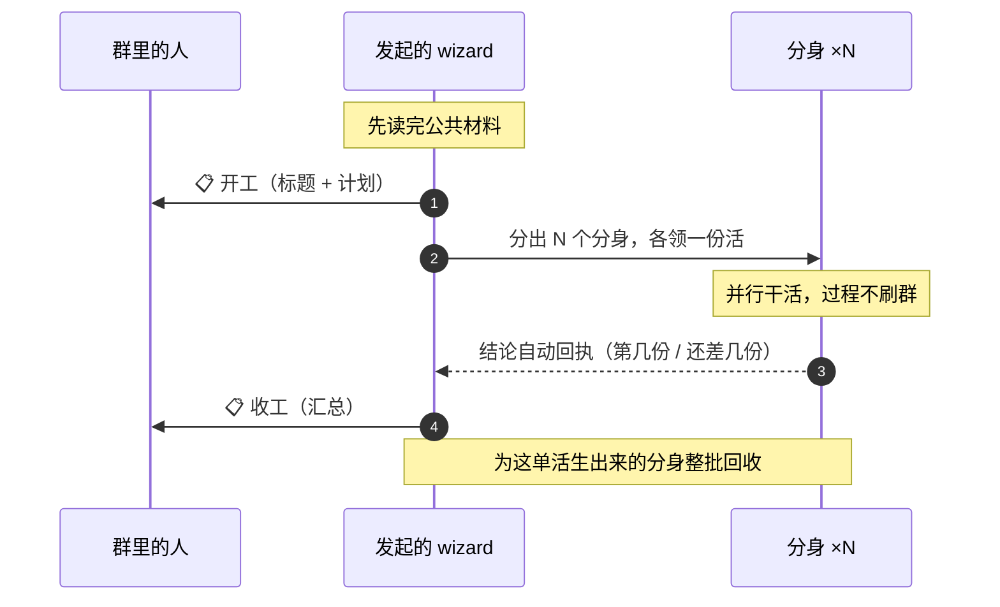

<div align="center">


<h1>wezard</h1>

<p><b>把 AI 编程 Agent 装进企业微信。</b><br/>在地铁上、被窝里、开会摸鱼时，照样能跟你电脑上的 Agent 干活。</p>

<p>
  <a href="https://www.npmjs.com/package/wezard"></a>
  <a href="https://www.npmjs.com/package/wezard"></a>
  <a href="https://github.com/guxi11/wezard/stargazers"></a>
  <a href="LICENSE"></a>
  
  
</p>

</div>


| 功能 | 说明 |
| --- | --- |
| 🛎 **远程审批** | Agent 要跑 `Bash` / `Edit` 时，审批卡片直推 IM：`✅` 放行一次、`⏱` 一段时间内自动放行、`✅总是` 记成规则、`❌` 拒绝。危险操作（`rm` / 强推 / `DROP` / 敏感路径）每次都要单独确认。 |
| 📋 **计划审批** | Agent 做完计划时，摘要和审批卡推到 IM：`✅同意` 开始执行，`✏️继续改` 接着完善。Agent 提的选择题也会变成投票卡。 |
| 🪞 **会话镜像** | 电脑上 Agent 的回复、工具调用、思考过程实时同步到企业微信；IM 里发的消息原样落进 CLI 输入框。回到电脑前 `tmux attach -t wezard` 接着干，对话一字不少。 |
| 🖼 **图片直贴** | 在企业微信里发图，Agent 直接当贴图处理。 |
| 🔍 **详情页** | 每次工具调用 / 审批请求都有详情页，IM 里点链接看完整 input / result / git diff。 |
| 📡 **主动汇报** | Agent 可以主动给你发消息、发卡片、向你提问。 |
| 📄 **文档读写** | Agent 直接新建企业微信在线文档、写 Markdown、读文档链接、操作智能表格。 |
| 🗂 **多会话** | 列出本机所有在跑的会话、切换 IM 镜像到哪一个、在指定目录新开会话。每个会话有一枚固定的 emoji，审批卡和回复一眼区分。 |
| 🧙 **多 wizard 协同** | 每个会话是一个有名字的 wizard，写作 `.name`，在任何群里都叫得到；有职责、有记忆，能分身、能互相派活——派完就放手，对方干完结论自动送回，把一件大活拆成几路并行做完。 |
| 🪪 **rolepage** | 每个 wizard 视角下的 IM：`⌘K` 搜遍 role / 会话 / 消息，关系图看清谁和谁对过话，用量条一眼看出模型、轮次、上下文与 token 花在哪。 |
| ⏰ **定时任务** | 「每个工作日晚上 9:30 跑一遍回归」——到点自动起一个 wizard 去干，结果发回群里。 |
| 🔄 **重启即续** | 电脑重启 / tmux 关了 / daemon 崩了都不掉档：下一条 IM 消息自动把会话拉起来，历史完整继承。 |

<details>
<summary><b>目录</b></summary>

- [快速开始](#快速开始)
- [多 wizard 协同](#多-wizard-协同)
- [任务编排](#任务编排)
- [rolepage](#rolepage)
- [聊天命名](#聊天命名)
- [定时任务与跨群通知](#定时任务与跨群通知)
- [企业微信文档](#企业微信文档)
- [多 CLI 后端](#多-cli-后端)
- [缓存保活](#缓存保活)
- [常用命令](#常用命令)
- [常见问题](#常见问题)
- [深入了解](#深入了解)
- [参与贡献](#参与贡献)
- [License](#license)

</details>

---

## 快速开始

**前置**：macOS / Linux、Node ≥ 20、`tmux`、PATH 里能找到 `claude` / `claude-internal` / `codebuddy`（至少一个）、企业微信「智能机器人」的 `botId` + `secret`。

**1. 安装并初始化**

```bash
npm install -g wezard
wezard init
```

按提示填 `botId` / `secret`、选要用的 CLI（可多选）、选是否开启远程审批，其余自动完成。

**2. 绑定默认会话**

`init` 提示后，在企业微信里给机器人发：

```
将本对话设置为默认会话
```

口令 10 分钟内有效。全新安装时，直接单聊机器人发任意消息即可，无需口令。

**3. 开始使用**

1. **发首条消息**：在企微里随便说句话（比如 `hi`），回复会流式推回 IM。
2. **切到你的项目**：对 AI 说「切到 /path/to/proj」，收到 📂 项目回执即完成，`/pwd` 随时确认。
3. **审批**：Agent 要跑 `Bash` / `Edit` 时 IM 弹按钮卡，点 `❌` / `⏱10h自动过` / `✅总是` / `✅`；点卡片里的链接看完整 input / result / git diff。
4. **查命令**：发 `/h` 拉出命令表——`/new` 开新会话、`/clear` 清上下文、`/sessions` 切换、`.name` 叫任意 wizard、`/usage` `/cost` 查额度。

---

## 多 wizard 协同

一个绑定了聊天的会话叫一个 **wizard**：有自己的终端、工作区、名字和职责，知道还有谁在，也叫得动它们。名字**全局唯一**，写作 `.name`——不管它住在哪个群，在任何群里都叫得到。


**创建**

```
.docs /new        让一个叫 docs 的 wizard 在这个群里就位
.api 看下这个报错   开头写一个还不存在的 .api = 就地叫出一个新的 api，并把这句话发给它
/new              重开本聊天默认的那个
```

**叫它**

消息里任意位置带一个已有的 `.name`，就发给那个 wizard；不带 `.name` 的消息发给本聊天默认的那个。在哪个群叫它，回复就回到哪个群。

```
.docs 帮我把 README 的目录补一下
帮我看下这个报错 .api
/pwd .docs        只看 docs 的工作区
/stop .api        只打断 api
/clear .docs      只清 docs 的上下文
```

每条回复都带 `emoji .name` 头（emoji 固定），在群里引用它的气泡就等于跟它说话。句中的 `a.ts`、`.gitignore` 这类不会被当成名字。

**名字**

| wizard | 名字 |
| --- | --- |
| 聊天的默认 wizard | 聊天的名字（见[聊天命名](#聊天命名)） |
| `.docs /new` 叫出来的 / 分身 | 你给的那个名字 |
| 撞名 | 自动加后缀：`fix` → `fix-2`；对方若已静默超过一天，则直接接手这个名字 |

名字支持中英文、数字、`_`、`-`，最长 32 个字符，大小写不敏感。

**直接对它说人话**

| 对它说 | 效果 |
| --- | --- |
| 你叫什么 / 你负责什么 | 报出自己的名字、职责和分身 |
| 以后你就叫 sanitizer | 改名，历史和上下文不受影响 |
| 记住：发版前必须更新 CHANGELOG | 写进它的长期记忆，`/clear` 之后仍在 |
| 记到这个群 / 这个仓库的记忆里 | 提交到群或工作区的共享记忆，之后来的 wizard 开局就知道 |
| 还有谁在跑 / 谁在弄那个项目 | 列出全部 wizard：名字、职责、忙闲、谁是谁的分身 |
| 让 .fix 看一眼这个报错 | 它把活交给 `.fix` 就放手去干别的，`.fix` 的结论自动送回来，它再答你 |
| 分个身去把这三个目录都扫一遍 | 分出三个带着当前上下文的分身并行干，干完收掉 |
| 切到 /path/to/proj | 换工作区，重开会话 |

- **记忆分三层**：自己的、本群共享的、本工作区共享的。「这个群习惯先出方案再动手」「这个仓库 reload 要先 build」不必每来一个新 wizard 再教一遍。
- **分身继承上下文**：分身开局就带着原 wizard 读过的全部材料，原 wizard 不受影响；也可以生一个白板的子 wizard，顺便换个工作区。分身还能再分身。
- **模型可以挑**：`/new [cli] [model]`，或让它生分身时指定——要判断的给 opus，跑腿的给 haiku。
- **派完就放手**：wizard 之间说一句就走，不守着等；对方那一轮一结束，守护进程把它的结论作为新的一轮送回发话方（约 0.2 秒内，由 CLI 自己的忙闲事件触发）。对方正忙时可以约好「等它闲下来再说」，同样是它一停下就投。
- **管家分派**：交给聊天默认 wizard 的活，它先判断是派给已有的 wizard 还是新起一个——拿不准时，守护进程给它一张候选表：谁的职责、最近说的话、上下文里读过的文件和这件活对得上，忙不忙、上下文多重；末尾永远附「新起一个」。
- **群里只留结论**：wizard 之间派活、来回默认是私聊，不刷群；生分身、收工、交接这类生命周期事件也不进群。群里只出现回给你的那条回复、通知、工单的开工 / 收工、定时任务的 ⏰，以及它们主动公开的讨论。过程想看去 [rolepage](#rolepage)。
- **上下文满了自己交接**：它会写一份简报、原地重开，接着干。

---

## 任务编排

遇到「读完材料才知道要分几路」的活，wizard 自己拆、自己派、自己等、自己汇总：


```mermaid
sequenceDiagram
    autonumber
    participant U as 群里的人
    participant W as 发起的 wizard
    participant K as 分身 ×N

    Note over W: 先读完公共材料
    W->>U: 📋 开工（标题 + 计划）
    W->>K: 分出 N 个分身，各领一份活
    Note over K: 并行干活，过程不刷群
    K-->>W: 结论自动回执（第几份 / 还差几份）
    W->>U: 📋 收工（汇总）
    Note over W,K: 为这单活生出来的分身整批回收
```

- **群里只有两条气泡**：开工和收工。中间的过程在各自的 rolepage 里。
- **材料只读一遍**：分身是从发起方的上下文里分出来的，不用各自重读。
- **并行**：几路同时干，总耗时只取决于最慢的那一路。
- **齐了才汇总**：回执是陆续回来的，守护进程替它数——每一份都写着第几份、还差几份，最后一份明说「全部到齐」，它才汇总收工。
- **自动回收**：收工时为这单活生出来的分身一并收掉；被拉来帮忙的长期 wizard 不受影响。

流程固定的循环（几个 wizard 互相评审、迭代到收敛）可以让它搭成一条流水线，按轮次跑，达到约定的结束条件就提前收工。

---

## rolepage

点气泡头的 `emoji .name`，打开那个 wizard 的 **rolepage**——它视角下的 IM：

- **侧栏**：它参与的每个群聊，以及与人、与其他 wizard 的单聊；有新消息亮未读红点。
- **消息窗**：它发的靠右，收到的靠左；每一轮的工具调用收进一个可折叠的虚线框，终句是一颗气泡，模型 / ctx / 耗时写在名字那一行。
- **切视角**：点一条消息对侧的空白，切到对方的 rolepage，气泡带动画换边。
- **`⌘K` 搜索**：按 role 名字、会话名、消息正文搜，键盘选中回车直接跳到那个会话的那一句；空查询时是最近会话的快速切换器。
- **关系图**：侧栏切到关系图，一棵树把家谱（谁是谁的分身）和对话（谁和谁说过话、几次）画在一起，人也是节点。卡片就是会话项——最近一句、时刻、未读都和会话列表同一口径；点卡片打开它与图上相连者之间的往来。
- **用量条**：页脚两条，一条是当前视角，一条是窗口对端那个 wizard——模型、轮次、工具调用、API 请求、上下文峰值、耗时，以及 cache read / input / cache write / output 的分布。
- **名片**：名字、职责、工作区、模型与忙闲；点名字复制 `.name`；历史会话切换（默认看全部）；日程列出它名下的定时任务和工单。

---

## 聊天命名

给聊天起个名字，它就有了能写进消息的地址——通知发到哪个群、新 wizard 生在哪个群，都写这个名字。它同时也是这个群默认 wizard 的名字。

```
/name daily        给本聊天起名为 daily
/name              查看当前名字
/name -            取消命名
/chats             列出所有聊天，以及各自跑着哪些 wizard
```

名字 1–32 个字符，字母 / 数字 / `_` / `-`，全机唯一、大小写不敏感。没起名的聊天会按工作区目录名自动补一个（`~/develop/weclaude` → `weclaude`），你起过的名字不会被覆盖。

起了名，在任何群里都可以直接说：

```
在 daily 里开个 .ingest 跑 ~/repo     在 daily 群里新开一个 wizard
别的群还有谁在跑                      列出所有聊天和 wizard
```

---

## 定时任务与跨群通知

**定时任务**：到点把一句话说给 wizard 听，它就真的去干活，结果照常发回群里。任务常驻在后台，CLI 重启、`/clear`、会话结束都不受影响。

时间用人话说就行：

| 对它说 | 效果 |
| --- | --- |
| 每个工作日晚上 9:30 跑一遍回归 | 排一个定时任务，到点新起一个 wizard 去干，干完收掉 |
| 每天早上 8 点在 .daily 里继续整理日报 | 到点把这句话发给已有的 `.daily` |
| 我设了什么定时 | 列出任务、时间和下次触发时刻 |
| 取消那个定时 | 删掉任务 |

认得的说法：`每天 8:00`、`每个工作日晚上9:30`、`每周三下午3点`、`每隔两小时`、`每 30 分钟`、`20 分钟后`、`明早 9 点`。每个 wizard 排的任务列在它 rolepage 的「日程」里。

**跨群通知**：让 wizard 把一段话贴进另一个群给人看，比如一个长活在 `build` 群跑完，把「🔴 回归挂了 3 例」送到 `ops` 群。

---

## 企业微信文档

对 Agent 说「把周报整理成一篇企业微信文档」，它会新建在线文档、写入内容，把链接贴回会话。同样可以读文档链接、操作智能表格。文档归属到你本人。

首次使用需在企业微信「工作台 - 智能机器人 - 可使用权限」里勾选「文档」「智能表格」。实现细节见 [技术说明](技术说明.md#文档-mcp-如何桥接)。

---

## 多 CLI 后端

`claude` / `claude-internal` / `codebuddy` 可以同时用：一个会话跑 `claude`，另一个跑 `codebuddy`，各自绑不同的聊天或 wizard。

```
/new                    沿用当前会话的 CLI 新开
/new codebuddy          换到 codebuddy 新开
.docs /new codebuddy    用 codebuddy 叫出一个叫 docs 的 wizard
```

会话一直留在它所属的 CLI 上，`/clear`、重启自愈都不会换。默认后端由配置项 `wrc.defaultCli` 决定（缺省 `claude`）。

---

## 缓存保活

Agent 空闲超过约 5 分钟，模型侧的 prompt 缓存就会过期，下一轮对话要为整份上下文重新付费。wezard 在缓存快过期时自动发一次极小的心跳把它续上：

- 每次真实对话后最多续 6 次（约 26 分钟），之后不再续；
- 心跳不出现在聊天里，只记在详情页时间线；
- 上一轮因报错 / 限额中断时，心跳会顺手把活接上；
- `/stop` 同时暂停保活，下次真实对话自动恢复。

配置项在 `wrc.mirror.keepalive`，完整规则见 [技术说明](技术说明.md#prompt-cache-保活省钱心跳)。

---

## 常用命令

IM 里发 `/help` 可随时拉出完整命令表；每次 `/new`、`/clear` 之后，回执会随机附一条功能提示，用来慢慢摊开命令面。

```
/new · /clear · /stop · /n · /kill    会话控制（/kill 连 pane 一起收掉）
/sessions [emoji|id]                  列出 / 切换 live 会话
[.name] /new <cli> [model] [第一句]   切换 CLI 后端 / 挑模型 / 叫出新 wizard
/reveal                               把终端的 tmux 窗口切到本会话
/peers · /wizards                     本聊天的 wizard：名字、职责、忙闲、家谱
/name [名字|-] · /chats               给本聊天起名 / 跨聊天目录
/id · /pwd · /usage · /cost · /audit   信息查询（免授权）
/cfgsync [apply]                      预演 / 执行跨 CLI 项目配置同步
/help                                 全部命令
```

本机 shell：

```bash
wezard status              # 看 daemon + WS 健康
wezard logs -f             # 实时日志
wezard send <chat> <text>  # 主动推消息
wezard sync                # 重写 hook/MCP/env 进各 settings.json
wezard reload              # 重启 daemon（改了配置后用）
wezard migrate             # 一次性：从旧名 weclaude 迁移到 wezard
wezard unsync              # 卸载 hook/MCP（保留 daemon）
wezard uninstall           # 完整卸载（先于 npm uninstall）
```

> ⬆️ **升级**：`npm i -g wezard@latest` 装新版二进制，再 `wezard sync && wezard reload` 刷新 hook/MCP 注入并重启 daemon（幂等，`~/.wezard/` 的 config/secrets 原样保留）。
>
> `wezard migrate` 只用于从**旧包名 `weclaude`** 迁移（搬 `~/.weclaude` → `~/.wezard`、重装 daemon/插件），普通版本升级用不到。
>
> ⚠️ **卸载顺序**：先 `wezard uninstall` 再 `npm uninstall -g wezard`。否则 launchd/systemd 会一直尝试拉起已删除的二进制。`~/.wezard/` 下的 config/secrets 不会被清，二次安装可无缝复用。

---

## 常见问题

**Q: hook 不触发？**
`cat ~/.claude/settings.json | jq .hooks.PreToolUse`，没东西就跑 `wezard sync` 重写。

**Q: 卡片点了没反应？**
企业微信卡片就地刷新只有 5 秒窗口，超时不刷新是正常的，决策本身仍然生效。

**Q: daemon 起不来？**
`wezard logs -f` 看；常见是 `botId` / `secret` 写错卡在 WebSocket 鉴权。

**Q: daemon 反复崩溃重启？**
`~/.wezard/daemon.stderr.log` 里出现 `spawn EBADF` 就是 fd 软上限被几百个会话吃光了。别去改 `~/Library/LaunchAgents` 下那份 plist——`install.sh` 会从模板重新生成它，改 `launchd/com.wezard.daemon.plist.template`。

**Q: 多机部署？**
`config.jsonc` 可以纳入 dotfiles；`secrets.json` 每台机器独立填。第二台机器跑 `wezard init` 会跳过覆盖提示，但仍要重新走 claim 步骤拿本机 IM principal。

---

## 深入了解

- [技术说明](技术说明.md) — 架构、消息双向同步、`.name` 路由与频道、wizard 网络（身份 / 分身 / 感知 / 编排）、rolepage、保活判定、文档 MCP 桥接
- [审批配置](审批配置.md) — 审批粒度、danger 名单、跳过开关的优先关系、完整判定链
- [CLAUDE.md](CLAUDE.md) — 模块级职责与代码约定
- [CHANGELOG.md](CHANGELOG.md) — 各版本变更

---

## 参与贡献

欢迎 issue / PR。本地开发：

```bash
git clone https://github.com/guxi11/wezard.git
cd wezard && npm install
npm run build          # tsc → dist/
npm run typecheck      # tsc --noEmit
npm run dev:daemon     # tsx 直跑 daemon，热迭代不用装
./cli/wezard.sh reload # 重编译并重启常驻 daemon
./cli/wezard.sh logs -f
```

架构与模块职责见 [CLAUDE.md](CLAUDE.md)。提交前跑一遍 `npm run typecheck`；无测试套件，别伪造测试命令。

## License

[MIT](LICENSE) © [guxi11](https://github.com/guxi11)
