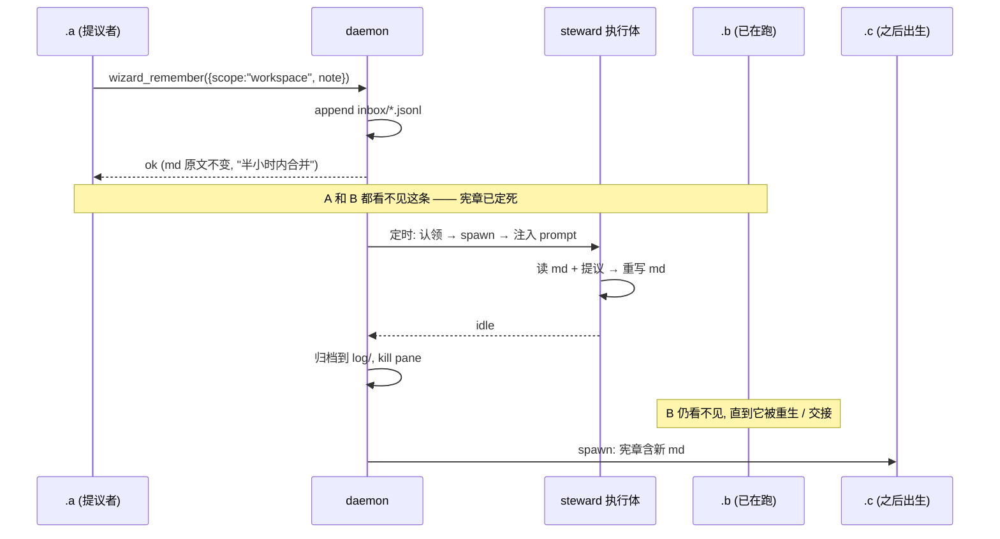
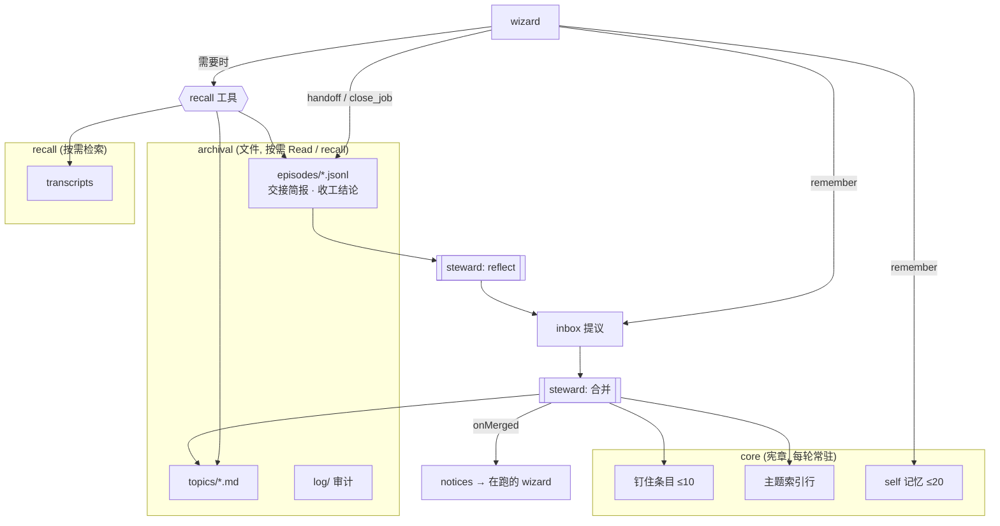

# wezard 记忆体系: 现状与改进方向

> 调研: `.ev-mem` · 2026-10-02 · 依据: `daemon/wizard.ts` / `wizard-memory.ts` / `memory-steward.ts` (含 `.memsteward` 未提交的改动) / `handoff.ts` / `index.ts` 的 `/wizard/remember` 与 `charterFor`、`~/.wezard/` 实际数据
> 边界: `memory-steward.ts` 归 `.memsteward`, 本文只提接口建议, 不动代码。

## 1. 一句话结论

wezard 现在有**六种**"记忆", 但只有两种 (self、共享 md) 是被设计成记忆的, 而且两种都走**同一条路**: 出生那一刻把全文写进 system prompt。结果是: 能记的东西写得很少, 写了的又看不到 (要等整理、要等重生), 而真正量大的情景记忆 (transcript、交接简报) 没有检索入口。眼下最大的问题**不是记忆太多, 而是注入时机僵、检索缺失、几套记忆各说各话**。

## 2. 六种记忆: 存哪、谁写、谁读、何时注入、何时过期

| 种类 | 存储 | 写入者 | 读者 / 注入 | 生效时机 | 过期 / 上限 |
|---|---|---|---|---|---|
| **self** | `~/.wezard/wizards.json` → `WizardRecord.memory[]` | 本 wizard `wizard_remember({scope:"self"})`, 直写 | 本 wizard 的宪章 `## 我的记忆` | **下一次 spawn** (system prompt 是出生时定死的) | 尾部保留 60 条 × 600 字; 无整理、无衰减; `forget` 子串删 |
| **chat** | `memory/chats/<base>.md` | 任意 wizard 投提议 → 收件箱 `memory/inbox/chats/*.jsonl` → 整理者合并; 人可直接改 md | 该群 (含 slot) 出生的每个 wizard 的宪章 `## 本群记忆` | 合并后 (≤30min + 一轮) **且**在那之后出生 | 整理者按"新增/改写/删除/不动"取舍, 目标 ≤3000 字; 渲染截断 4000 字 |
| **workspace** | `memory/workspaces/<cwd 编码>.md` | 同上, key = runningCwd | 在该 cwd 出生的 wizard 的宪章 `## 本工作区记忆` | 同上 | 同上 |
| **handoff 简报** | 仅过渡态在 `handoffs.json` (`Pending.brief`), 完成即删 | 本 wizard 自写 (`handoff_self`) 或被要求写 (`/handoff`) | 作为**一条消息**贴进新会话 | 交接完成那一刻 | **用完即弃**, 不归档 |
| **transcript** | `<projectsDir>/<enc(cwd)>/<sid>.jsonl` | CLI 自身 | `peek_peer` / `read_chat` / `route_candidates` (按名字/群/时间, 非按主题) | 按需拉取 | CLI 管, wezard 不管; 交接/`/clear` 后旧 sid 只能靠 `read_chat` 翻 |
| **Claude Code auto-memory** | `~/.claude/projects/<enc(cwd)>/memory/MEMORY.md` + 文件 | CLI 内置记忆机制 (任何会话) | CLI 每轮自动注入索引 | 写完即对**同 cwd 所有会话**生效 | 人/模型手动维护 |
| (附) CLAUDE.md | 仓库 / `~/.claude` | 人 | CLI 每轮注入 | 立即 | 人维护 |

实测 (`~/.wezard`, 2026-10-02):
- `wizards.json` 542 条记录, **只有 1 条有 self 记忆** (`.wezard` 一条)。
- 共享记忆: **还没有任何一份 md**; 收件箱里共 5 条提议 (weclaude 3、lisct 2), 最早的已躺了 2 天 —— 旧的定时任务版整理者没合并过它们; `.memsteward` 的内建版今天刚第一次认领 (`memory steward: claimed fresh:2`), 本文写作时还在跑。
- auto-memory: 12 个项目目录, weclaude 下 1 条 (`wezard-web-svr-config.md`)。
- 宪章体积: 本 wizard 的宪章中, **同群名册快照**占了大头 (约 150 个名字、20+ 行带职责), 记忆区为空。

## 3. 数据流

```mermaid
flowchart LR
  subgraph W["wizard 会话 (tmux pane)"]
    M[模型]
  end
  subgraph Store["~/.wezard"]
    WJ[(wizards.json<br/>self memory)]
    IB[(memory/inbox/*.jsonl<br/>提议)]
    MD[(memory/chats|workspaces/*.md)]
    LOG[(memory/log/*.jsonl<br/>审计)]
    HO[(handoffs.json<br/>仅过渡态)]
  end
  TR[(CLI transcript<br/>*.jsonl)]
  AM[(~/.claude/projects/*/memory<br/>auto-memory)]
  CL[(CLAUDE.md)]
  ST[[memory-steward<br/>每30min, 内部白板 wizard]]
  CH[[renderCharter<br/>--append-system-prompt]]

  M -- "remember self" --> WJ
  M -- "remember chat/workspace" --> IB
  IB -- 认领 --> ST -- 重写 --> MD
  ST -. 收工归档 .-> LOG
  WJ --> CH
  MD -- "clip 4000" --> CH
  CH -- "仅 spawn 时" --> M
  M -- handoff_self 简报 --> HO -- 贴进新会话后删除 --> M
  M -. 自动写 .-> TR
  TR -- "peek_peer / read_chat<br/>(按名字/时间)" --> M
  AM -- CLI 每轮 --> M
  CL -- CLI 每轮 --> M
  M -. CLI 内置记忆 .-> AM
```

一条共享记忆的生命周期:



## 4. 问题

### 4.1 注入时机: 只在出生
所有 wezard 管的记忆都走 `--append-system-prompt`, 随进程终身不变。后果:
- **已在跑的 wizard 看不到新的共享记忆**; 自己写的 self 记忆当轮看得见 (在返回值里), 但一次 `/clear` 就没了 —— 宪章还是出生时那份。长寿 wizard (管家、`.evolve` 这类) 恰恰最需要它们。
- 共享记忆从提议到可见 = 整理周期 (≤30min) + 合并耗时 + **等下一次 spawn**。人刚立的规矩, 群里当时在跑的那批 wizard 一个都不知道。
- `notices.ts` 已经是"把变化捎进下一条注入"的现成通路, 记忆却没接上。

### 4.2 全量注入, 不按相关性
- 共享 md 整份进宪章 (各 4000 字上限), 不论这个 wizard 干什么。现在 md 为空所以没痛, 但设计上 N 个群 × M 条规矩只会涨, 而且涨在**每一轮都要背着的** system prompt 里。
- 截断是"截头留前" (`clipForCharter`), 整理者又按主题排序 —— 被截掉的是哪部分是随机的, 不是最旧/最不重要的。
- self 记忆 60×600 = 最多 36k 字, 没有整理者、没有体积目标, 上限形同虚设。

### 4.3 宪章体积被名册吃掉
记忆不是宪章的大头, 名册快照才是: 一个群积累 150+ 个 wizard 名字 (大量是收工的临时分身) 全进 system prompt, 而它在出生那刻就开始过期 (notices 负责补差, `wizard_roster` 才是真相)。这块不属于记忆, 但它和记忆争同一份预算; 先省下这里, 记忆才有地方放。

### 4.4 几套记忆各说各话
同一类事实 ("这个仓库怎么 reload / svr 怎么重启") 可能同时落在:
CLAUDE.md (人写) · auto-memory (`wezard-web-svr-config.md`) · workspace 收件箱 ("reload 不会重启 rolepage svr…") · 某个 wizard 的 self。
整理者只看收件箱和 md, **看不见 CLAUDE.md 与 auto-memory**, 去重做不到, 矛盾也发现不了; 而 auto-memory 不经整理、对同 cwd 所有会话即时生效, 是一条绕过整理者的旁路。

### 4.5 情景记忆没有检索入口 (episodic 缺失)
- transcript 是最大的记忆库, 但只能按 **名字 / 群 / 时间** 翻 (`read_chat`、`peek_peer`), 不能问"以前谁处理过 tell_peer 回执丢失"。`route_candidates` 有一点词面 + 读过文件的交集, 但它是派活用的, 不是回忆用的。
- **交接简报用完即删**: 它恰是一个 wizard 对一段工作最好的压缩摘要 (情景→语义的天然中间产物), 现在只活在新会话的第一条消息里, 下次 `/clear` 或再交接就没了。
- 收工的临时分身 (占了 542 条里的绝大多数) 的结论只在 transcript 里, 没有任何沉淀。

### 4.6 clone 继承不一致
`clone_wizard` fork 了父的整段上下文 (含父宪章里的记忆文本), 但 clone 自己的 `WizardRecord.memory` 是空的 (`blank()`)。clone 一旦 `/clear` 或交接, 宪章重渲染, 父的 self 记忆就消失了 —— "开局带着一切"只到第一次重开为止。

### 4.7 无出处、无衰减
- 提议有 `by` / `at`, 合并进 md 后就只剩一句话; 审计日志 (`log/`) 有原文但不和 md 行对应。人看一条规矩不知道谁、何时、为何写的; 整理者判"过时"只能凭感觉。
- 没有任何"被用到"的信号, 无法做 Ebbinghaus / LRU 式衰减。

### 4.8 记得少
542 个 wizard 里 1 个写过 self 记忆, 全机 5 条共享提议。工具描述和宪章都说了"该记就记", 但没有**触发点** —— 人纠正 wizard 的那一刻、交接的那一刻、`close_job` 的那一刻, 没有任何东西提醒它"这条值不值得记"。

## 5. 业界参照 (只取可迁移的)

| 思想 | 出处 | 对 wezard 的映射 |
|---|---|---|
| **分层: core / recall / archival** | MemGPT / Letta | core = 宪章里常驻的少量条目; recall = transcript 可检索; archival = md + 归档简报, 按需查 |
| **sleep-time agent** | Letta | 已采纳: steward 与在线 wizard 分离。可再扩: 让它也做"反思" (从 transcript 提炼) |
| **episodic → semantic consolidation** | Generative Agents (reflection)、CLS 理论 | 交接简报 / job 收工结论 = episodic 摘要; steward 定期从中提炼规矩进 md |
| **按需检索 > 全量注入** | RAG、Claude Code 的 `MEMORY.md` 索引 + 文件按需读 | 宪章只放**索引行** + 少量钉住条目, 全文用 `recall` / Read 取 |
| **衰减 / 重要性打分** | Generative Agents (recency × importance × relevance)、Ebbinghaus | md 行带 `at` 与 `hits`, steward 依此淘汰 |
| **出处与冲突解决** | Zep/Graphiti 的 bi-temporal 事实、mem0 的 ADD/UPDATE/DELETE | steward 现在的"新增/改写/删除/不动"就是 mem0 的四操作; 缺的是每行的出处与失效时间 |

Claude Code 自己的 auto-memory 就是"索引常驻 + 正文按需"的样板: `MEMORY.md` 一行一个指针, 正文在独立文件里。wezard 的共享 md 应该学的是这个形状, 而不是"整份 4000 字塞进去"。

## 6. 改进方向 (按 收益/成本 排序)

| # | 方向 | 收益 | 成本 | 与 `.memsteward` |
|---|---|---|---|---|
| 1 | 合并后经 notices 推送给在跑的 wizard | 高: 解决 4.1 的大半 | 低: 已有通路 | **接口** (见 §7.1) |
| 2 | 整理者读 CLAUDE.md + auto-memory 作"已知"去重 | 高: 解决 4.4 | 极低: 改 prompt | **它的文件** (§7.2) |
| 3 | 归档交接简报 + job 收工结论为 episode | 高: 补上 episodic 的源头 | 低: 写一个 jsonl | 产出给它消费 (§7.3) |
| 4 | self 记忆跨 `/clear` 存活 (下一条注入捎带差集) | 中 | 低 | 无关 |
| 5 | 宪章名册瘦身 (无职责的只给计数) | 中: 省预算 | 低 | 无关 |
| 6 | md 改成"钉住区 + 索引区", 宪章只注入钉住区 + 索引 | 中高: 解决 4.2 | 中: 格式约定 + 渲染 | 整理者要按新格式写 |
| 7 | `recall` 工具: 检索 md + episode + log (+ transcript 摘要) | 高: 解决 4.5 | 中: 先 grep/BM25, 不上向量 | 读它的产物 |
| 8 | clone 继承父 self 记忆 (标注来源) | 中: 解决 4.6 | 低 | 无关 |
| 9 | 行级出处 + 命中计数 + 衰减 | 中 | 中 | 整理者执行淘汰 |
| 10 | 反思: 整理者从 episode / 人的纠正里**主动**提炼提议 | 高 (解决 4.8) | 中高: 额外 token | 它的下一阶段 |
| 11 | 统一 auto-memory 与 workspace 记忆 | 中 | 高: 要碰 CLI 行为 | 远期 |

### 6.1 详述 (前 6 项)

**① 合并后推送。** steward 一轮收工时知道改了哪几份 md; 对每份 md 找出 home 群 / cwd 匹配的**活着的** wizard, 往它们的 notices 箱投一行 `本工作区记忆已更新 (+2 −1), 全文见 <path>`。不推全文 —— notices 是提示, 真相是文件。在跑的 wizard 下一条消息就知道去读。

**② 整理者看得见其他记忆源。** stewardPrompt 对 workspace md 额外列出 `<cwd>/CLAUDE.md` 与 `~/.claude/projects/<enc>/memory/MEMORY.md` 作为**只读上下文**: "已写在这些里的不要再收进 md; 与它们矛盾的提议, 标注冲突而不是静默覆盖"。成本是一句 prompt。

**③ 情景记忆归档。** `handoff.ts` 在贴回简报成功后, 追加一行 `{at, name, target, sid, brief}` 到 `memory/episodes/<name>.jsonl`; `close_job` 同样把 summary 写进 `memory/episodes/jobs.jsonl`。这是零 LLM 成本的沉淀, 却让"这个 wizard 上一段干了什么"第一次有了持久答案, 也是 ⑦⑩ 的原料。

**④ self 记忆跨 `/clear` 存活。** 写下的那一轮, 返回值里有完整列表, 模型看得见; 交接 / 重生走 charterProvider 重渲染, 也看得见。漏的是 **`/clear`**: 它不重启进程, system prompt 还是出生时那份, 出生后写的 self 记忆随对话一起被清掉, 直到 pane 重生。修法: mirror-bridge 已能识别 `/clear` 跟随, 在那之后的第一条注入上挂一个 reminder, 带上「宪章之后新增的 self 记忆」(按 `bornAt` 之后的条目算差集)。成本低。

**⑤ 名册瘦身。** `rosterLines` 的"同工作区、没写职责的"一行改成 `另有 N 个同工作区、未写职责的 wizard (wizard_roster 可查)`。150 个名字 → 一句话。

**⑥ 钉住区 + 索引区。** 约定 md 两段:
```md
## 钉住
- (≤10 条, 每个 wizard 都必须知道的硬约束, 进宪章全文)
## 索引
- rolepage 关系图与 chat list 共用逻辑 → topics/rolepage.md
- svr 重启方式 → topics/ops.md
```
宪章只注入"钉住"全文 + "索引"行; 正文按主题拆到 `topics/*.md`, 由 wizard 按需 Read。体积从 O(条数) 变成 O(主题数)。

### 6.2 不建议现在做的
- **向量库 / embedding 检索**: 总量是几十条级别, grep + 让模型自己挑就够; 引入索引服务的运维成本远高于收益。等 episode 累积到上万行再说。
- **把每个 wizard 的 self 记忆都交给整理者**: self 是"我自己的"、当场生效的, 让它排队等合并违背语义。只在超过体积阈值 (如 20 条) 时由整理者帮它压缩一次。

## 7. 与 `.memsteward` 的衔接 (接口草案)

`.memsteward` 当前的形状 (未提交): `startSteward({root, log, run, everyMs})`, 一轮 = 认领收件箱 → `run(stewardPrompt(root, files))` → 成功则 `archive`。下面的扩展都保持"控制流在 daemon、判断在执行体"的分工。

### 7.1 合并完成回调 (方向 ①)
```ts
interface StewardDeps {
  // …现有字段
  /** 一轮成功收工后, 这一轮动过的 md。daemon 侧据此投 notices。 */
  onMerged?: (mds: readonly string[]) => void;
}
// startSteward 内: files.forEach(archive(root)); deps.onMerged?.(files.map((f) => mdOfInbox(root, f)));
```
daemon (`index.ts`) 实现 `onMerged`: md 路径 → `(scope, key)` → 匹配的活 wizard → `notices.post`。增减条数可由执行体的 `RESULT:` 行带出, 也可以 daemon 自己 diff 前后行数 (更可靠, 不依赖模型输出格式)。

### 7.2 只读参考源 (方向 ②)
```ts
export const stewardPrompt = (
  root: string,
  files: readonly string[],
  refsOf?: (md: string) => readonly string[],   // workspace md → [CLAUDE.md, auto-memory MEMORY.md]
): string
```
`refsOf` 由 daemon 注入 (它知道 md 对应的 cwd 和 backend 的 projectsDir), 纯函数保持可测。

### 7.3 episode 作为第二种输入 (方向 ③⑩)
收件箱是"有人明确说要记"; episode 是"发生过的事"。建议**不混进同一个收件箱**:
- `memory/episodes/*.jsonl` 只追加, 由 handoff / close_job 写;
- steward 每 N 轮 (或每天一次) 额外跑一个 "reflect" 任务: 读上次之后新增的 episode, **产出提议投回收件箱** (`by: "memsteward-reflect"`), 再走正常合并。这样合并逻辑只有一份, 反思只是又一个提议者。
- 游标 (读到哪了) 放 `task-state.json` 同款的 daemon 状态文件, 不写回 episode。

### 7.4 行格式 (方向 ⑥⑨)
整理者写 md 时每行尾部带一个 HTML 注释, 人看 md 渲染时不可见:
```md
- 改完一个完整单元就 commit, 只 stage 自己的文件 <!-- by=.wezard at=2026-10-02 -->
```
渲染进宪章前剥掉注释 (`clipForCharter` 的上游加一步 `stripMeta`)。衰减 (`hits`) 要等 ⑦ 的 `recall` 有了命中信号才有意义, 先只落 `by/at`。

### 7.5 分工清单

| 事项 | 归属 |
|---|---|
| `onMerged` 回调、`refsOf` 参数、reflect 轮、行格式写入 | `.memsteward` (`memory-steward.ts`) |
| notices 投递、`refsOf` 实现、episode 写入 (handoff / close_job)、`stripMeta`、名册瘦身、clone 继承、`recall` 工具 | 其他 wizard (`index.ts` / `handoff.ts` / `jobs.ts` / `wizard.ts` / `mcp/server.ts`) |
| md 格式约定 (钉住/索引/topics) | 两边共同遵守, 建议写进 `wizard-memory.ts` 文件头注释作为唯一定义 |

## 8. 目标形态



## 9. 建议的下一步

1. 先落 ①②③⑤ (都是小改, 互不依赖): ② 和 ① 的回调口由 `.memsteward` 在当前改动里顺手加, 其余派给新 wizard。
2. 观察一周: episode 积累量、收件箱提议量、md 体积。数据够了再决定 ⑥⑦ 的形状。
3. ⑩ 反思是"记得少"的根治, 但要额外 token, 放在 ① 证明推送有效之后。
