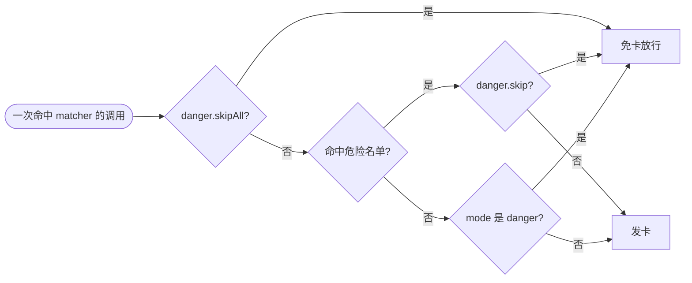
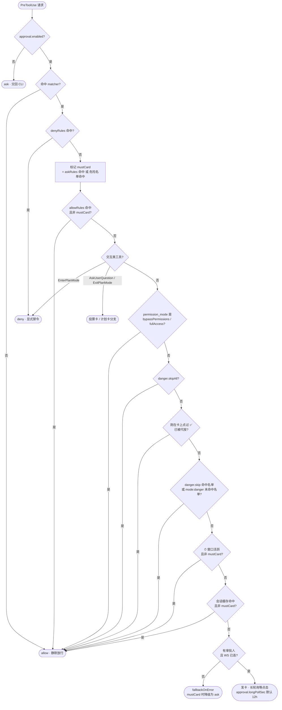

# 审批配置说明

wezard 的 PreToolUse 远程审批由 `~/.wezard/config.jsonc` 的 `approval` 段控制。本文覆盖审批粒度、各级「跳过」开关及其优先关系；完整配置项见 `config.example.jsonc`（每项带内联注释）。

## 审批粒度：`approval.mode`

| mode | 语义 | 谁会收到卡片 |
| --- | --- | --- |
| `"all"`（默认） | 每个命中 `matcher` 的工具调用都发卡 | 所有工具调用 |
| `"danger"` | 只有命中危险名单（`approval.danger`）的调用才发卡，其余静默放行 | 仅危险操作 |

`"danger"` 模式在 `danger.enabled: false`（名单关掉）时自动退回 `"all"`——否则它成了变相的全放行，与 `danger.skipAll` 语义混淆且更隐蔽。

## 跳过开关：`danger.skip` / `danger.skipAll`

`approval.danger` 下的一对布尔开关，跳过范围递增：

| 开关 | 跳过什么 | MCP key |
| --- | --- | --- |
| `danger.skip: true` | **只跳过 danger 审批**——仅命中危险名单的调用免卡放行，普通调用照审 | `danger_skip` |
| `danger.skipAll: true` | **跳过所有审批**——命中 `matcher` 的调用一律静默放行（危险名单也不审） | `danger_skip_all` |

三种「少收卡」效果的配置方式：

| 想要的效果 | 配置 |
| --- | --- |
| 只豁免命中危险名单的调用 | `danger.skip: true` |
| 跳过所有**非危险**调用（危险名单照审） | `mode: "danger"` |
| 全部跳过 | `danger.skipAll: true` |

三个开关作用在同一次调用上的分工——先看它危不危险，再看哪个开关为它开门：

图 1｜一次调用会被哪个开关放行

### `danger.skip` 细节

- 只作用于命中名单（内置 `rm` / `git push --force` / `DROP TABLE` / 敏感路径等，见 `daemon/danger.ts`）的调用；未命中的普通调用照常走审批链。
- 与 `danger.enabled: false` 的区别：关名单后完全不算命中（日志里也没有）；`skip: true` 仍会计算命中（日志 / 卡片标注 / redact 用得到），只是不再拦。
- 被 `askRules` 命中时 `skip` 失效——用户显式配的强制审批不能被 danger 开关顺带关掉。

### `danger.skipAll` 的边界

「跳过所有审批」压过：危险名单、`askRules`、⏱ 自动放行窗口、会话缓存。但以下机制**不受影响**：

- **`denyRules` 仍然拒绝**——拒绝不是审批，开关只决定「要不要发卡问人」，不解除显式禁令；
- **`EnterPlanMode` 拦截**（`blockAutoPlanMode`）仍然生效——同为 deny 语义；
- **`AskUserQuestion` 投票卡 / `ExitPlanMode` 计划卡照常发**——这两个是交互桥（把 CLI 里的提问 / 计划呈现给远程的你），不是权限闸门；`mode: "danger"` 下同样保留；
- **`.claude/**` 写守卫照常收尾**——放行时 daemon 仍会去 pane 代按 CC 的原生确认框，避免静默死锁。

`danger.skipAll` 与 `approval.enabled: false` 的区别：前者让 hook 明确回答 `allow`（CLI 不再弹任何确认）；后者回答 `ask`（wezard 不介入，退回 CLI 本地的权限系统）。

### 命中危险名单意味着什么

危险名单不只是「会发卡」，它是一组更硬的约束（`daemon/danger.ts` 头部即此清单）：

| 约束 | 说明 |
| --- | --- |
| 逐次单独审批 | 不吃 ⏱ 自动放行窗口，也不吃会话缓存——同参数重复调用仍要再点一次 |
| 不参与批量合流 | 永远独占一张卡，不会被 `✅ ×N` 聚合掉 |
| 卡上只有 ❌ / ✅ 确认执行 | 没有「⏱ 自动过」「✅总是」两颗按钮 |
| 错误时降级为 ask | `fallbackOnError: "allow"` 对它无效：超时 / 断线交回本地 CLI，绝不静默放行一次 `rm` |

同一组约束对 `askRules` 命中同样成立——两者在判定链里站在同一层，代码里合称 `mustCard`。

### 子代理 (subagent) 的审批归属

CC / CodeBuddy 的子代理（Task/Agent 工具 spawn）在内部做工具调用时同样触发 `PreToolUse` hook。两者默认把 hook 的 `session_id` 上报成**父会话** id，所以子代理工具调用天然与主会话走同一套判定链——`danger.skipAll` / 卡片 / ⏱窗口 / 会话缓存 / 规则全部适用，无需额外配置。

少数 CC 版本 / IDE 集成会上报子代理**自己**的 session id。该 id 未镜像绑定且能通过 transcript 反推出父会话时，daemon 把请求路由回父会话的 chat（hook 侧透传 `agent_id` / `agent_type`，daemon 按 `transcript_path` 反推），保证卡片发到正确会话、开关照常生效——而不是落到 `ask` 兜底变成 pane 里远程无人可点的原生确认框。

反推不到父会话、又没有审批人时，子代理请求返回 **deny + 原因**而非 `ask`：无人值守的子代理收到 `ask` 会永久挂起，deny 至少把「缺审批人」带回对话。

一个不受 wezard 约束的例外：子代理（或整个会话）被显式配置成 `bypassPermissions` / `fullAccess` 时直接放行——那是用户显式选了「全跳过」，wezard 的开关与卡片本就该不介入。

## 判定链

每一次 PreToolUse 请求按下图自上而下走，命中任一出口即返回，后续分支不再计算。八条不同理由的静默放行汇到同一个 `allow` 出口——它们的区别只在日志里的 `reason` 字段：

图 2｜PreToolUse 请求的完整判定顺序

`askRules` 与危险名单不在图里单独出现，它们在 `mustCard` 那一步合流——此后凡是带「且非 mustCard」条件的出口都对它们关闭。

卡片按钮随 `mustCard` 变化：

| 场景 | 按钮 |
| --- | --- |
| 普通调用 | `❌` · `⏱<窗口>自动过` · `✅总是`（写回 `allowRules` 并落盘） · `✅` |
| mustCard（危险名单 / `askRules`） | `❌` · `✅ 确认执行` |

窗口时长取 `approval.windowMinutes`（默认 600 分钟，按钮上渲染为 `⏱10h自动过`）。

危险名单的定制（`commandPatterns` / `toolPatterns` / `pathPatterns` / `allowPatterns`）与 `allowRules` / `denyRules` / `askRules` 的语法见 `config.example.jsonc` 内联注释。

## 运行时切换

IM 里直接对 Agent 说人话，它调 MCP `config_set`：

| 说 | 效果 |
| --- | --- |
| 「危险名单命中也放行」 | `config_set(danger_skip, "true")` |
| 「跳过所有审批」 | `config_set(danger_skip_all, "true")` |
| 「只审危险操作」 | `config_set(approval_mode, "danger")` |
| 「恢复全量审批」 | `config_set(approval_mode, "all")` |

改动落盘到 `config.jsonc` 并即时生效（内存同步更新）；`wezard reload` 后仍保持。
