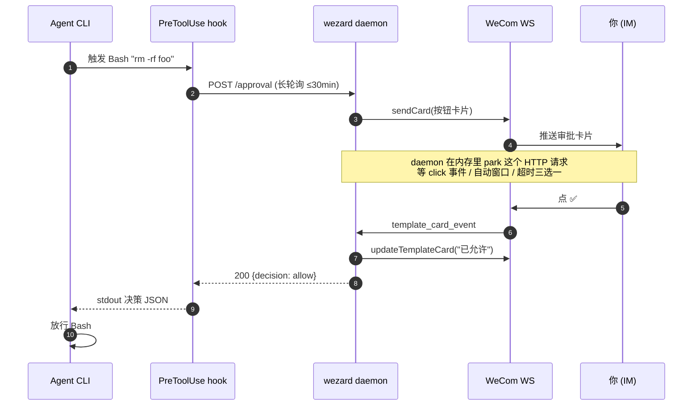
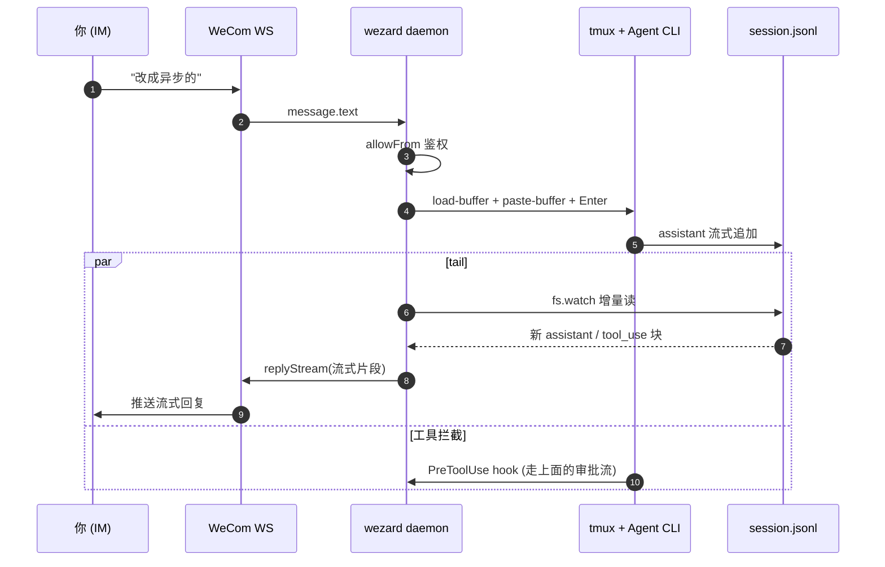
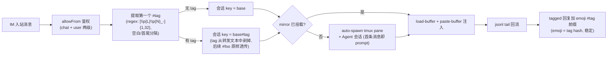
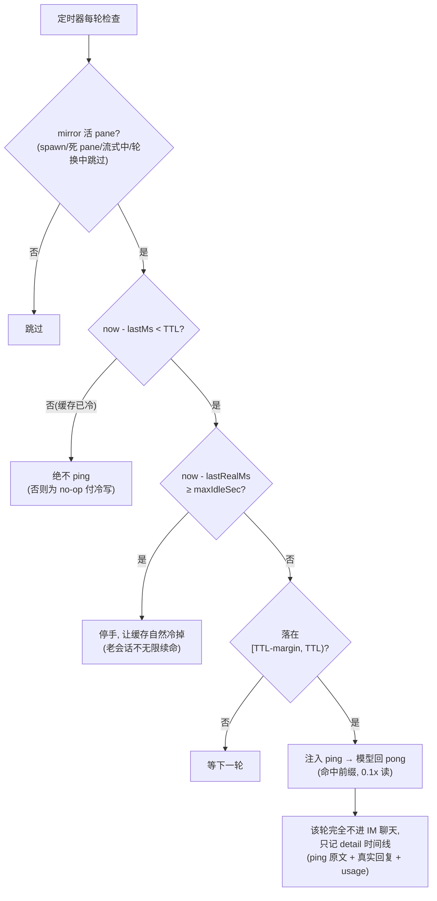

# wezard 技术说明

面向想搞清楚内部机制的读者：消息如何双向同步、多会话如何路由、保活如何省钱、文档 MCP 如何桥接、整体架构长什么样。上手用法看 [README](README.md)，安装引导看 [ONBOARDING](docs/ONBOARDING.md)，模块级职责看 [CLAUDE.md](CLAUDE.md)。

---

## 架构一瞥

三个进程走 `127.0.0.1:17890` + `~/.wezard/`：

```
 WeCom ── WebSocket ──► daemon (常驻, launchd/systemd)
                          │
                          ├── HTTP :17890 ◄── hook (pre-tool-use.sh, 长轮询)
                          ├── HTTP :17890 ◄── MCP server (Agent CLI 的 stdio 子进程)
                          └── tail jsonl + tmux paste (mirror)
```

daemon 是**唯一**持有 WeCom WS 连接的进程，hook 和 MCP 都是它的薄 HTTP 客户端。

---

## 消息是怎么同步的

**审批流**（工具调用审批都走这条）：



**镜像流**（IM ↔ tmux 双向）：



要点：
- daemon 是**唯一**和 WeCom 说话的进程，hook 和 MCP 都只是它的 HTTP 客户端
- 审批是**长轮询 + 内存 park**，没有 webhook、不依赖外网回调
- 镜像是**单向 paste + 单向 tail**：IM→tmux 走粘贴键，tmux→IM 走读 jsonl，两条管道独立、互不阻塞

---

## 多会话路由（`#tag` · 聊天命名 · 多 CLI）

一个聊天的身份是 base principal（`user:<id>` / `chat:<id>`），会话 key = base + 可选 `#tag` 后缀。路由全部发生在 daemon 侧，tmux pane 无感知：



关键规则：

- **cwd 是聊天级的**：同一聊天所有 tagged / 默认会话共用一个 cwd，`/new #foo` 在聊天绑定的 cwd 下起 pane；换项目走 `set_workspace` MCP，daemon 内部即 `setPendingCwd` + `/new` 重开路径，聊天层一步生效。
- **命名聊天打开跨群地址空间**：`/name` 之后 `fix`（本聊天优先，回退全局唯一）、`daily#fix`（指定聊天的 tag）、`daily#`（默认 wizard）、`chat:wr…#fix`（全量 key）四级都可寻址，供 `send_peer` / `spawn_clone` / `new_claude_session` 等 MCP 工具使用。未命名聊天不可寻址也不可被建入——刻意的。
- **多 CLI 并存**：会话身份就是 jsonl 路径，daemon 由路径反推写它的 CLI，`--resume` 二进制、jsonl schema、project-dir 编码全部由此派生；首次 `/new #tag` 继承本聊天基础会话的 CLI。

---

## Prompt-cache 保活（省钱心跳）

Anthropic prompt cache TTL ~5 分钟，写 1.25x、读 0.1x。pane 空闲时整份上下文掉出缓存，下一轮真实对话要按 1.25x 冷写。保活在缓存过期前注入一次极小 ping，把 TTL 往前滑。

每会话两把时钟（由 transcript 的 MESSAGE 轮时间戳驱动）：

| 时钟 | 含义 |
| --- | --- |
| `lastMs` | 最近一轮（真实或 ping）= **缓存温度**时钟 |
| `lastRealMs` | 最近一轮**真实**对话 = 真实空闲判据，ping 不刷新它 |



- **自我不续命**：ping 刷新 `lastMs` 但不刷新 `lastRealMs`，所以保活自己不会把会话判成活跃。
- **`/stop` 暂停**：Esc 打断同时挂起保活，下次真实对话自动恢复（带 grace window 防在飞 ping 自我复活）。
- **reload 不复燃**：daemon 重启后若 transcript 最后一轮是自己的 ping，锚点按「早已空闲」处理，搁置的大会话不会被重新烧热。

---

## 文档 MCP 如何桥接

`wezard` 把企业微信智能机器人的远端 MCP（doc / smartsheet / contact 等）桥接到本地 Agent，**不走 corp access_token**：daemon 直接复用 botId+secret 的 WS 长连，通过 `aibot_get_mcp_config` 命令拉到每个 category 的 Streamable HTTP MCP URL，再以 JSON-RPC 调 `tools/list` / `tools/call`，`x-openclaw-wecom-userid` header 透传文档归属人。

**前置一次性授权**：在企业微信「工作台 - 智能机器人 - 你的机器人 - 可使用权限」里勾选「文档」「智能表格」对应能力。第一次调用如果未授权，远端会返回结构化错误（errcode 851013）+ 授权链接，原样转给 Agent，照着点同意即可。

**Agent 侧自动发现**：模型先调一次 `wecom_doc_list_tools(category="doc")` 拿到工具列表（`create_doc` / `edit_doc_content` / `smartpage_create` / `upload_doc_image` ...）和入参 schema，再用 `wecom_doc_call(category, method, args)` 执行。category 当前可选：

| category | 能干嘛 |
| --- | --- |
| `doc` | 在线文档、智能文档、文档图片上传 |
| `smartsheet` | 智能表格的字段 / 记录读写 |
| `contact` | 通讯录查询（按需授权） |

**curl 验证**：

```bash
# 列 doc 类目下所有可用工具
curl -sS -X POST http://127.0.0.1:17890/wedoc/list \
  -H 'content-type: application/json' \
  -d '{"category":"doc"}'

# 创建一篇文档
curl -sS -X POST http://127.0.0.1:17890/wedoc/call \
  -H 'content-type: application/json' \
  -d '{"category":"doc","method":"create_doc","args":{"doc_type":3,"doc_name":"demo"}}'

# 写入 Markdown
curl -sS -X POST http://127.0.0.1:17890/wedoc/call \
  -H 'content-type: application/json' \
  -d '{"category":"doc","method":"edit_doc_content",
       "args":{"docid":"<返回的 docid>","content_type":1,"content":"# 标题\n正文"}}'

# 授权变更后清缓存
curl -sS -X POST http://127.0.0.1:17890/wedoc/invalidate -H 'content-type: application/json' -d '{}'
```

`requesterUserId` 解析顺序：调用方显式传入 → `defaultChat` 的 `user:<id>` 部分 → 不传（远端会拒，错误原样回到 Agent，比 daemon 提前判更透明）。
