# wezard 技术说明

面向想搞清楚内部机制的读者：消息如何双向同步、`.name` 如何路由、公开频道与私聊怎么分、管家如何分派、wizard 之间如何编排与收回执、顶层模式管住了什么、rolepage 怎么从 turn 记录折出一个 wizard 的 IM、缓存冷热如何判、文档 MCP 如何桥接、整体架构长什么样。上手用法看 [README](README.md)，审批粒度看 [审批配置](审批配置.md)，模块级职责看 [CLAUDE.md](CLAUDE.md)。

---

## 架构一瞥

三个进程走 `127.0.0.1:17890` + `~/.wezard/`。daemon 是**唯一**持有 WeCom WS 连接的进程，hook 和 MCP 都是它的薄 HTTP 客户端：

图 1｜三进程与它们之间的四条通路

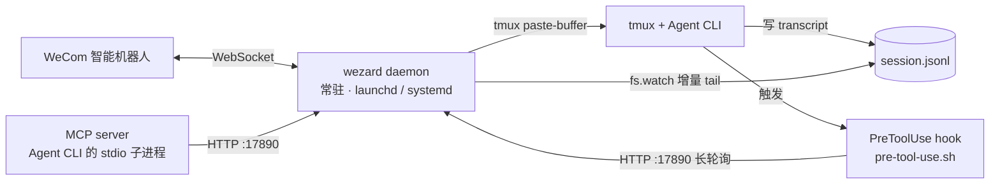
```mermaid
flowchart LR
    wecom["WeCom 智能机器人"] <-- WebSocket --> daemon["wezard daemon<br/>常驻 · launchd / systemd"]
    hook["PreToolUse hook<br/>pre-tool-use.sh"] -- "HTTP :17890 长轮询" --> daemon
    mcp["MCP server<br/>Agent CLI 的 stdio 子进程"] -- "HTTP :17890" --> daemon
    daemon -- "tmux paste-buffer" --> cli["tmux + Agent CLI"]
    cli -- "写 transcript" --> jsonl[("session.jsonl")]
    daemon -- "fs.watch 增量 tail" --> jsonl
    cli -- 触发 --> hook
```

---

## 消息是怎么同步的

**审批流**（工具调用审批都走这条）。hook 的 curl `--max-time` 必须严格大于 `longPollSec`，否则人还没点、hook 已经自己回了 `ask`：

图 2｜一次工具调用从阻塞到放行

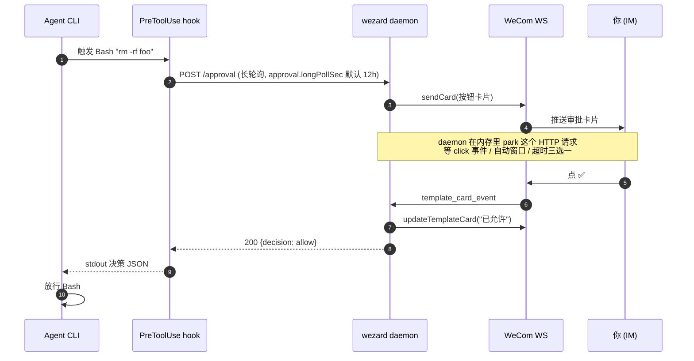
```mermaid
sequenceDiagram
    autonumber
    participant CC as Agent CLI
    participant Hook as PreToolUse hook
    participant D as wezard daemon
    participant WS as WeCom WS
    participant U as 你 (IM)

    CC->>Hook: 触发 Bash "rm -rf foo"
    Hook->>D: POST /approval (长轮询, approval.longPollSec 默认 12h)
    D->>WS: sendCard(按钮卡片)
    WS->>U: 推送审批卡片
    Note over D,U: daemon 在内存里 park 这个 HTTP 请求<br/>等 click 事件 / 自动窗口 / 超时三选一
    U->>WS: 点 ✅
    WS->>D: template_card_event
    D->>WS: updateTemplateCard("已允许")
    D-->>Hook: 200 {decision: allow}
    Hook-->>CC: stdout 决策 JSON
    CC->>CC: 放行 Bash
```

**镜像流**（IM ↔ tmux 双向）：

图 3｜一条 IM 消息进 CLI、再流式回到 IM

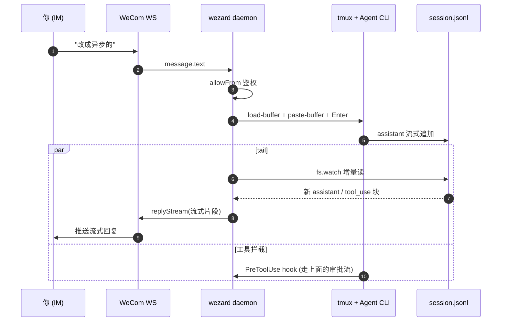
```mermaid
sequenceDiagram
    autonumber
    participant U as 你 (IM)
    participant WS as WeCom WS
    participant D as wezard daemon
    participant T as tmux + Agent CLI
    participant J as session.jsonl

    U->>WS: "改成异步的"
    WS->>D: message.text
    D->>D: allowFrom 鉴权
    D->>T: load-buffer + paste-buffer + Enter
    T->>J: assistant 流式追加
    par tail
        D->>J: fs.watch 增量读
        J-->>D: 新 assistant / tool_use 块
        D->>WS: replyStream(流式片段)
        WS->>U: 推送流式回复
    and 工具拦截
        T->>D: PreToolUse hook (走上面的审批流)
    end
```

两条流的共同要点：

- 审批是**长轮询 + 内存 park**，没有 webhook、不依赖外网回调；
- 镜像是**单向 paste + 单向 tail**：IM→tmux 走粘贴键，tmux→IM 走读 jsonl，两条管道独立、互不阻塞。

---

## 多会话路由（`.name` · 频道 · 聊天命名 · 多 CLI）

一个 wizard 有两个身份，各管一件事：

| | 形态 | 管什么 |
| --- | --- | --- |
| **会话 key** | `user:<id>` / `chat:<id>` + 可选 `#slot` | 内部路由与落盘：pane、jsonl、cwd 都挂在它上面。base 部分就是它的 **home 群** |
| **名字** | `.name`，全局唯一，存在 `wizards.json` | 人和模型看得见、写得出的唯一地址 |

默认会话（无 slot）的名字取聊天名，其余取 slot id；撞名由 `pickName` 加 `-N`（大小写不敏感）。名字惰性落定——`settleName` 在第一次被问到时 claim，`settleAll` 在 boot 时按「默认会话先挑、其余按出生先后」把名册一次补齐，老记录（名字还跟着聊天走的那一代）就在这里迁完。**改名只改名册，不动 key**：pane、jsonl、历史都不受影响。

路由全部发生在 daemon 侧，tmux pane 无感知：

图 4｜一条入站消息如何落到某一个 wizard

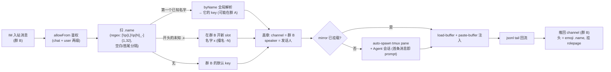
```mermaid
flowchart LR
    msg["IM 入站消息<br/>(群 B)"] --> auth["allowFrom 鉴权<br/>(chat + user 两级)"]
    auth --> scan["扫 .name<br/>(regex: [\\p{L}\\p{N}_-]{1,32},<br/>空白/首尾分隔)"]
    scan -- "第一个已知名字" --> byname["byName 全局解析<br/>→ 它的 key (可能在群 A)"]
    scan -- "开头的未知 .x" --> fresh["在群 B 开新 slot<br/>名字 x (撞名 -N)"]
    scan -- "无" --> base["群 B 的默认 key"]
    byname --> stamp["盖章: channel = 群 B<br/>speaker = 发话人"]
    fresh --> stamp
    base --> stamp
    stamp --> exist{"mirror 已挂载?"}
    exist -- 否 --> spawn["auto-spawn tmux pane<br/>+ Agent 会话 (首条消息即 prompt)"]
    exist -- 是 --> paste["load-buffer + paste-buffer 注入"]
    spawn --> paste
    paste --> tail["jsonl tail 回流"]
    tail --> label["推回 channel (群 B)<br/>头 = emoji .name, 挂 rolepage"]
```

关键规则：

- **名字全局可达，回复回发话群**：人在群 B 里 `.fix`，而 `.fix` 的 home 是群 A——本轮 `recordTurnStart` 记下 `channel = 群 B`，回复（流式 / standalone）连同本轮的审批卡、提问卡都推回群 B。在 home 群说话照旧，`channel` 就是 home。
- **只有开头的未知名字会造人**：句中一个没人叫的 `.x`（`a.ts`、`.gitignore`）原样透传，只有消息开头的那个才在本聊天开一个新 slot。本聊天同名的老 slot 还活着就复用它；被一个改了名的冷 wizard 占着就挪到 `slot-N`，不唤醒别人。
- **引用即路由**：出站气泡的头 `emoji .name`（或 rolepage 链接形态 `[emoji .name](url)`）由 `parseTagHeader` 反解，引用一条气泡 = 跟那个 wizard 说话。改名前发出去的 `#tag` 头仍被认，解析不到名字时退回本聊天同名 slot。
- **cwd 是聊天级的**：同一聊天（home）里的所有会话共用一个 cwd；换项目走 `set_workspace` MCP，daemon 内部即 `setPendingCwd` + `/new` 重开路径，聊天层一步生效。
- **聊天名是另一层地址**：`notify` 往哪个群发、`spawn_wizard({detached:true, chat})` 把 home 设在哪个群，写的是聊天名；它同时是这个群默认 wizard 的名字——人 `/name` 改聊天名时默认 wizard 一并改名，tmux 窗口名跟着换。没名字的聊天按工作区末段自动补一个（`~/develop/Guxi11/weclaude` → `weclaude`，撞名加序号），补名点是「要把名字交给模型」的那一刻——各 MCP 路由的收件解析，以及**渲染 charter 时**：系统提示随进程终身，一个在聊天还没名字时出生的 wizard 会一辈子以为自己住在「(未命名)」的地方。只填空，永不覆盖人起过的名字。
- **多 CLI 并存**：会话身份就是 jsonl 路径，daemon 由路径反推写它的 CLI，`--resume` 二进制、jsonl schema、project-dir 编码全部由此派生；新叫出的 `.name` 继承本聊天基础会话的 CLI。

---

## wizard 网络：身份、感知、分派、编排

一个绑定了聊天的会话就是一个 **wizard**。它要协作，就得知道自己是谁、记得住跨会话的东西、知道网络里还有谁，还要有一套把活分出去再收回来的原语。每样各有各的通路，共同的约束只有一条——**不许多花轮次**：身份走系统提示，名册变动搭顺风车，回执作为新的一轮自己回来，没有一样是靠「先问一句」换来的。

| 小节 | 解决的问题 | 落在哪 |
| --- | --- | --- |
| [身份](#身份系统提示不是聊天记录) | 它是谁，`/clear` 之后还记不记得 | `wizard.ts` |
| [记忆](#记忆三个作用域共享的那两份只有一个写入者) | 跨会话、跨 wizard 共享的那些约定 | `wizard-memory.ts` · `memory-steward.ts` |
| [分身](#分身fork-上下文不是新开一个) | 公共材料读一遍，分出 N 路 | `mirror-bridge.ts` |
| [感知](#感知快照--增量) | 名册只会越来越假 | `notices.ts` · `peers.ts` |
| [分派](#分派默认-wizard-是这个群的管家) | 没点名的活该给谁、用哪一档模型 | `route.ts` · `steward-guard.ts` |
| [编排](#编排控制流留在发起方) | 一次 fan-out 的账本、验收与回收 | `jobs.ts` · `graph.ts` |
| [回执](#回执问完就走答案自己回来) | 派完活不必阻塞着等 | `receipts.ts` · `idle-nudge.ts` · `pending-items.ts` |
| [交接](#交接换会话不换身份) | 上下文大了怎么原地重开 | `handoff.ts` |

### 身份：系统提示，不是聊天记录

身份（全局名字、工作区、职责、记忆、家谱、工具清单、编排剧本、公开与私聊的规矩）由 `wizard.ts` 的 `renderCharter` 从注册表渲染，`spawn-tmux` 以 `--append-system-prompt "$(cat <file>)"` 压进进程。于是它**随进程终身有效**：`/clear` 抹不掉、不占一轮对话、群里看不见。注册表本身是一份写穿 json（`~/.wezard/wizards.json`），由 `bindWizardStore` 绑成进程内单例，IM 侧的 `/peers` 也读得到。

图 5｜charter 走系统提示通道，与对话上下文互不相干

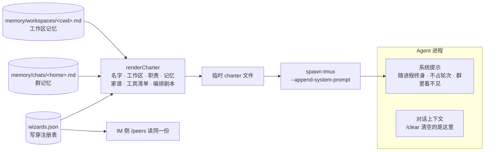
```mermaid
flowchart LR
    reg[("wizards.json<br/>写穿注册表")] --> render["renderCharter<br/>名字 · 工作区 · 职责 · 记忆<br/>家谱 · 工具清单 · 编排剧本"]
    cm[("memory/chats/&lt;home&gt;.md<br/>群记忆")] --> render
    wm[("memory/workspaces/&lt;cwd&gt;.md<br/>工作区记忆")] --> render
    render --> file["临时 charter 文件"]
    file --> spawn["spawn-tmux<br/>--append-system-prompt"]
    reg --> peers["IM 侧 /peers 读同一份"]
    subgraph proc["Agent 进程"]
        sys["系统提示<br/>随进程终身 · 不占轮次 · 群里看不见"]
        ctx["对话上下文<br/>/clear 清空的是这里"]
    end
    spawn --> sys
```

没有 `--append-system-prompt` 的后端（codebuddy）宁可不带 charter，也不带一个会被拒的参数。

### 记忆：三个作用域，共享的那两份只有一个写入者

`wizard_remember({scope})` 写三种记忆，区别不在存哪儿，而在**谁能写**：

| scope | 存在哪 | 生效 |
| --- | --- | --- |
| `self`（默认） | 它自己的名册记录（`wizards.json`） | 当场 |
| `chat` | `~/.wezard/memory/chats/<home>.md` | 提议，等整理者合并 |
| `workspace` | `~/.wezard/memory/workspaces/<cwd 编码>.md` | 提议，等整理者合并 |

自己的记忆跟着自己走，直写即可。可很多东西不属于某一个 wizard——「这个群里人习惯先出方案再动手」属于这个群，「这个仓库没有测试、reload 要先 build」属于这个工作区。这两份是**共享**的 markdown，任何以那个群为 home、或在那个目录下出生的 wizard 都把它们读进 charter，于是新来的不必被人再教一遍。是 md 而不是 json：人也会直接打开改。

共享的那两份**不直写**。`wizard_remember({scope})` 只往同名收件箱（`memory/inbox/<chats|workspaces>/<key>.jsonl`）追加一行 json 提议（`{at, by, note?, forget?}`）——一行一条、追加写，几十个 wizard 并发投也不会互相覆盖。直接追加的老路在几十个 wizard 同写一份文件时只会越来越长、互相矛盾，而每个新 wizard 出生都要把它整份吃下。

图 6｜共享记忆的单写入者：提议进收件箱，整理者合并进 md

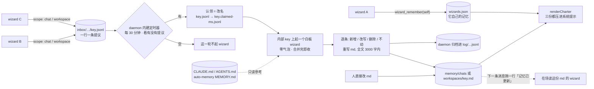
```mermaid
flowchart LR
    w1["wizard A"] -- "wizard_remember(self)" --> reg[("wizards.json<br/>它自己的记忆")]
    w2["wizard B"] -- "scope: chat / workspace" --> inbox[("inbox/…/key.jsonl<br/>一行一条提议")]
    w3["wizard C"] -- "scope: chat / workspace" --> inbox
    inbox --> gate{"daemon 内建定时器<br/>每 30 分钟 · 看有没有提议"}
    gate -- "空" --> skip["这一轮不起 wizard"]
    gate -- "有" --> claim["认领 = 改名<br/>key.jsonl → key.claimed-ms.jsonl"]
    claim --> fresh["内部 key 上起一个白板 wizard<br/>零气泡 · 合并完即收"]
    refs[("CLAUDE.md / AGENTS.md<br/>auto-memory MEMORY.md")] -. 只读参考 .-> fresh
    fresh --> merge["逐条: 新增 / 改写 / 删除 / 不动<br/>重写 md, 全文 3000 字内"]
    merge --> md[("memory/chats 或 workspaces/key.md")]
    merge --> arch[("daemon 归档进 log/…jsonl")]
    md -. "下一条消息捎一行「记忆已更新」" .-> live["在场读这份 md 的 wizard"]
    human["人直接改 md"] --> md
    reg --> charter["renderCharter<br/>三份都压进系统提示"]
    md --> charter
```

**整理者既不是常驻 wizard，也不是一条定时任务**，是 daemon 的内建定时器（`memory-steward.ts`，每 30 分钟，开机后 1 分钟先跑一轮）。它看收件箱有没有提议，有才在一个**不属于任何聊天**的内部 key 上起一个白板 wizard 去合并，合并完即收。整理不放进管家的上下文——管家的上下文只留给名册和分派；这是 Letta 把 sleep-time agent 与主 agent 分开的同一个理由：在线的那个不该被后台活拖慢。不走 `tasks.ts` 是因为它不是谁排的日程：任务会出现在 `list_tasks` 和日程里、放枪要发 ⏰ 气泡、执行体住在某个群里，而整理是 daemon 自己的家务，不该惊动任何群——全程零气泡，结果只留在执行体的 rolepage 和审计日志里。老版本写下的 `memory-steward.task.mjs` 开机时改名为 `.retired` 停用，免得两路并跑。

- **认领 = 改名**（`x.jsonl` → `x.claimed-<ms>.jsonl`）：认领之后新来的提议落进一个新的 `x.jsonl` 等下一轮，不会和正在合并的那批搅在一起。整理者中途死掉留下的认领超过一小时再认一次——按**文件名里的时刻**判，不按 mtime（改名不动 mtime）。
- **合并规则**：逐条决定新增 / 改写（新的更准，或推翻了旧的）/ 删除（`forget` 命中，或已被推翻、过时）/ 不动（重复、只是某次任务的临时状态，或参考文件里已经写了）；重写 md，每条一行，相近的合并，全文 3000 字以内，人手写的内容与格式保留。收工后由 daemon 把收件箱归档进 `log/` 再删——执行体只动 md。
- **参考源只读**：该工作区的 `CLAUDE.md` / `CODEBUDDY.md` / `AGENTS.md` / `.claude/CLAUDE.md` 与各 backend 的 auto-memory `MEMORY.md` 一并交给执行体。已写在那里的不再收；与之矛盾的提议不进 md，记作冲突——参考文件是人写的，优先。workspace 提议记下 `cwd`，提议者收工后仍找得到参考源。
- **合并后告诉在场的**：宪章是出生快照，改了 md 活着的 wizard 也看不到。真有改动时，pane 活着且读这份 md 的 wizard 下一条消息尾巴上捎一行「记忆已更新，全文见 …」。
- **宪章里每份共享记忆截到 4000 字**（`CHARTER_MEMORY_MAX`），超了只截头并指路全文——压短是整理者的活，不是渲染器的。

读写失败一律吞掉：记忆是锦上添花，读不到就当没有，写不进就回报失败，都不该拖垮一次 spawn。

### 分身：fork 上下文，不是新开一个

`MirrorBridge.cloneSession` 走 `--resume <父 sid> --fork-session`：CLI 把父亲的 transcript 复制一份再往下写，孩子开局就带着父亲读过的一切，父亲毫发无损。**「公共材料读一遍，再分出 N 路」靠的就是这个。** 两条不变式：

- `--fork-session` 是强制的——少了它，第二个 pane 会追加进父亲的 jsonl，两个聊天当场串线；
- fork 出来的 transcript 只在那个 pane **收到第一条消息**时才出现，所以分身的开场白就是触发器，attach 会等这个 fork；等不到就杀掉 pane，绝不退而绑到父亲的 sid 上。

图 7｜带与不带 `--fork-session` 的分歧

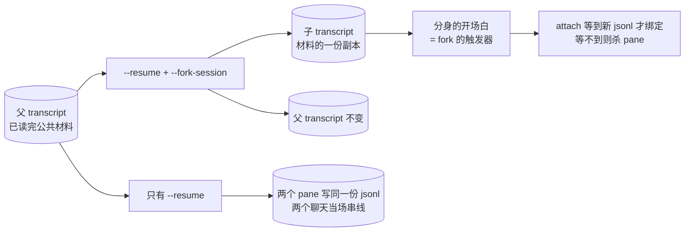
```mermaid
flowchart LR
    parent[("父 transcript<br/>已读完公共材料")]
    parent --> ok["--resume + --fork-session"]
    parent --> bad["只有 --resume"]
    ok --> child[("子 transcript<br/>材料的一份副本")]
    ok --> keep[("父 transcript 不变")]
    child --> first["分身的开场白<br/>= fork 的触发器"]
    first --> attach["attach 等到新 jsonl 才绑定<br/>等不到则杀 pane"]
    bad --> cross[("两个 pane 写同一份 jsonl<br/>两个聊天当场串线")]
```

### 感知：快照 + 增量

charter 里那份名册是 spawn 那一刻的快照，只会越来越假；而「每次协作前先查一次名册」要花一轮，于是实际上没人查。所以补上另一半：

图 8｜名册变动怎么搭顺风车进到别人耳朵里

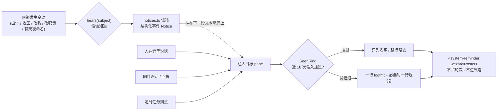
```mermaid
flowchart LR
    ev["网络发生变动<br/>(出生 / 收工 / 改名 / 改职责 / 聊天被命名)"] --> hears{"hears(subject)<br/>谁该知道"}
    hears --> box["notices.ts 信箱<br/>结构化事件 Notice"]
    box -.挂在下一段文本尾巴上.-> inj
    human["人在群里说话"] --> inj["注入目标 pane"]
    peer["同伴派活 / 回执"] --> inj
    cron["定时任务到点"] --> inj
    inj --> seen{"SeenRing<br/>近 10 次注入挂过?"}
    seen -- "挂过" --> short["只列名字 / 整行略去"]
    seen -- "没挂过" --> full["一行 logfmt + 必要时一行规矩"]
    short --> sr["&lt;system-reminder wezard=roster&gt;<br/>不占轮次 · 不进气泡"]
    full --> sr
```

- **事件是结构化的**（`Notice`），渲染成一行 logfmt：`born .x by=.p clone job=… cwd=…` / `ended` / `renamed` / `job` / `chat` / `note`。工作区与收件人相同就不提；两次注入之间生了又收掉的净值为零不报；同一位收掉的一批分身并成一行 `ended .a .b .c …(+N) by=.p`。
- **谁该知道**由纯函数 `hears(subject)` 按注册表定：没有 parent 且写了职责的长住 wizard，告诉同群全体；有 parent 的只告诉 parent 与它所在的、还开着的工单的发起人，不上溯家谱；既无 parent 也没写职责的（还没自我介绍的会话）谁也不告诉，写下职责那一刻才算登场。回归测试那一批临时分身因此不再刷别人。
- **去重窗口**：每个 pane 记着「近 10 次注入挂过哪些提示」（`SeenRing`，落盘 `~/.wezard/notice-seen.json` 扛 reload；换 sid、`/clear`、压缩、新宪章即清零）。窗口里介绍过的 wizard 只列名字，同一行变动不再重复，每段的使用规矩只在窗口里没给过时挂一行。一条点名 + 十几行分身生收的尾巴由约 810 tok 压到约 125 tok。
- **群况快照**（`mode="full"`）：只报变动的话，管家和长住 wizard 几乎收不到什么。所以长住 wizard（没有 parent 的）在近 10 次注入里没拿到过群况时，尾巴上挂一份 CSV 群况表 `name,state,job`——管家、长住有职责的、管家生的、收件人自己生的；忙闲取注册表，不抓 pane。交接 / `/clear` 后的头一条必带。
- **点名**（`wezard="mention"`）：消息里点到的 `.x` 每个一行 `.x job=… [chat=…] [cwd=…]`，窗口内再点同一个只剩名字。
- **挂起事项**（`wezard="pending"`，只给管家）：见[回执](#回执问完就走答案自己回来)一节的挂起事项表。

每条 reminder 的事实都写在开标签属性上（`wezard=envelope|mention|roster|pending`、`kind` / `from` / `chat` / `scope`），正文只给模型读——改措辞不会破坏解析（`shared/reminder.ts` 的 `parseEnvelope`）。投递即清空信箱：那一次注入失败这几行就丢了。通知是提示，真相永远可以 `wizard_roster` 问到——为一行提示做可靠投递不值当。

`wizard_roster` 自己则是一张**索引**而不是一份转储：服务端按 `query`（名字/职责/地址子串）、`cwd`（工作区反查）、`chat`、`alive` 过滤，默认只回最相关的一页（自己 → 活着的 → 最近动过的），附 `total` / `matched` / `more` 让调用方知道自己看的是不是全部。三百个会话一次吐出来，等于找不到人。

### 分派：默认 wizard 是这个群的管家

聊天的默认会话（`WizardBrief.steward`）是这个群的**管家**：人没点名说的话都落到它这儿，点了 `.name` 的直达那个 wizard，不经过它。`renderCharter` 只给它多压一段「我是这个群的管家」，所以管家不是另一种进程，只是多了一段职责。

它的活是**分派**，不是亲手干——上下文留给名册和来龙去脉，别被大段代码和文件塞满。一两句能答完的（问进度、问谁在干什么、闲聊）自己答；要读很多代码、改文件、跑很久的活，哪怕它自己做得了也转出去：它一忙，这个群里没点名的话就都排在它后面。

主路径是一步 `dispatch({task, name, description})`：查候选 → 给默认决定 → 以管家的名义 `tell_peer` 投出去，回包写明决定、理由、件号与落到的模型。管家照办，或显式推翻——`to` 点名、`spawn:true` 硬要新的、`force` 越过冷门控、`tier` 换档。只想看证据自己判断时调 `route_candidates({task})`，拿到的是同一张表。

**`route.ts` 把这件事拆成能算的事实与必须判断的权衡。** 候选表只摆事实；`decide` 再把同一套事实收成一个默认决定——管家判断失准也不至于派错的那一半。

图 9｜候选表算到哪一步为止，剩下的交给管家

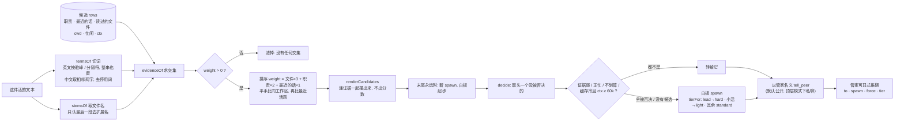
```mermaid
flowchart LR
    task["这件活的文本"] --> terms["termsOf 切词<br/>英文按驼峰 / 分隔符, 整串也留<br/>中文取相邻两字, 去停用词"]
    task --> stems["stemsOf 取文件名<br/>只认最后一段去扩展名"]
    rows[("候选 rows<br/>职责 · 最近的话 · 读过的文件<br/>cwd · 忙闲 · ctx")] --> ev["evidenceOf 求交集"]
    terms --> ev
    stems --> ev
    ev --> filt{"weight &gt; 0 ?"}
    filt -- "否" --> drop["滤掉: 没有任何交集"]
    filt -- "是" --> sort["排序 weight = 文件×3 + 职责×2 + 最近的话×1<br/>平手比同工作区, 再比最近活跃"]
    sort --> render["renderCandidates<br/>连证据一起摆出来, 不出分数"]
    render --> last["末尾永远附: 新 spawn, 白板起步"]
    last --> decide["decide: 取头一个没被否决的"]
    decide --> veto{"证据弱 / 正忙 / 不划算 /<br/>缓存冷且 ctx ≥ 60k ?"}
    veto -- "都不是" --> exist["转给它"]
    veto -- "全被否决 / 没有候选" --> spawn["白板 spawn<br/>tierFor: lead→hard · 小活→light · 其余 standard"]
    exist --> tell["以管家名义 tell_peer<br/>(默认公开, 顶层模式下私聊)"]
    spawn --> tell
    tell --> judge["管家可显式推翻<br/>to · spawn · force · tier"]
```

- **能算的**：职责 / 最近的话与这件活的词面交集；它上下文里读过的文件被这件活点到；在不在同一个工作区、忙不忙、`ctx` 多大、缓存冷没冷。
- **文件只认整个文件名被点到**：目录名（`daemon/`、`web/`）几乎每个文件都带，文件名里的半截词（`role-render` 的 `render`）又太常见——撞上它们说明不了它读过这一个。
- **排序只是让最有证据的先被看到**：文件命中（它真读过）> 职责 > 最近的话，同工作区只用来打破平手。权重为 0 的直接滤掉。
- **每个候选附一行代价**：缓存冷热（TTL 读自它 transcript 实际写入的档位，起点是最近一次请求的开始，见[保活](#prompt-cache-保活省钱心跳)）、唤醒要重写多少缓存（对比白板 spawn 起步约 25k 的倍数）、往后每轮背着的 ctx。证据弱又贵（缓存冷且 ctx ≥60k，或热但 ≥150k）的标 ⚠「不划算，建议白板 spawn」；看着是小活（一句话 / 样式 / 单点修改 / 简单查询）的表头点明。
- **末尾永远留着「新 spawn」**：它是没有好候选时的默认，所以表空了也不必特判。

`decide` 的否决按顺序判：**证据弱**（没读过点到的文件，职责也没撞上两个以上的词）→ **正忙** → **不划算**（上一条的 ⚠）→ **缓存冷且 ctx ≥60k**（`force` 可越过）。头一个没被否决的就是它；全被否决就白板 spawn，理由里写前几个为什么不行。spawn 的默认档由 `tierFor` 定，两头的 `mini` / `ultra` 只由调用方显式给。

留给管家的恰好是算不出来的那两件，推翻默认决定时用得上：

| 判断 | 依据 |
| --- | --- |
| **相关性** | 表里的交集是不是真的同一件事。字面沾边不算；文件命中比词面重叠可信。 |
| **接着用这段上下文划不划算** | 收益是它省掉的重读（要重读的材料越多越划算）；代价是唤醒时的缓存重写，以及 `ctx` 越大往后每一轮都背着整段历史——更贵、更慢、更容易被旧话题带偏、离交接越近。 |

**冷门控**：这笔账不只管家要算。任何 `tell_peer` 派新活（`kind:"task"`、不带 `re`、`priority` 不是 `now`）给缓存已冷且 ctx ≥100k 的 wizard，守护进程先不投，409 退回一行「`.x` 冷 · ctx Nk · 唤醒约等于白板 spawn 的 M 倍」；真依赖它的上下文就带 `force:true` 重发。冷热与倍数与候选表同一把尺（`wakeCostOf`）。

**档位**（`models.tiers`，由轻到重）：

| 档 | 缺省 | 用途 |
| --- | --- | --- |
| `mini` | haiku · low | 机械一步，照单执行 |
| `light` | haiku · low | 跑腿：查找、搬运、跑命令 |
| `standard` | sonnet · medium | 常规实现 |
| `hard` | opus · high | 要判断：设计、排障、审查 |
| `ultra` | opus · max | 最难的架构取舍、疑难排障、关键评审 |

`spawn_wizard` / `clone_wizard` / `dispatch` 都收 `tier`，显式给的 model / effort / cli 压过档位，返回里每项写明来源（`explicit` / `tier` / `inherit`）。模型名能确切对上本机 transcript 里真答过的 id 时直接 `--model <id> --effort <档>` 启动，省掉 `/model` 选择器那一来回；档位记进绑定，死 pane 重生、`/new`、交接重开都沿用。克隆换不了 CLI，档里的 `cli` 被忽略。管家用 `models.steward` 指的那一档（缺省 `light`，按群用 `chatPolicy.<chat>.steward` 覆盖）：首条消息、`/new`、换目录、交接重开都按它起，死 pane 重生只在绑定没记模型时补上；已在跑的管家不动（换模型会让缓存整份重读），要换上就 `handoff` 或 `set_model`。

**复杂的活交给 lead**。要 coder + reviewer、来回几轮的，管家 `dispatch({lead:true, criteria})` 开一张需求根单交给一个 `hard` 档的 lead；直接拆给多个 wizard 只限彼此独立、不同领域的子活。lead 的打法（开工单、coder 按需 clone / spawn、reviewer 必须白板 `hard` 起步不带作者上下文、打回与收队的时机）由 `renderLeadPlaybook` 随派活信封带过去，不进出生宪章。层级规矩见[编排](#编排控制流留在发起方)。

**手闸**（`steward-guard.ts`）：宪章说分派，管家实际上常常自己埋头干——一忙，群里没点名的话就全排在它后面。守护进程在 PreToolUse 判定链的最前面拦它（排在 matcher、allowRules、⏱ 窗口、`skipAll` 之前，拦的不是危险而是越位）：`Edit` / `Write` / `MultiEdit` / `NotebookEdit` / `Agent` / `Task` 一律拒；读、搜、跑命令每轮最多 `chatPolicy.<群>.stewardBudget` 次（缺省 4，`-1` = 关），超了拒；wezard MCP 与 ToolSearch 这类元工具不计。deny 的 reason 直接写改道说明：去 `dispatch`。

### 编排：控制流留在发起方

两端早就有了——`tell_peer` 是手工点对点，`run_agent_graph` 是预先声明好的静态循环（`graph.ts`，步进式注入 + 等空闲 + 把回复喂给下一步，`until` 哨兵提前收敛；run 只活在内存里，reload 即丢；默认工具面已不注册，`WEZARD_MCP_EXTRA=1` 挂回来）。中间空着的是「读完材料才知道要分几路」。

补上的几件遵循同一条取舍：**控制流留在发起的那个 wizard 的上下文里，守护进程只做账本与执行器。** graph 把控制流搬进了 daemon，代价就是 run 撑不过一次 reload；账本（`jobs.ts` → `~/.wezard/jobs.json`）是死数据，落盘即可，而控制流留在 wizard 那边，重启后它重试一次就接上了。

图 10｜一次 fan-out：过程全在账本里，群里只有发起者最后那一句

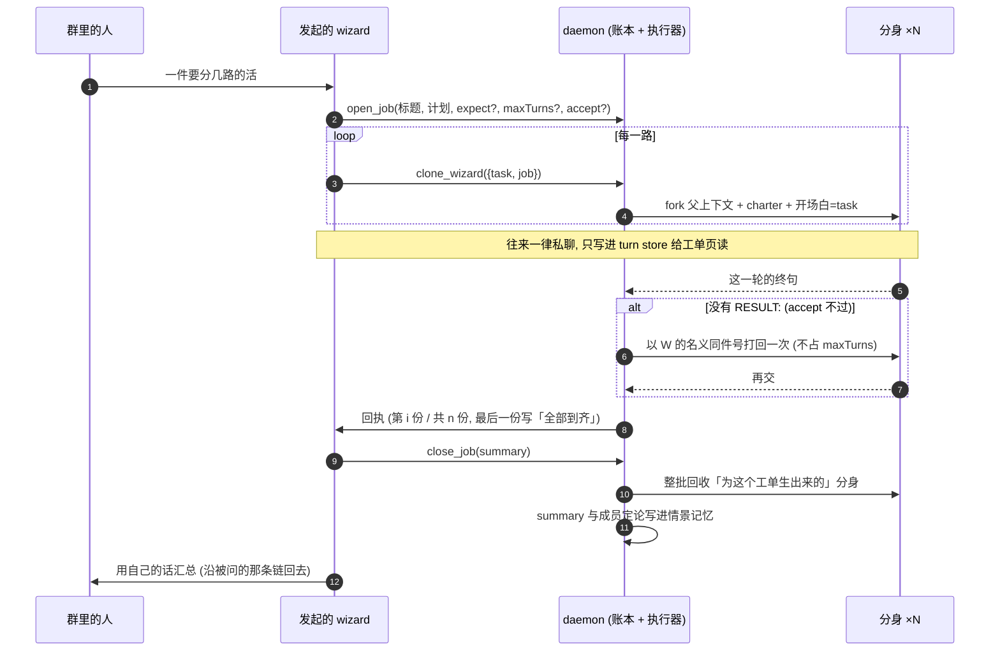
```mermaid
sequenceDiagram
    autonumber
    participant U as 群里的人
    participant W as 发起的 wizard
    participant D as daemon (账本 + 执行器)
    participant K as 分身 ×N

    U->>W: 一件要分几路的活
    W->>D: open_job(标题, 计划, expect?, maxTurns?, accept?)
    loop 每一路
        W->>D: clone_wizard({task, job})
        D->>K: fork 父上下文 + charter + 开场白=task
    end
    Note over W,K: 往来一律私聊, 只写进 turn store 给工单页读
    K-->>D: 这一轮的终句
    alt 没有 RESULT: (accept 不过)
        D->>K: 以 W 的名义同件号打回一次 (不占 maxTurns)
        K-->>D: 再交
    end
    D->>W: 回执 (第 i 份 / 共 n 份, 最后一份写「全部到齐」)
    W->>D: close_job(summary)
    D->>K: 整批回收「为这个工单生出来的」分身
    D->>D: summary 与成员定论写进情景记忆
    W->>U: 用自己的话汇总 (沿被问的那条链回去)
```

| 原语 | 不这么做会怎样 |
| --- | --- |
| 工单 `open_job` / `close_job` / `list_jobs` | 没人记得回收分身，而每个分身都占一个 pane 加一份上下文。被拉来帮忙的长期 wizard 与调用方自己**不在**回收之列。工单整个不进群：开工、收工都不发气泡，带 `job` 的 `tell_peer` 一律私聊——人读不懂过程，只该看到结论。 |
| 成员定论（`JobMember.outcome`） | 份数若按回执槽数，同一对 wizard 后一句话会顶掉前一份，「全部到齐」提前报出。现在每个成员的回执落终态时写一次定论，done / total 由守护进程按成员数，`expect` 给分批派的定下限。 |
| 验收 `accept`（`result` 默认 / `artifact` / `none`） | 成员最后一条可能是「好的我开始了」，也可能是八百字散文。没写 `RESULT:`（或要求列 `ARTIFACT:` 却没列）的那份不投、不计数，守护进程以发起者名义同件号打回一次；再交上来的照收。 |
| 派活预算 `maxTurns` | NEED 乒乓、续问兜圈没有自然终点。带这张工单的每次 `tell_peer`（含 `re`）与带 task 的 spawn / clone 各记一次，用完再派 409。 |
| `wait_peer({names, need})` | 有了[回执](#回执问完就走答案自己回来)之后只用在「这一轮非得拿到答案才能往下走」的 join 上，平时让结论自己回来。法定人数一满，剩下的等待立刻撤掉。 |
| `cloneMax` / `JOB_MEMBER_MAX`（5） | 分身能递归生分身，一次跑飞的编排足以把 fd 吃光（见 launchd plist 的 `NumberOfFiles`）。撞上限的回执直接说该怎么办：把一块子活交给现有成员让它自己开子单，或先收工回收一批。 |

**层级（金字塔）**：复杂的活是一棵工单树。管家（L1）只面对需求、交付与验收；lead 只发自己单里的成员，成员之间只 `ask` / `fyi`；每张单直接成员不超过 5 个、深度不超过 3 层。对上的 `RESULT` 单列「取舍 / 遗留」，下层的结论一层层冒泡，不越级。需求根单（`dispatch({lead:true})` 开的）还记着几道闸：

| 闸 | 何时过 |
| --- | --- |
| g1 需求确认 | 管家带着验收标准（`criteria`）派下去——说明已经问过人 |
| g2 方案确认 | lead 的 `NEED:` 得到了 owner 的答复 |
| g3 交付验收 | 人认可，`close_job({as:"accept"})` 归档 |

`close_job` 的 `as` 还有 `cancel`（关单并回收整棵子树，留档标「取消」）、`shelve`（不关单、只停提醒，rolepage 标「搁置」）、`resume`；给 lead 派新活自动恢复。交付了却没人验收，守护进程以群管家的名义往原群发一句提醒（4 小时 → 1 天 → 2 天，之后每 2 天；只在 09–21 点；人 30 分钟内刚说过话的群顺延；同群合成一条、不带单号），同时往管家信箱挂一行带单号的，人在该群再开口时提示「这句可能是在验收」。

### 回执：问完就走，答案自己回来

在回执之前，派完活只有两条路：挂在 `wait_peer` 上阻塞等（把一个能干活的 pane 锁死在轮询里，而且一次只能等一批、等完才醒），或者自己记得回头 `peek_peer`——后者实际上没人做。回执（`receipts.ts`）把「问」和「收」拆开：问完就接着干自己的事，答案到了作为**新的一轮**进来。

这不是第二个编排器，是一条投递通路。每件活在注入前领一个**件号**（`t` + 6 位 hex），写进信封与回包；之后的一切都按件号走：

图 11｜一次 `tell_peer` 之后，回执自己走完的几步

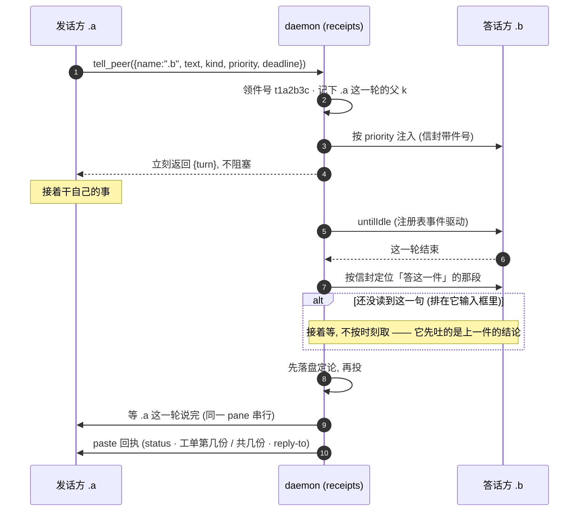
```mermaid
sequenceDiagram
    autonumber
    participant A as 发话方 .a
    participant D as daemon (receipts)
    participant B as 答话方 .b

    A->>D: tell_peer({name:".b", text, kind, priority, deadline})
    D->>D: 领件号 t1a2b3c · 记下 .a 这一轮的父 k
    D->>B: 按 priority 注入 (信封带件号)
    D-->>A: 立刻返回 {turn}, 不阻塞
    Note over A: 接着干自己的事
    D->>B: untilIdle (注册表事件驱动)
    B-->>D: 这一轮结束
    D->>B: 按信封定位「答这一件」的那段
    alt 还没读到这一句 (排在它输入框里)
        Note over D,B: 接着等, 不按时刻取 —— 它先吐的是上一件的结论
    end
    D->>D: 先落盘定论, 再投
    D->>A: 等 .a 这一轮说完 (同一 pane 串行)
    D->>A: paste 回执 (status · 工单第几份 / 共几份 · reply-to)
```

**定论**（`status`，`shared/turn-state.ts` 的 `Terminal`）：

| status | 含义 | 之后 |
| --- | --- | --- |
| `done` | 正常收口（`RESULT:`，可附 `ARTIFACT: <路径> — 一句话`） | 落定，计入工单 |
| `need` | 对方收口成 `NEED: <问题>` 反问 | 照投、不计份数；发话方 `tell_peer({re})` 答它，接着守同一件 |
| `error` | 那一轮以 CLI 的 `API Error: …` 收尾 | 照投、不计份数；接着守它续跑出来的答案 |
| `timeout` | 到了 `deadline`（60–43200 秒，缺省 1 小时）还没答完 | 合成一份说明 + 它最后一句，投出去 |
| `silent` | 停下 3 次都没答这一句 | 同上 |
| `dead` | 它的 pane 没了 | 同上 |
| `canceled` | 被撤回（`stop_wizard({turn})`、回收前的 `stop_wizard` / `close_job`） | 同上；发起撤回的一方不再收到 `dead` |

失败的也投——「没有答案」也是答案，发话方不该永远等。

- **按信封定位，不按时刻**（`peers.replyToPeer`）。对方正忙时我们那一句是排队的，它先吐出来的是上一件的结论——按时刻取就会张冠李戴。定位不到问话一律视为「还没读进」接着等，不计扑空；只有对方整段 20 秒都闲着而问话仍不在才算一次，连着 3 次（`MAX_FRUITLESS`）才判 `silent`。找问话按发话时刻往回读、不设上限（`turnsSince`）——长轮上工具输出能让 transcript 涨过几 MB，固定读窗会把问话推出去。CLI 自插的 `<task-notification>` 行、一轮中途吃进的排队消息都算轮界 / 问话。
- **同一个 pane 的回执串行投递**（`chains` / `serial`）。两份回执同时等到发话方 idle 时，两次 paste 会挤进同一个输入框被当成一轮读掉。每次注入还用自己的具名 tmux buffer——共用默认 buffer 时，同一毫秒的两份回执会互换 pane。
- **登记落盘，reload 后续守**（`~/.wezard/receipts.json`，键 `from\0to`，`resume()` 把没收尾的重新守起来）。被派活的 wizard 自己就常以 `build + reload` 收尾，reload 恰好落在它那一轮里。答案本来就在对方的 transcript 里，重启后接着守，取到的还是同一段；结果先落盘再投，reload 重投同一份，迟到的答案不改写已投的定论。
- **同一对的第二件不顶掉第一件**：第一件若已派出子活、正挂着等，就按件号停放；子活回来时那一轮的终句仍作为第一件的回执回到上游。新一件不继承停放那份的工单。
- **发话方只要 pane 活着就一直等**到能投；与 `wait_peer` 取走撞在一起时，投递前同步再查一次并先记成已投，不双投。

**链式 reply-to**：答话方在答上游 X 的这一轮里又派了活，那么 X 那份回执是「已派给 B」而不是结论。所以登记时记下发话方这一轮的**父 k**（读自它开轮那句的信封：人 / 定时任务在群里开的 → 那个群；上游私聊派来的 → 上游那件）。它的第一次答复被**挂起**（不投、不计数），直到子活落定；最后一份子回执带上 `reply-to`，那一轮的终句进群或作为 X 的回执送回，多级链逐级冒泡；还有兄弟没回时只进 rolepage。子活失败、被 `wait_peer` 取走、发话方不在了，同样叫醒挂起的上游。与上游无关的旁支活带 `chain:false`，不挂父 k。

**`tell_peer` 的三根正交的轴**：

| 参数 | 管什么 | 取值 |
| --- | --- | --- |
| `kind` | 对方怎么接 | `task`（默认，干活）/ `ask`（只答这一问，别开新活）/ `fyi`（知会：不收回执、不进工单、不进群） |
| `priority` | 对方正忙时何时投（闲着一律立刻投） | `normal`（默认，等这一轮结束）/ `urgent`（先 Esc 打断再投，不清它的注入队列）/ `now`（并进当前这一轮：插话、答它的问；`re` 的默认） |
| `receipt` | 要不要回执 | 缺省要；`false` 不登记槽，不会顶掉同一对还在等的那件 |

`re: <件号>` 接着那件活说，沿用它的频道与还开着的工单；来回超过 3 次信封只提示直接收口，硬刹车是工单的 `maxTurns`。`urgent` 打断的若是别人的活（它这一轮在为别的 wizard / 人 / 定时任务干），自动降成 `normal`；`stop_wizard({mode:"interrupt", turn})` 只撤回自己派的那一件——它此刻正做的就是这件才按 Esc，否则只记成 `canceled` 并捎它一句「不用做了」。

**`normal` 为什么准。** 「忙」= 这一轮还没结束，或者停在审批上等人点——都不是能接新活的时候。判定以 CLI 自己的**会话注册表**为准（`idleVerdict`）：status 在整轮里（工具调用之间、PreToolUse 审批 hook 挂着时）一直是 `busy`，只在轮结束那一刻翻 `idle`，所以不必抽样 spinner、也不必连数几次安静来排除工具间隙；`idle` 却悬着工具调用 = 停在本地审批框上等人点，不算闲。注册表不认得这个 pane（codebuddy / 旧版 CC / 会话已退出）才退回 pane 轮询。`untilIdle` 是**事件驱动**的：注册表目录一有写入就重判，翻成 idle 的那一刻即返回，1 秒的兜底轮询只防 watch 漏事件。两个 wizard 同时找第三个时，这就是「一句话就是一轮」的保证。

**在飞的活有一套共用的词**（`shared/turn-state.ts`）：`working` / `blocked`（停在审批卡上）/ `needs-input`（NEED 反问待答）/ `errored` / `deferred`（挂起等子活），读时由槽与一次 pane 探测算出。`wizard_roster`、`peek_peer`、`list_jobs` 的「在等 / 欠着」行，rolepage 的回执 chip 与工单页，说的都是这几个词。

**闲置追问**（`idle-nudge.ts`）：派出去的活状态是 `working`，对方却一直闲着（不忙、没停在审批卡上、不在交接）又没交回结论——满 `wrc.mirror.idleNudge.afterMin` 分钟（缺省 5，0 = 关）守护进程就以发话方名义同件号追问一句「进展如何 / 卡在哪」，答复照常作为那件活的回执回去。反问中、挂起等子活、报过错、停在审批上的不问；一忙或件号上又有新话就从头计；同一件至多 `idleNudge.max` 次（缺省 3）。追问由 `receipts.reask` 重新登记，工单、频道、父 k、期限沿用原件，不续期。

**挂起事项表**（`pending-items.ts` → `~/.wezard/pending.json`）：管家派出去的事多了，记不住哪件还欠着。每次 `tell_peer` / 带 task 的 spawn 由守护进程记一行——件号、对象、一句话题、为谁派的（群里哪句人话 / 上游哪件）。状态不靠模型报：在飞的从回执槽现算，落定由回执的 `onOutcome` 写一次；NEED 挂「等人拍板」，人在那件活的群里再开口记「人已回话」；`re` 续问或同一对改派消掉，done / 收工的关掉，没结论的（timeout / silent / dead）留着直到改派或显式 `drop`。提醒只给管家，搭注入边界的 `wezard="pending"` reminder：平时只挂必要的一行（某件刚变成等人、人开口时「这句可能在答哪件」、某件 30 分钟还没回执）；「快忘了」才给一次全表——交接、`/clear` 或压缩之后，离上次全表 15 次注入或 ctx 涨了 80k，某件 2 小时没动静。`pending_items({drop?})` 读全表或显式消项。

### 交接：换会话，不换身份

`handoff` 把工作压成一份简报，换一个全新会话接着干：**同一个 target、同一个名字，新的 sid、新的 pane**。不传 `name` = 交接自己（带 `brief`），传 `name` = 替那个 wizard 交接（`focus`）；`wizard_handoff_self` 留作别名。

**交接不是压缩**：判断线是 `min(200k, 模型窗口的七成)`（`handoffAt`，`wizard_whoami` 的 `handoffSuggested`），而不是等快满——大 ctx 每一轮都在付钱，缓存一冷还要整段重写。越线后下一条注入捎一次提醒（每段会话一次），宪章要它在手上这摊告一段落、或往后的活不再依赖前面的材料时交接。窗口按它实际跑的模型查一张最小表（`[1m]` 与 Claude 5 家族 = 1M，haiku = 200k，认不出 = 200k）。简报贴回新会话成功后追加到 `~/.wezard/memory/episodes/<name>.jsonl`，与工单收工结论同一份情景记忆（`kind` 区分）。身份、工单、日程、名册信箱都挂在 target / 名字上，换会话碰不到它们。会断的是那些隐含着「这个会话」的东西：

- **回执的答方**：欠着别人的那一句，答案要么已经在旧 transcript 里（换了会话 `replyFor` 就读不到了），要么还没答——义务得跟着简报转进新会话，而不是把简报那一轮的回复错当成回执；
- **回执的发方与一切注入**：重开的那几秒 pane 是死的，此刻投进来的话要么被当成「发话方已经不在」丢掉，要么 resume 回旧 sid，要么抢在简报前面成了新会话的开场白；
- **交接本身**：旧实现是一段纯内存的 async，reload 落在「杀了旧 pane、还没贴回简报」之间，新会话就空着醒来，简报没了。

所以 `handoff.ts` 做三件事：交接期间立一道闸、在旧会话还在的那一刻清点欠着的回执、每一步落盘（`~/.wezard/handoffs.json`）。闸是进程级单例——人话的入口（`inbound`）在 mirror 块之前就装好了，拿不到实例；boot 时 `handoffs.resume()` 必须排在 `receipts.resume()` 之前：闸要先立起来。

图 12｜四个 stage，每一步先落盘再动手

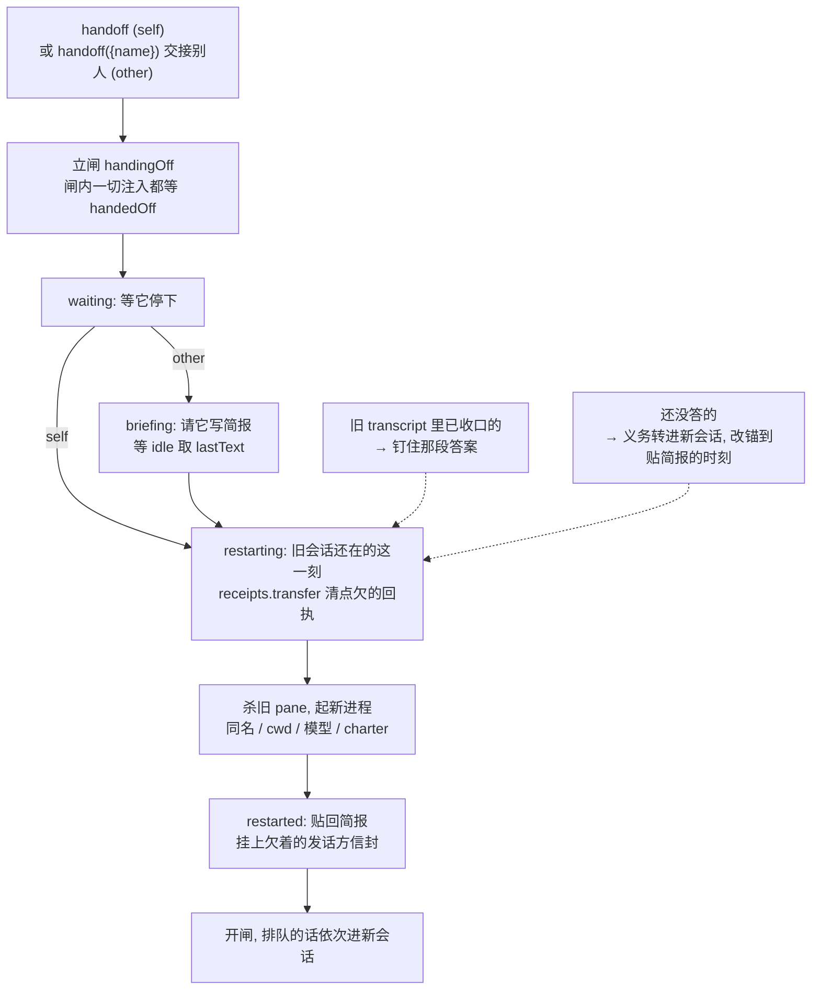
```mermaid
flowchart TD
    entry["handoff (self)<br/>或 handoff({name}) 交接别人 (other)"] --> gate["立闸 handingOff<br/>闸内一切注入都等 handedOff"]
    gate --> waiting["waiting: 等它停下"]
    waiting -- "self" --> restarting["restarting: 旧会话还在的这一刻<br/>receipts.transfer 清点欠的回执"]
    waiting -- "other" --> briefing["briefing: 请它写简报<br/>等 idle 取 lastText"]
    briefing --> restarting
    restarting --> kill["杀旧 pane, 起新进程<br/>同名 / cwd / 模型 / charter"]
    kill --> restarted["restarted: 贴回简报<br/>挂上欠着的发话方信封"]
    restarted --> release["开闸, 排队的话依次进新会话"]
    answered["旧 transcript 里已收口的<br/>→ 钉住那段答案"] -.-> restarting
    carried["还没答的<br/>→ 义务转进新会话, 改锚到贴简报的时刻"] -.-> restarting
```

- **`stage` 落盘**，boot 时从断点接着做。reload 落在重开中途时靠 sid 分辨：`sid` 已经换了就是做完了，别再杀一次新会话。
- **清点的时机只有这一个**：一重开，旧 transcript 就再也读不到了。自我交接只认**调用之前**就收口的那些轮（调用这一轮的收尾话不是答案）；交接别人时，简报那一句已经把它之前的每一轮都关上了。
- **没等到 idle 就不能重开**——那会丢掉这次还在生成的简报。
- **欠着多份回执不并成一句**：简报那一轮只挂第一份的信封，其余每份等上一轮答完再各开一轮、带各自的信封与频道，各自按件号续回自己的上游。请它写简报那一句私聊；重开后「接着干」那一轮沿用交接那一刻这一轮的频道。
- **失败只告诉它自己**：下一条进它会话的话尾巴上捎带一行，生命周期事件不进群。

### 频道：群是公开的，wizard 之间是私聊

名字全局可达以后，「这句话发到哪个群」不能再从 key 的 base 推出来了。于是每一轮 turn 记录一个 **channel**（`TurnDetailRecord.channel`）——这一轮的输入在哪儿说的、回复发到哪儿：

| channel | 含义 | 回复推到 |
| --- | --- | --- |
| `chat:…` / `user:…` | 公开频道：群，或与人的企业微信单聊 | 那个聊天 |
| `""` | wizard 之间的私聊 | **哪儿都不推**，只落 turn 记录（rolepage） |
| 缺省 | 老记录：按 `from` 推——peer 视为私聊，其余在 home | —— |

图 13｜同一次 tell_peer 的两种走向

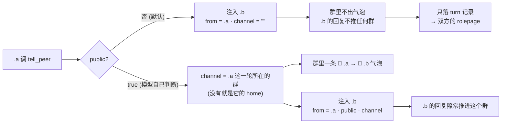
```mermaid
flowchart LR
    a[".a 调 tell_peer"] --> pub{"public?"}
    pub -- "否 (默认)" --> priv["注入 .b<br/>from = .a · channel = &quot;&quot;"]
    priv --> nob["群里不出气泡<br/>.b 的回复不推任何群"]
    nob --> rp["只落 turn 记录<br/>→ 双方的 rolepage"]
    pub -- "true (模型自己判断)" --> ch["channel = .a 这一轮所在的群<br/>(没有就是它的 home)"]
    ch --> bub["群里一条 🦊 .a → 🐬 .b 气泡"]
    ch --> inj["注入 .b<br/>from = .a · public · channel"]
    inj --> rep[".b 的回复照常推进这个群"]
```

要不要公开由发话的 wizard 自己判断（`tell_peer` 的描述里写着：需要人知道、或本该当着人讨论的才 `public`；`dispatch` 默认公开）。于是群里只剩人该看见的东西：**人发起的那一轮的回复**、`notify`、wizard 主动公开的讨论。分身出生、派活、回程结论、工单开工 / 收工这几种旧气泡都不再有；带 `job` 的往来一律私聊。

**一轮的终句去哪，由守护进程按「这一轮在为哪件 ask 服务」推定**，模型改不了：

- 人在群里说的、定时任务放的 → 那个群；
- 同伴私聊派来的活（包括 `clone_wizard({task})` 分身的第一轮，它的出处不带频道印章）→ `""`，结论作为回执回给它；
- 回执轮 → 只有父 k 是人在群里开的那一轮、且兄弟都已落定时才进群；其余（`chain:false` 的旁支、中途的 NEED / error、上游那份已被取走）一律私聊，不再沿用子活当初 `public:true` 的频道；
- CLI 把几句排队的话并成一行时，里面有私聊那句，整轮就按私聊——答复不跟着人的话进群。

`run_agent_graph` 的每一步与进度播报、交接里请它写简报的那一句、`.claude/**` 原生确认框代按失败后的告知，同样跟随发起它的那一轮的频道，没有一处注入是不带频道的。

注入的那一行会被 `recentInjects` 当成回显吞掉、走不到 tail 的 `user_text`，所以本轮的 `userQuery`（「谁对它说了什么」那一半）在注入的同时就盖进去；`channel` / `from` 同理，要早于 inject 落地——tail 是独立轮询的，可能在 inject 的 promise resolve 之前就开出 turn。

### 顶层模式：人只和顶层 wizard 说话

公开往来一多，群就被 wizard 之间的对话刷屏，人还得自己从过程里拼结论。顶层模式（群聊级配置 `chatPolicy.<base principal>.topOnly`，热生效）把这件事收紧成守护进程强制的规矩：

| | 关（默认） | 开 |
| --- | --- | --- |
| 人在群里面对谁 | 谁说话都可能进群 | 只有**顶层 wizard**：群管家，以及人 `.name` 点名的那个 |
| `tell_peer` / `dispatch` 的 `public` | 照办 | 一律降为私聊（含 `re` 沿用的公开频道），回包带一句 `topOnly` |
| 为同伴干活的 wizard `notify` 进群 | 照办 | 409 退回（这一轮是同伴私聊派来的活，或为上游派出的子活的回执轮）；管家在自己的群豁免，人说的、定时任务、`chain:false` 旁支的回执轮不拦 |
| 宪章 | —— | 多一节「本群开着顶层模式」：顶层用自己的话讲结论、取舍和要人拍板的；子 wizard 以 `RESULT:` / `NEED:` 交回上游，由上游代为交代 |

配置键只认确定的聊天 id：`config_set` 写聊天名时换成它此刻指向的 principal 落盘，认不出的拒写。管家的宪章不论开没开都带一行「顶层模式」——关着时讲它是什么、怎么开。

**什么时候该开，由守护进程提醒**（`top-only-nudge.ts`，`wrc.mirror.topOnlyNudge` = `{windowMin: 30, threshold: 6, cooldownH: 24}`）：没开的群里，每条 wizard 间公开往来（公开的 `tell_peer` / `dispatch`）计一次，窗口内达到阈值就往该群管家的信箱挂一行，人下次说话时它顺带问要不要开，附 `config_set` 的写法。不另起一轮、不发气泡；同群提醒过后冷却期内不再提，计数与冷却落盘扛 reload。

### rolepage：从 turn 记录折出一个 wizard 的 IM

chat 详情页过去折的是「一个聊天里有哪些会话」。名字全局唯一以后这个轴不对了：wizard 不属于某个聊天，它在好几个群里被人叫、跟好几个同伴私聊。rolepage（`shared/role-view.ts`，纯函数）换成**一个 role 的视角**重新折叠同一批 turn 记录：

图 14｜一轮 turn 拆成两条消息，按频道归进会话

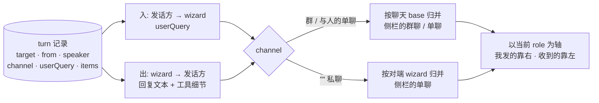
```mermaid
flowchart LR
    turn[("turn 记录<br/>target · from · speaker<br/>channel · userQuery · items")] --> inm["入: 发话方 → wizard<br/>userQuery"]
    turn --> outm["出: wizard → 发话方<br/>回复文本 + 工具细节"]
    inm --> conv{"channel"}
    outm --> conv
    conv -- "群 / 与人的单聊" --> pubc["按聊天 base 归并<br/>侧栏的群聊 / 单聊"]
    conv -- "&quot;&quot; 私聊" --> privc["按对端 wizard 归并<br/>侧栏的单聊"]
    pubc --> view["以当前 role 为轴<br/>我发的靠右 · 收到的靠左"]
    privc --> view
```

- **role**：wizard 就是它的 target key；人是 `human:<userid>`（不用 `user:<id>`——那正是「与这个人的单聊」里默认 wizard 的 target，字面相同会变成自己对自己说）；定时任务是 `task:<id>`，只发不收，不能切成视角。
- **发话方**：同伴（`from.kind=peer`）/ 定时任务（`task`）/ 人（`speaker`；老记录没有就记作「人」）。
- **侧栏**：群聊与单聊；群下展开成对子项（当前 role 与群里另一个 role 在这个群里的往来），「往来 / 全部」开关切到全部时再列出群里与它无往来的 role（淡色，点开是那个 role 在群里的全部记录）。侧栏可切成**关系图**：一棵树把家谱与对话画在一起，卡片就是会话项——排序、时刻、预览、未读、选中、忙闲共用同一份实现（`glanceOfTalk` / `convWindowOf` / `theirsOf`），改一边就是改两边。
- **两个独立视角**：**页面视角** `role`（名片、侧栏、标题、关系图中心）只由点头像、名字及其装饰切；**详情视角** `viewpoint`（URL 参数，老 `eye=` 兼容）只管详情区里谁靠右，由点卡片 / 会话项的其余地方、移交行、各种提示行以及气泡对面的空白设。详情区里的任何一行都不切页面视角——否则读着读着整页就换了主人。
- **未读**：会话项右边的红点只数**点开这一项看得到的**——服务端 `pendingOf` 按窗口、看的 role 与开口水位算出带消息 id 的可能未读，客户端减去已上屏的。名字旁的他人未读是**切到那个 role 之后它看得到的全部未读**（服务端 `unreadByRole` 按页面未读基线给每个 role 一份与侧栏同口径的账，随摘要下发 `peerUnread`）。已读全局只一份 `SEEN`（消息 id → 上屏时刻），片段在可见详情区上屏才记，与哪个视角、侧栏还是关系图无关，记下即两边重画。
- **工单页**（`j:<id>`）：按时间排开开工框（成员与各自状态）、归在工单名下的派活 / 答话 / 回执、收工框（定论、交付物、结论，按 markdown 分行）。入口只有 📋：会话行、群下子项、关系图上经手过工单的那条关系；一张直接进，多张进只列这几张的列表。看着一张工单切到关系图，只亮它的当事人。进度（已落定 / 一共）由 `world.jobProgress` 一处算，摘要随 role 下发全部工单的账（`jobIndex`）。
- **回执 chip**：回执那一轮的名字行上挂「↩ 回执 · 已交 / 反问 / 超时 … · 第 i/n 份」，按定论着色；点它跳回派活那句（同一个件号）。turn 记录的 `from` 带件号、回执 `status` 与工单 `done` / `total`。
- **忙闲**：空闲 / 执行中 / **等人点**（停在 daemon 发出的审批卡、提问卡上，紫色；取 daemon 的 pending，按审批认卡的同一口径归到 wizard）/ 已关闭。审批长轮询期间 pane 照样在转圈，不单列这一态就和真在干活分不出来。
- **用量条**：页脚两条（当前视角、窗口对端）——模型简名与 effort（取 transcript assistant 行上的 `effort`，没有才用绑定里的，都没有不显示）、估算费用（`shared/model-prices.ts` 是 LiteLLM 价格表的快照，认不出的模型不猜价、费用前加「≥」）、轮次、工具调用、API 请求、上下文（最近一轮主会话最后一次调用送入的 input + 缓存）、cache read / input / cache write / output 分布。
- **名片与日程**：身份、cwd、创建时间；同名下多个 session（`/clear`、`/new`、交接轮换）出切换器；「日程」列它名下（`owner`）的定时任务。
- **消息头**：多方会话（群、整个 chat）的名字行带这一轮的模型 / ctx / 耗时，两个 role 之间的对话只留时刻与耗时；同伴派来的那句带发话方发出它那一轮的账；进行中的一轮按开始时刻每秒走表。`<system-reminder>` 收成一个 `<reminder>` 标签，点开看原文。
- **路由**：`GET /role`（老 `/chat` 同一页面）、`/api/role`、`/api/msgs`（`?before=<msgid>` 按游标往前翻页）、`/api/role-events`（SSE）、`/api/world`（带 ETag，名册没变时轮询回 304）、`/api/glance`，daemon 与独立 svr 共用。`?id=` 是一条不可猜的记录 id，它就是凭据；页面的核心动作是顺着消息走到对端，而对端可能住在任何群，所以**任一有效票据可以看全部 role**（单用户部署下的取舍：名册本来就对每个 wizard 敞开）。要把正文严格关在一个群里的部署，不该对外暴露这些路由。链接里的 `role=` 用 target key 而不是名字，改名后旧链接照样能开。

---

## 配置：说人话改，放权要人点

wizard 读写配置只有两个工具，都由 `ConfigSchema`（zod）驱动，不维护第二份字段清单：

- **`config_get({path?})` 渐进披露**：不给 path 列各节一行说明；给了就列这一层子项的类型、当前值、默认值、说明，标出 ✋（改动要人确认）、↻（需 reload）、*（不同于默认）。说明取自字段的 `.describe()`，✋ / ↻ 由 `shared/config-meta.ts` 的 `knob` 标在 schema 上、沿树继承。`models` 下附各档模型的本周 / 今日用量；`chatPolicy.<聊天名>` 先换成它指向的 principal 再查。
- **`config_set({path, value, op: set|add|remove|unset, dryRun})`**：整份配置（叠上 secrets）过 zod 才写，经 `config-writer` 落盘保留注释；`dryRun` 回改前改后与 jsonc 行级 diff；热生效项写完即装进活的 cfg。

分级的界线是「放权」——谁能驱动本机、审批怎么判、跑哪个二进制带什么参数：

| 级别 | 路径 | 怎么改 |
| --- | --- | --- |
| 不可读写 | `bot.*`、认领口令、`secrets.json` 里出现的路径 | —— |
| 放权项 ✋ | `wrc.allowFrom`、`approval.*`、`claudeBin` / `cliBackends` / `extraArgs`、`sync`、监听与外送地址、`defaultChat` | 守护进程**自己**推确认卡，人点了才落盘——不经 hook，`danger.skipAll` 也压不过；卡在请求里等 4 分钟，之后回 pending，迟到的确认照常落盘并捎给调用方 |
| 其余 | 模型档位、`chatPolicy.*`、mirror 的各项开关… | 直接写 |

**改配置可能改宪章**：宪章是出生快照，改了配置活着的 wizard 看不到。`config_set` 落盘前后各渲染一遍有会话的 wizard 的宪章，按 `## ` 段比对——不靠字段清单，任何进宪章的配置都覆盖（自认是出生快照的档位行不比）。受影响的在回包里点名，调用方自己受影响就直说这一轮收尾后 `handoff`，其余各挂一条提醒随下一条消息到。人 `/name`、`name_chat`、自动补名这些聊天名写入点走同一个 `guardCharter`。

**写敏感状态的路由要口令**：`/config/set`、`/claim/start`、`/claim/reset`、`/tasks/schedule` 只认带 `x-wezard-token` 头、值等于 `~/.wezard/daemon-token`（0600，daemon 开机生成）的请求；wezard 自己的 MCP server 与 CLI 每次现读它，本机别的进程直接 curl 一律 403。PreToolUse hook 对 wezard CLI 的免审也只认整条命令就是一次只读子命令、不含 shell 元字符。

---

## Prompt-cache 保活（省钱心跳）

Anthropic prompt cache 的 TTL 由每次请求自己选：API 默认 5 分钟（写 1.25x），显式 `cache_control: {type:"ephemeral", ttl:"1h"}` 才是 1 小时（写 2x）；读都是 0.1x（Opus 5.5 为 0.05x），每次读写都从**请求开始**重新计时。档位与模型无关。pane 空闲到 TTL 之外，整份上下文掉出缓存，下一轮真实对话要整段冷写。保活在缓存过期前注入一次极小 ping，把 TTL 往前滑。

**为什么默认关**（`enabled: false`）：保活是按 5 分钟 TTL 设计的，而 Claude Code 订阅的主线程写的是 1h 缓存。本机实测（1621 个 transcript、18,699 次请求）：主会话 1490/1491 只写 1h，opus / sonnet / haiku / fable 都一样；只有 Task 子代理写 5m。相邻两次请求隔 6–60 分钟的 230 次里 229 次整段命中（中位命中率 1.00），超过 65 分钟后 0 次整段命中，只剩约两成共享的 system / tools 前缀。一小时内的空闲本来就不冷，ping 只是往活 pane 里多塞模型轮次。transcript 写 `ephemeral_5m` 的环境（如裸 API key）再打开。即便打开，缓存闲置超过 10 分钟（`KEEPALIVE_MAX_IDLE_MS`）也不再保温：1h 缓存的 ping 要到闲置约 59 分钟才打，那段空闲 TTL 本身已经盖住，所以实际只有 5 分钟缓存会被保温。

**冷热判定**（路由 `route_candidates` / `dispatch` 与 `tell_peer` 冷门控，`route.wakeCostOf`）不依赖保活：TTL 由 `peers.cacheTtlSec` 读最近一次分档写入（`cache_creation.ephemeral_1h/5m` → 3600 / 300 秒，读不到回落 `ttlSec`）；起点由 `peers.cacheTouchMs` 读最近一次已应答请求的**开始**时刻（它前面那行 user / tool_result），读不到才退回 mtime。mtime 是响应写完的时刻，实测比请求开始晚 p50 5 秒、p99 59 秒、最长 396 秒，还会被不碰缓存的元数据行推动；在 TTL 边界附近，用它会把已经冷了的判成热。

每会话三把时钟（由 transcript 的时间戳驱动，mtime 只当「要不要重读 tail」的廉价闸门）：

| 时钟 | 含义 |
| --- | --- |
| `cacheAt` | 最近一次已应答请求（真实或 ping）的**开始** = **缓存温度**时钟（`peers.cacheTouchMs`，与路由同一口径；读不到退回 `lastMs`） |
| `lastMs` | 最近一轮（真实或 ping）= 判 ping 已落定的时钟 |
| `lastRealMs` | 最近一轮**真实**对话 = 重置心跳预算的锚点，ping 不刷新它 |

定时器每 15 秒扫一遍所有挂载，逐会话判定：

图 15｜一次保活 tick 的判定

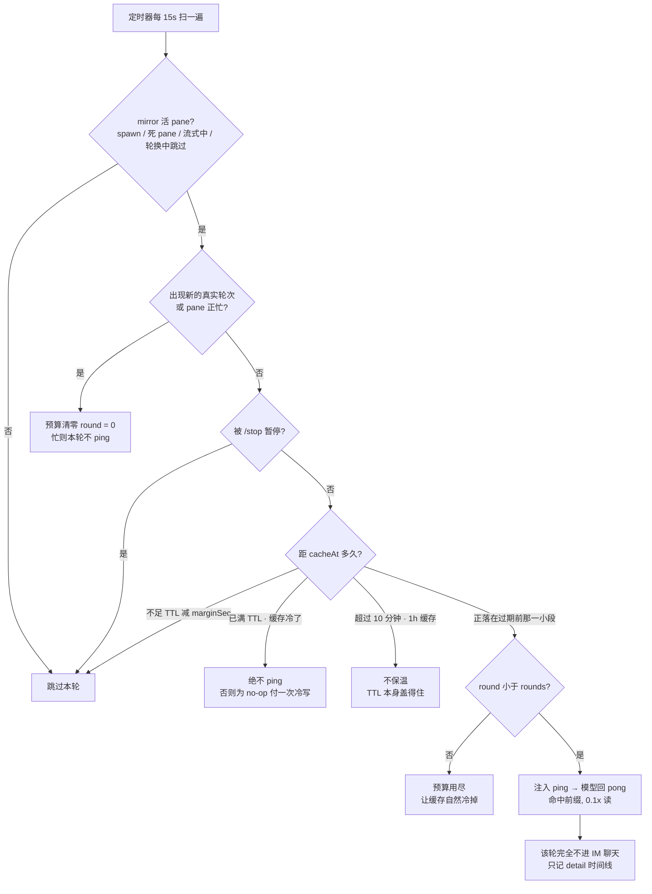
```mermaid
flowchart TD
    tick["定时器每 15s 扫一遍"] --> gate{"mirror 活 pane?<br/>spawn / 死 pane / 流式中 / 轮换中跳过"}
    gate -- 否 --> skip["跳过本轮"]
    gate -- 是 --> real{"出现新的真实轮次<br/>或 pane 正忙?"}
    real -- 是 --> reset["预算清零 round = 0<br/>忙则本轮不 ping"]
    real -- 否 --> paused{"被 /stop 暂停?"}
    paused -- 是 --> skip
    paused -- 否 --> warm{"距 cacheAt 多久?"}
    warm -- "不足 TTL 减 marginSec" --> skip
    warm -- "已满 TTL · 缓存冷了" --> cold["绝不 ping<br/>否则为 no-op 付一次冷写"]
    warm -- "超过 10 分钟 · 1h 缓存" --> long["不保温<br/>TTL 本身盖得住"]
    warm -- "正落在过期前那一小段" --> budget{"round 小于 rounds?"}
    budget -- 否 --> stop["预算用尽<br/>让缓存自然冷掉"]
    budget -- 是 --> ping["注入 ping → 模型回 pong<br/>命中前缀, 0.1x 读"]
    ping --> quiet["该轮完全不进 IM 聊天<br/>只记 detail 时间线"]
```

- **自我不续命**：ping 刷新 `lastMs` 但不刷新 `lastRealMs`，所以保活自己不会把会话判成活跃，也不会把预算重新加满。
- **预算而非时限**：一次真实对话之后最多补 `rounds`（默认 6）次 ping，节奏是 `ttlSec - marginSec`（默认 255 秒），约 26 分钟；真实轮次一来，计数清零重新开始。
- **三道成本保险**：缓存已冷（距 `cacheAt` ≥ TTL）绝不 ping；距 `cacheAt` 超过 10 分钟不 ping；预算用尽直接放手。
- **`/stop` 暂停**：Esc 打断同时挂起保活，等 pane 真的忙起来（且过了 30 秒 grace）才恢复——防止 `/stop` 自己那点落盘写把暂停解掉。
- **注入失败回滚**：inject 不成功就撤回「等待中」状态，下一 tick 重试，且不计入预算。
- **reload 不复燃**：daemon 重启后时钟从 transcript 的真实轮次重建（ping 轮不算数），搁置很久的大会话因缓存早已冷掉而直接跳过，不会被重新烧热。
- **一句话只说一遍不行**：每轮都重发完整 ping 文案而不是裸 `ping`——模型把裸 `ping` 当成一轮开放对话，答出 `pong` 之外的东西就会被当成真实活动推进群里。

全部可配（`wrc.mirror.keepalive`）：`enabled`（默认 `false`）/ `ttlSec` / `marginSec` / `rounds` / `ping` / `spawnDefault`。原先挂在同一个 tick 上的「卡死续跑」（`resumeOnStall` / `resumePing`：上一轮死在 API 报错时自动发 `continue`）已删除。

---

## 文档 MCP 如何桥接

`wezard` 把企业微信智能机器人的远端 MCP（doc / smartsheet / contact 等）桥接到本地 Agent，**不走 corp access_token**：daemon 直接复用 botId+secret 的 WS 长连，通过 `aibot_get_mcp_config` 命令拉到每个 category 的 Streamable HTTP MCP URL，再以 JSON-RPC 调 `tools/list` / `tools/call`，`x-openclaw-wecom-userid` header 透传文档归属人。

图 16｜一次文档写入穿过的四段链路

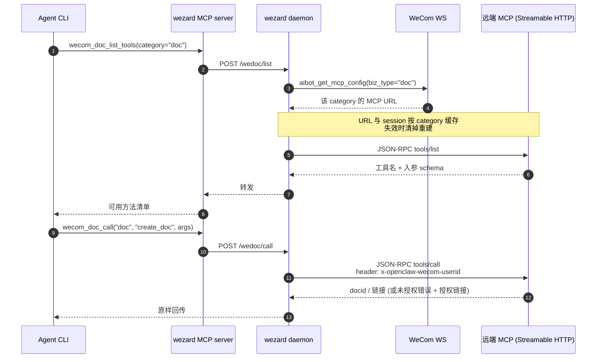
```mermaid
sequenceDiagram
    autonumber
    participant A as Agent CLI
    participant M as wezard MCP server
    participant D as wezard daemon
    participant WS as WeCom WS
    participant R as 远端 MCP (Streamable HTTP)

    A->>M: wecom_doc_list_tools(category="doc")
    M->>D: POST /wedoc/list
    D->>WS: aibot_get_mcp_config(biz_type="doc")
    WS-->>D: 该 category 的 MCP URL
    Note over D,R: URL 与 session 按 category 缓存<br/>失效时清掉重建
    D->>R: JSON-RPC tools/list
    R-->>D: 工具名 + 入参 schema
    D-->>M: 转发
    M-->>A: 可用方法清单
    A->>M: wecom_doc_call("doc", "create_doc", args)
    M->>D: POST /wedoc/call
    D->>R: JSON-RPC tools/call<br/>header: x-openclaw-wecom-userid
    R-->>D: docid / 链接 (或未授权错误 + 授权链接)
    D-->>A: 原样回传
```

**前置一次性授权**：在企业微信「工作台 - 智能机器人 - 你的机器人 - 可使用权限」里勾选「文档」「智能表格」对应能力。第一次调用如果未授权，远端会返回结构化错误（errcode 851013）+ 授权链接，原样转给 Agent，照着点同意即可。

**Agent 侧自动发现**：模型先调一次 `wecom_doc_list_tools(category="doc")` 拿到工具列表（`create_doc` / `edit_doc_content` / `smartpage_create` / `upload_doc_image` ...）和入参 schema，再用 `wecom_doc_call(category, method, args)` 执行。category 当前可选：

| category | 能干嘛 |
| --- | --- |
| `doc` | 在线文档、智能文档、文档图片上传 |
| `smartsheet` | 智能表格的字段 / 记录读写 |
| `contact` | 通讯录查询（按需授权） |

**curl 验证**：

```bash
# 列 doc 类目下所有可用工具
curl -sS -X POST http://127.0.0.1:17890/wedoc/list \
  -H 'content-type: application/json' \
  -d '{"category":"doc"}'

# 创建一篇文档
curl -sS -X POST http://127.0.0.1:17890/wedoc/call \
  -H 'content-type: application/json' \
  -d '{"category":"doc","method":"create_doc","args":{"doc_type":3,"doc_name":"demo"}}'

# 写入 Markdown
curl -sS -X POST http://127.0.0.1:17890/wedoc/call \
  -H 'content-type: application/json' \
  -d '{"category":"doc","method":"edit_doc_content",
       "args":{"docid":"<返回的 docid>","content_type":1,"content":"# 标题\n正文"}}'

# 授权变更后清缓存
curl -sS -X POST http://127.0.0.1:17890/wedoc/invalidate -H 'content-type: application/json' -d '{}'
```

`requesterUserId` 解析顺序：调用方显式传入 → `defaultChat` 的 `user:<id>` 部分 → 不传（远端会拒，错误原样回到 Agent，比 daemon 提前判更透明）。
