# wezard 技术说明

面向想搞清楚内部机制的读者：消息如何双向同步、`.name` 如何路由、公开频道与私聊怎么分、wizard 之间如何编排、rolepage 怎么从 turn 记录折出一个 wizard 的 IM、保活如何省钱、文档 MCP 如何桥接、整体架构长什么样。上手用法看 [README](README.md)，审批粒度看 [审批配置](审批配置.md)，模块级职责看 [CLAUDE.md](CLAUDE.md)。

---

## 架构一瞥

三个进程走 `127.0.0.1:17890` + `~/.wezard/`。daemon 是**唯一**持有 WeCom WS 连接的进程，hook 和 MCP 都是它的薄 HTTP 客户端：

图 1｜三进程与它们之间的四条通路

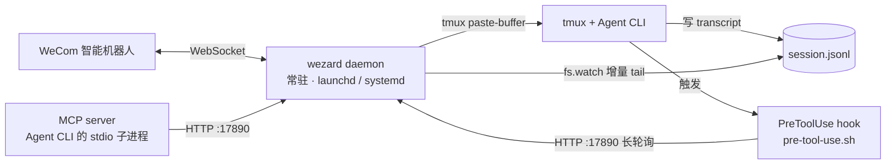
```mermaid
flowchart LR
    wecom["WeCom 智能机器人"] <-- WebSocket --> daemon["wezard daemon<br/>常驻 · launchd / systemd"]
    hook["PreToolUse hook<br/>pre-tool-use.sh"] -- "HTTP :17890 长轮询" --> daemon
    mcp["MCP server<br/>Agent CLI 的 stdio 子进程"] -- "HTTP :17890" --> daemon
    daemon -- "tmux paste-buffer" --> cli["tmux + Agent CLI"]
    cli -- "写 transcript" --> jsonl[("session.jsonl")]
    daemon -- "fs.watch 增量 tail" --> jsonl
    cli -- 触发 --> hook
```

---

## 消息是怎么同步的

**审批流**（工具调用审批都走这条）。hook 的 curl `--max-time` 必须严格大于 `longPollSec`，否则人还没点、hook 已经自己回了 `ask`：

图 2｜一次工具调用从阻塞到放行

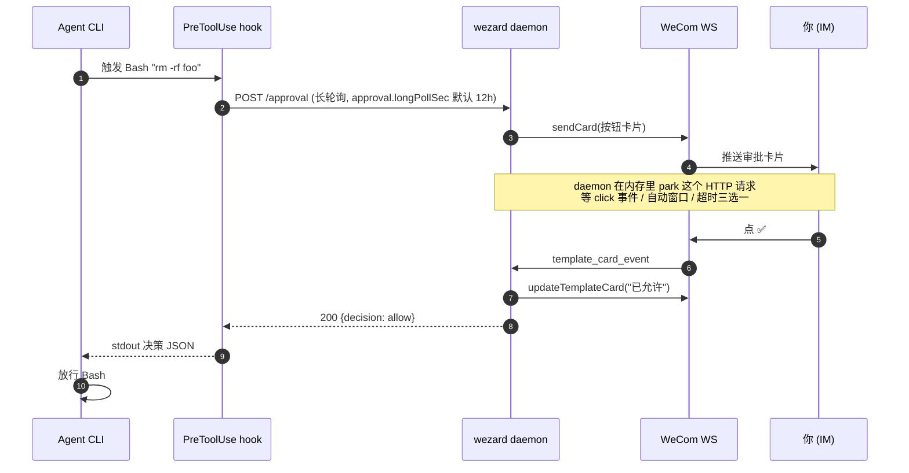
```mermaid
sequenceDiagram
    autonumber
    participant CC as Agent CLI
    participant Hook as PreToolUse hook
    participant D as wezard daemon
    participant WS as WeCom WS
    participant U as 你 (IM)

    CC->>Hook: 触发 Bash "rm -rf foo"
    Hook->>D: POST /approval (长轮询, approval.longPollSec 默认 12h)
    D->>WS: sendCard(按钮卡片)
    WS->>U: 推送审批卡片
    Note over D,U: daemon 在内存里 park 这个 HTTP 请求<br/>等 click 事件 / 自动窗口 / 超时三选一
    U->>WS: 点 ✅
    WS->>D: template_card_event
    D->>WS: updateTemplateCard("已允许")
    D-->>Hook: 200 {decision: allow}
    Hook-->>CC: stdout 决策 JSON
    CC->>CC: 放行 Bash
```

**镜像流**（IM ↔ tmux 双向）：

图 3｜一条 IM 消息进 CLI、再流式回到 IM

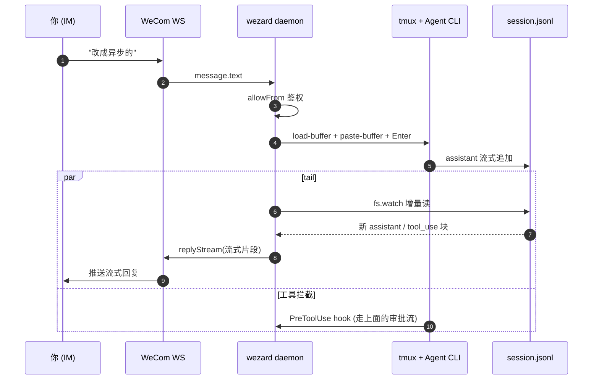
```mermaid
sequenceDiagram
    autonumber
    participant U as 你 (IM)
    participant WS as WeCom WS
    participant D as wezard daemon
    participant T as tmux + Agent CLI
    participant J as session.jsonl

    U->>WS: "改成异步的"
    WS->>D: message.text
    D->>D: allowFrom 鉴权
    D->>T: load-buffer + paste-buffer + Enter
    T->>J: assistant 流式追加
    par tail
        D->>J: fs.watch 增量读
        J-->>D: 新 assistant / tool_use 块
        D->>WS: replyStream(流式片段)
        WS->>U: 推送流式回复
    and 工具拦截
        T->>D: PreToolUse hook (走上面的审批流)
    end
```

两条流的共同要点：

- 审批是**长轮询 + 内存 park**，没有 webhook、不依赖外网回调；
- 镜像是**单向 paste + 单向 tail**：IM→tmux 走粘贴键，tmux→IM 走读 jsonl，两条管道独立、互不阻塞。

---

## 多会话路由（`.name` · 频道 · 聊天命名 · 多 CLI）

一个 wizard 有两个身份，各管一件事：

| | 形态 | 管什么 |
| --- | --- | --- |
| **会话 key** | `user:<id>` / `chat:<id>` + 可选 `#slot` | 内部路由与落盘：pane、jsonl、cwd 都挂在它上面。base 部分就是它的 **home 群** |
| **名字** | `.name`，全局唯一，存在 `wizards.json` | 人和模型看得见、写得出的唯一地址 |

默认会话（无 slot）的名字取聊天名，其余取 slot id；撞名由 `pickName` 加 `-N`（大小写不敏感）。名字惰性落定——`settleName` 在第一次被问到时 claim，`settleAll` 在 boot 时按「默认会话先挑、其余按出生先后」把名册一次补齐，老记录（名字还跟着聊天走的那一代）就在这里迁完。**改名只改名册，不动 key**：pane、jsonl、历史都不受影响。

路由全部发生在 daemon 侧，tmux pane 无感知：

图 4｜一条入站消息如何落到某一个 wizard

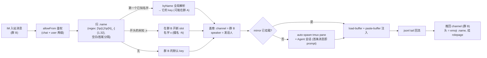
```mermaid
flowchart LR
    msg["IM 入站消息<br/>(群 B)"] --> auth["allowFrom 鉴权<br/>(chat + user 两级)"]
    auth --> scan["扫 .name<br/>(regex: [\\p{L}\\p{N}_-]{1,32},<br/>空白/首尾分隔)"]
    scan -- "第一个已知名字" --> byname["byName 全局解析<br/>→ 它的 key (可能在群 A)"]
    scan -- "开头的未知 .x" --> fresh["在群 B 开新 slot<br/>名字 x (撞名 -N)"]
    scan -- "无" --> base["群 B 的默认 key"]
    byname --> stamp["盖章: channel = 群 B<br/>speaker = 发话人"]
    fresh --> stamp
    base --> stamp
    stamp --> exist{"mirror 已挂载?"}
    exist -- 否 --> spawn["auto-spawn tmux pane<br/>+ Agent 会话 (首条消息即 prompt)"]
    exist -- 是 --> paste["load-buffer + paste-buffer 注入"]
    spawn --> paste
    paste --> tail["jsonl tail 回流"]
    tail --> label["推回 channel (群 B)<br/>头 = emoji .name, 挂 rolepage"]
```

关键规则：

- **名字全局可达，回复回发话群**：人在群 B 里 `.fix`，而 `.fix` 的 home 是群 A——本轮 `recordTurnStart` 记下 `channel = 群 B`，回复（流式 / standalone）连同本轮的审批卡、提问卡都推回群 B。在 home 群说话照旧，`channel` 就是 home。
- **只有开头的未知名字会造人**：句中一个没人叫的 `.x`（`a.ts`、`.gitignore`）原样透传，只有消息开头的那个才在本聊天开一个新 slot。本聊天同名的老 slot 还活着就复用它；被一个改了名的冷 wizard 占着就挪到 `slot-N`，不唤醒别人。
- **引用即路由**：出站气泡的头 `emoji .name`（或 rolepage 链接形态 `[emoji .name](url)`）由 `parseTagHeader` 反解，引用一条气泡 = 跟那个 wizard 说话。改名前发出去的 `#tag` 头仍被认，解析不到名字时退回本聊天同名 slot。
- **cwd 是聊天级的**：同一聊天（home）里的所有会话共用一个 cwd；换项目走 `set_workspace` MCP，daemon 内部即 `setPendingCwd` + `/new` 重开路径，聊天层一步生效。
- **聊天名是另一层地址**：`notify` 往哪个群发、`new_claude_session({chat})` 把 home 设在哪个群，写的是聊天名；它同时是这个群默认 wizard 的初始名字。没名字的聊天按工作区末段自动补一个（`~/develop/Guxi11/weclaude` → `weclaude`，撞名加序号），补名点是「要把名字交给模型」的那一刻——各 MCP 路由的收件解析，以及**渲染 charter 时**：系统提示随进程终身，一个在聊天还没名字时出生的 wizard 会一辈子以为自己住在「(未命名)」的地方。只填空，永不覆盖人起过的名字。
- **多 CLI 并存**：会话身份就是 jsonl 路径，daemon 由路径反推写它的 CLI，`--resume` 二进制、jsonl schema、project-dir 编码全部由此派生；新叫出的 `.name` 继承本聊天基础会话的 CLI。

---

## wizard 网络：身份、感知、编排

一个绑定了聊天的会话就是一个 **wizard**。它需要三样东西才能协作：知道自己是谁、知道网络里还有谁、以及一套把活分出去再收回来的原语。三样各有各的通路，共同的约束只有一条——**不许多花轮次**。

### 身份：系统提示，不是聊天记录

身份（全局名字、工作区、职责、记忆、家谱、工具清单、编排剧本、公开与私聊的规矩）由 `wizard.ts` 的 `renderCharter` 从注册表渲染，`spawn-tmux` 以 `--append-system-prompt "$(cat <file>)"` 压进进程。于是它**随进程终身有效**：`/clear` 抹不掉、不占一轮对话、群里看不见。注册表本身是一份写穿 json（`~/.wezard/wizards.json`），由 `bindWizardStore` 绑成进程内单例，IM 侧的 `/peers` 也读得到。

图 5｜charter 走系统提示通道，与对话上下文互不相干

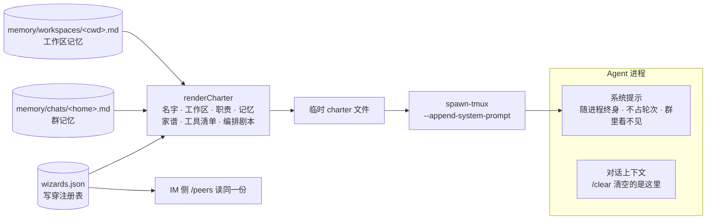
```mermaid
flowchart LR
    reg[("wizards.json<br/>写穿注册表")] --> render["renderCharter<br/>名字 · 工作区 · 职责 · 记忆<br/>家谱 · 工具清单 · 编排剧本"]
    cm[("memory/chats/&lt;home&gt;.md<br/>群记忆")] --> render
    wm[("memory/workspaces/&lt;cwd&gt;.md<br/>工作区记忆")] --> render
    render --> file["临时 charter 文件"]
    file --> spawn["spawn-tmux<br/>--append-system-prompt"]
    reg --> peers["IM 侧 /peers 读同一份"]
    subgraph proc["Agent 进程"]
        sys["系统提示<br/>随进程终身 · 不占轮次 · 群里看不见"]
        ctx["对话上下文<br/>/clear 清空的是这里"]
    end
    spawn --> sys
```

没有 `--append-system-prompt` 的后端（codebuddy）宁可不带 charter，也不带一个会被拒的参数。

**记忆有三份**，由 `wizard_remember({scope})` 写：`self`（默认）跟着 wizard 自己走，存在它的名册记录里；`chat` 与 `workspace` 是共享的 markdown（`wizard-memory.ts`：`~/.wezard/memory/chats/<home>.md`、`~/.wezard/memory/workspaces/<cwd>.md`），任何以那个群为 home、或在那个目录下出生的 wizard 都把它们读进 charter。它们是 md 而不是 json：人也会直接打开改。读写失败一律吞掉——记忆是锦上添花，不该拖垮一次 spawn。

### 分身：fork 上下文，不是新开一个

`MirrorBridge.cloneSession` 走 `--resume <父 sid> --fork-session`：CLI 把父亲的 transcript 复制一份再往下写，孩子开局就带着父亲读过的一切，父亲毫发无损。**「公共材料读一遍，再分出 N 路」靠的就是这个。** 两条不变式：

- `--fork-session` 是强制的——少了它，第二个 pane 会追加进父亲的 jsonl，两个聊天当场串线；
- fork 出来的 transcript 只在那个 pane **收到第一条消息**时才出现，所以分身的开场白就是触发器，attach 会等这个 fork；等不到就杀掉 pane，绝不退而绑到父亲的 sid 上。

图 6｜带与不带 `--fork-session` 的分歧

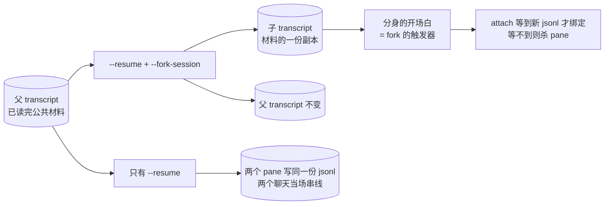
```mermaid
flowchart LR
    parent[("父 transcript<br/>已读完公共材料")]
    parent --> ok["--resume + --fork-session"]
    parent --> bad["只有 --resume"]
    ok --> child[("子 transcript<br/>材料的一份副本")]
    ok --> keep[("父 transcript 不变")]
    child --> first["分身的开场白<br/>= fork 的触发器"]
    first --> attach["attach 等到新 jsonl 才绑定<br/>等不到则杀 pane"]
    bad --> cross[("两个 pane 写同一份 jsonl<br/>两个聊天当场串线")]
```

### 感知：快照 + 增量

charter 里那份名册是 spawn 那一刻的快照，只会越来越假；而「每次协作前先查一次名册」要花一轮，于是实际上没人查。所以补上另一半：

图 7｜名册变动怎么搭顺风车进到别人耳朵里

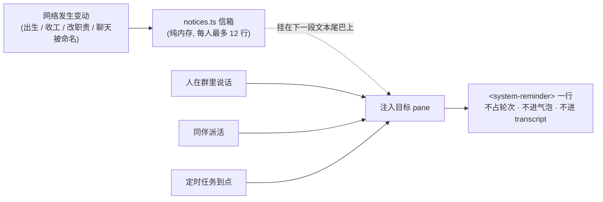
```mermaid
flowchart LR
    ev["网络发生变动<br/>(出生 / 收工 / 改职责 / 聊天被命名)"] --> box["notices.ts 信箱<br/>(纯内存, 每人最多 12 行)"]
    box -.挂在下一段文本尾巴上.-> inj
    human["人在群里说话"] --> inj["注入目标 pane"]
    peer["同伴派活"] --> inj
    cron["定时任务到点"] --> inj
    inj --> sr["&lt;system-reminder&gt; 一行<br/>不占轮次 · 不进气泡 · 不进 transcript"]
```

投递即清空：那一次注入失败这几行就丢了。通知是提示，真相永远可以 `wizard_roster` 问到——为一行提示做可靠投递不值当。

`wizard_roster` 自己则是一张**索引**而不是一份转储：服务端按 `query`（名字/职责/地址子串）、`cwd`（工作区反查）、`chat`、`alive` 过滤，默认只回最相关的一页（自己 → 活着的 → 最近动过的），附 `total` / `matched` / `more` 让调用方知道自己看的是不是全部。三百个会话一次吐出来，等于找不到人。

### 编排：控制流留在发起方

两端早就有了——`send_peer` / `wait_peer` 是手工点对点，`run_agent_graph` 是预先声明好的静态循环（`graph.ts`，步进式注入 + 等空闲 + 把回复喂给下一步，`until` 哨兵提前收敛；run 只活在内存里，reload 即丢）。中间空着的是「读完材料才知道要分几路」。

补上的四件遵循同一条取舍：**控制流留在发起的那个 wizard 的上下文里，守护进程只做账本与执行器。** graph 把控制流搬进了 daemon，代价就是 run 撑不过一次 reload；账本（`jobs.ts` → `~/.wezard/jobs.json`）是死数据，落盘即可，而控制流留在 wizard 那边，重启后它重试一次就接上了。

图 8｜一次 fan-out 的五步，群里只出两条气泡

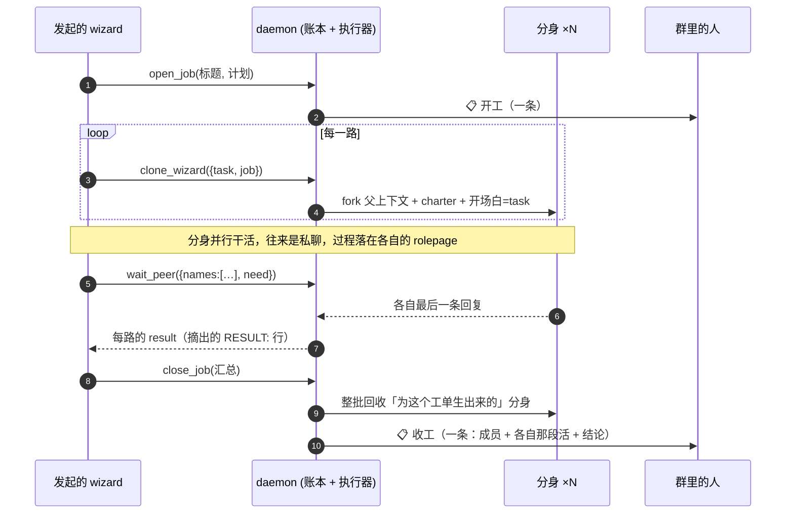
```mermaid
sequenceDiagram
    autonumber
    participant W as 发起的 wizard
    participant D as daemon (账本 + 执行器)
    participant K as 分身 ×N
    participant U as 群里的人

    W->>D: open_job(标题, 计划)
    D->>U: 📋 开工（一条）
    loop 每一路
        W->>D: clone_wizard({task, job})
        D->>K: fork 父上下文 + charter + 开场白=task
    end
    Note over W,K: 分身并行干活，往来是私聊，过程落在各自的 rolepage
    W->>D: wait_peer({names:[…], need})
    K-->>D: 各自最后一条回复
    D-->>W: 每路的 result（摘出的 RESULT: 行）
    W->>D: close_job(汇总)
    D->>K: 整批回收「为这个工单生出来的」分身
    D->>U: 📋 收工（一条：成员 + 各自那段活 + 结论）
```

| 原语 | 不这么做会怎样 |
| --- | --- |
| 工单 `open_job` / `close_job` / `list_jobs` | 五路 fan-out 刷十条交叉气泡，人读不出结构；且没人记得回收分身，而每个分身都占一个 pane 加一份上下文。被拉来帮忙的长期 wizard 与调用方自己**不在**回收之列。 |
| `wait_peer({names, need})` | 一个一个等，墙钟是所有人之和。地址整批先解析（打错一个不该等十分钟才发现），重复地址去重；法定人数一满，剩下的等待立刻撤掉，它们照常继续干。 |
| `RESULT:` 收口行 | join 的载荷是「对方最后一条 assistant 文本」——可能是「好的我开始了」，也可能是八百字散文。改不了 CLI 的输出格式，就在派活的提示里要求收口，`wait_peer` 摘最后一个匹配放进 `result`。与 graph 的 `until` 哨兵同源。 |
| `send_peer({when:"idle"})` | 两个 wizard 同时找第三个，两段文本挤进同一个输入框被当成一轮读掉。返回一律带 `wasBusy`。 |
| `cloneMax` / `JOB_MEMBER_MAX` | 分身能递归生分身，一次跑飞的编排足以把 fd 吃光（见 launchd plist 的 `NumberOfFiles`）。撞上限的回执直接说该怎么办：`stop_wizard` 收单个，`close_job` 整批。 |

### 频道：群是公开的，wizard 之间是私聊

名字全局可达以后，「这句话发到哪个群」不能再从 key 的 base 推出来了。于是每一轮 turn 记录一个 **channel**（`TurnDetailRecord.channel`）——这一轮的输入在哪儿说的、回复发到哪儿：

| channel | 含义 | 回复推到 |
| --- | --- | --- |
| `chat:…` / `user:…` | 公开频道：群，或与人的企业微信单聊 | 那个聊天 |
| `""` | wizard 之间的私聊 | **哪儿都不推**，只落 turn 记录（rolepage） |
| 缺省 | 老记录：按 `from` 推——peer 视为私聊，其余在 home | —— |

图 9｜同一次 send_peer 的两种走向

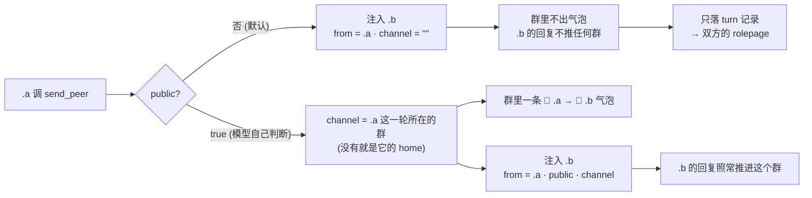
```mermaid
flowchart LR
    a[".a 调 send_peer"] --> pub{"public?"}
    pub -- "否 (默认)" --> priv["注入 .b<br/>from = .a · channel = &quot;&quot;"]
    priv --> nob["群里不出气泡<br/>.b 的回复不推任何群"]
    nob --> rp["只落 turn 记录<br/>→ 双方的 rolepage"]
    pub -- "true (模型自己判断)" --> ch["channel = .a 这一轮所在的群<br/>(没有就是它的 home)"]
    ch --> bub["群里一条 🦊 .a → 🐬 .b 气泡"]
    ch --> inj["注入 .b<br/>from = .a · public · channel"]
    inj --> rep[".b 的回复照常推进这个群"]
```

要不要公开由发话的 wizard 自己判断（`send_peer` 的描述里写着：需要人知道、或本该当着人讨论的才 `public`）。于是群里只剩人该看见的东西：**人发起的那一轮的回复**、`notify`、工单的开工 / 收工两条、wizard 主动公开的讨论。分身出生、派活、回程结论这几种旧气泡都不再有。

注入的那一行会被 `recentInjects` 当成回显吞掉、走不到 tail 的 `user_text`，所以本轮的 `userQuery`（「谁对它说了什么」那一半）在注入的同时就盖进去；`channel` / `from` 同理，要早于 inject 落地——tail 是独立轮询的，可能在 inject 的 promise resolve 之前就开出 turn。

### rolepage：从 turn 记录折出一个 wizard 的 IM

chat 详情页过去折的是「一个聊天里有哪些会话」。名字全局唯一以后这个轴不对了：wizard 不属于某个聊天，它在好几个群里被人叫、跟好几个同伴私聊。rolepage（`shared/role-view.ts`，纯函数）换成**一个 role 的视角**重新折叠同一批 turn 记录：

图 10｜一轮 turn 拆成两条消息，按频道归进会话

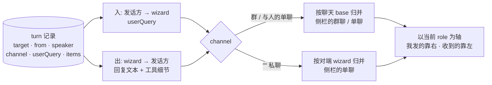
```mermaid
flowchart LR
    turn[("turn 记录<br/>target · from · speaker<br/>channel · userQuery · items")] --> inm["入: 发话方 → wizard<br/>userQuery"]
    turn --> outm["出: wizard → 发话方<br/>回复文本 + 工具细节"]
    inm --> conv{"channel"}
    outm --> conv
    conv -- "群 / 与人的单聊" --> pubc["按聊天 base 归并<br/>侧栏的群聊 / 单聊"]
    conv -- "&quot;&quot; 私聊" --> privc["按对端 wizard 归并<br/>侧栏的单聊"]
    pubc --> view["以当前 role 为轴<br/>我发的靠右 · 收到的靠左"]
    privc --> view
```

- **role**：wizard 就是它的 target key；人是 `human:<userid>`（不用 `user:<id>`——那正是「与这个人的单聊」里默认 wizard 的 target，字面相同会变成自己对自己说）；定时任务是 `task:<id>`，只发不收，不能切成视角。
- **发话方**：同伴（`from.kind=peer`）/ 定时任务（`task`）/ 人（`speaker`；老记录没有就记作「人」）。
- **侧栏**：群聊与单聊；选中的群展开群里其他 role 作子项，点开 = 当前 role 与它在这个群里的往来。**切视角**：点消息对侧的空白或头像，切到对端，能留在同一个群就留。
- **顶栏**：身份、cwd、创建时间；同名下多个 session（`/clear`、`/new`、交接轮换）出切换器；有家谱或派活关系时出「关系图」（复用 `/api/world`，聚焦当前 role）；「日程」列它名下（`owner`）的定时任务与工单。
- **路由**：`GET /role`（老 `/chat` 同一页面）、`/api/role`、`/api/msgs`、`/api/role-events`（SSE）、`/api/world`，daemon 与独立 svr 共用。`?id=` 是一条不可猜的记录 id，它就是凭据；页面的核心动作是顺着消息走到对端，而对端可能住在任何群，所以**任一有效票据可以看全部 role**（单用户部署下的取舍：名册本来就对每个 wizard 敞开）。要把正文严格关在一个群里的部署，不该对外暴露这些路由。链接里的 `role=` 用 target key 而不是名字，改名后旧链接照样能开。

---

## Prompt-cache 保活（省钱心跳）

Anthropic prompt cache TTL ~5 分钟，写 1.25x、读 0.1x。pane 空闲时整份上下文掉出缓存，下一轮真实对话要按 1.25x 冷写。保活在缓存过期前注入一次极小 ping，把 TTL 往前滑。

每会话两把时钟（由 transcript 的 MESSAGE 轮时间戳驱动，mtime 只当「要不要重读 tail」的廉价闸门）：

| 时钟 | 含义 |
| --- | --- |
| `lastMs` | 最近一轮（真实或 ping）= **缓存温度**时钟 |
| `lastRealMs` | 最近一轮**真实**对话 = 重置心跳预算的锚点，ping 不刷新它 |

定时器每 15 秒扫一遍所有挂载，逐会话判定：

图 11｜一次保活 tick 的判定

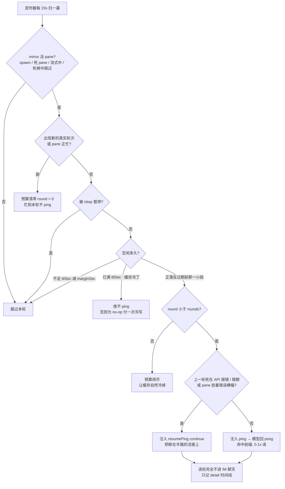
```mermaid
flowchart TD
    tick["定时器每 15s 扫一遍"] --> gate{"mirror 活 pane?<br/>spawn / 死 pane / 流式中 / 轮换中跳过"}
    gate -- 否 --> skip["跳过本轮"]
    gate -- 是 --> real{"出现新的真实轮次<br/>或 pane 正忙?"}
    real -- 是 --> reset["预算清零 round = 0<br/>忙则本轮不 ping"]
    real -- 否 --> paused{"被 /stop 暂停?"}
    paused -- 是 --> skip
    paused -- 否 --> warm{"空闲多久?"}
    warm -- "不足 ttlSec 减 marginSec" --> skip
    warm -- "已满 ttlSec · 缓存冷了" --> cold["绝不 ping<br/>否则为 no-op 付一次冷写"]
    warm -- "正落在过期前那一小段" --> budget{"round 小于 rounds?"}
    budget -- 否 --> stop["预算用尽<br/>让缓存自然冷掉"]
    budget -- 是 --> stall{"上一轮死在 API 报错 / 限额<br/>或 pane 挂着错误横幅?"}
    stall -- 是 --> resume["注入 resumePing continue<br/>把断在半路的活接上"]
    stall -- 否 --> ping["注入 ping → 模型回 pong<br/>命中前缀, 0.1x 读"]
    resume --> quiet
    ping --> quiet["该轮完全不进 IM 聊天<br/>只记 detail 时间线"]
```

- **自我不续命**：ping 刷新 `lastMs` 但不刷新 `lastRealMs`，所以保活自己不会把会话判成活跃，也不会把预算重新加满。
- **预算而非时限**：一次真实对话之后最多补 `rounds`（默认 6）次 ping，节奏是 `ttlSec - marginSec`（默认 255 秒），约 26 分钟；真实轮次一来，计数清零重新开始。
- **两道成本保险**：缓存已冷（距上次触碰 ≥ TTL）绝不 ping；预算用尽直接放手。
- **`/stop` 暂停**：Esc 打断同时挂起保活，等 pane 真的忙起来（且过了 30 秒 grace）才恢复——防止 `/stop` 自己那点落盘写把暂停解掉。
- **注入失败回滚**：inject 不成功就撤回「等待中」状态，下一 tick 重试，且不计入预算。
- **reload 不复燃**：daemon 重启后时钟从 transcript 的真实轮次重建（ping 轮不算数），搁置很久的大会话因缓存早已冷掉而直接跳过，不会被重新烧热。
- **一句话只说一遍不行**：每轮都重发完整 ping 文案而不是裸 `ping`——模型把裸 `ping` 当成一轮开放对话，答出 `pong` 之外的东西就会被当成真实活动推进群里。

全部可配（`wrc.mirror.keepalive`）：`enabled` / `ttlSec` / `marginSec` / `rounds` / `ping` / `resumeOnStall` / `resumePing`。

---

## 文档 MCP 如何桥接

`wezard` 把企业微信智能机器人的远端 MCP（doc / smartsheet / contact 等）桥接到本地 Agent，**不走 corp access_token**：daemon 直接复用 botId+secret 的 WS 长连，通过 `aibot_get_mcp_config` 命令拉到每个 category 的 Streamable HTTP MCP URL，再以 JSON-RPC 调 `tools/list` / `tools/call`，`x-openclaw-wecom-userid` header 透传文档归属人。

图 12｜一次文档写入穿过的四段链路

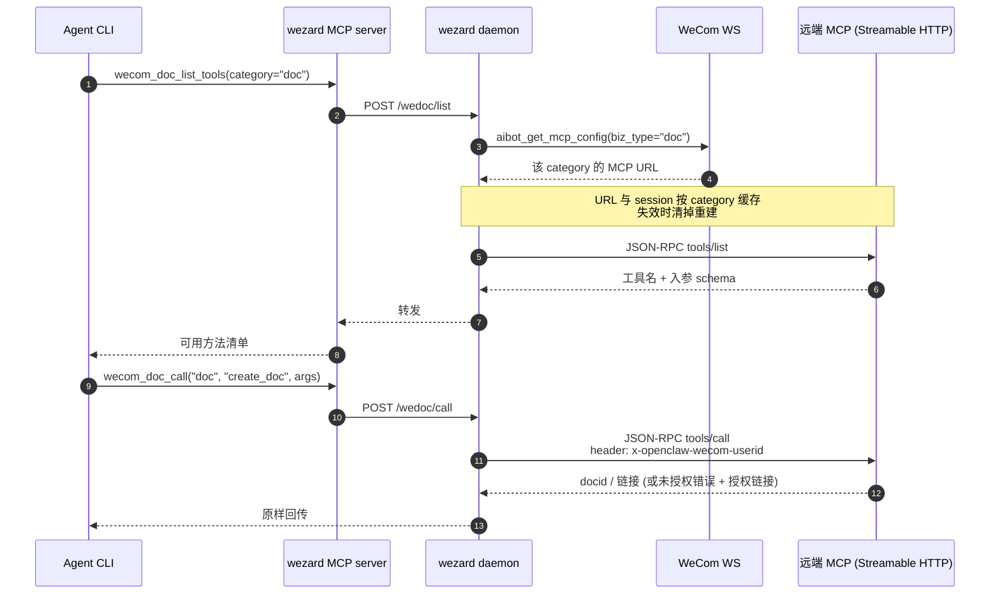
```mermaid
sequenceDiagram
    autonumber
    participant A as Agent CLI
    participant M as wezard MCP server
    participant D as wezard daemon
    participant WS as WeCom WS
    participant R as 远端 MCP (Streamable HTTP)

    A->>M: wecom_doc_list_tools(category="doc")
    M->>D: POST /wedoc/list
    D->>WS: aibot_get_mcp_config(biz_type="doc")
    WS-->>D: 该 category 的 MCP URL
    Note over D,R: URL 与 session 按 category 缓存<br/>失效时清掉重建
    D->>R: JSON-RPC tools/list
    R-->>D: 工具名 + 入参 schema
    D-->>M: 转发
    M-->>A: 可用方法清单
    A->>M: wecom_doc_call("doc", "create_doc", args)
    M->>D: POST /wedoc/call
    D->>R: JSON-RPC tools/call<br/>header: x-openclaw-wecom-userid
    R-->>D: docid / 链接 (或未授权错误 + 授权链接)
    D-->>A: 原样回传
```

**前置一次性授权**：在企业微信「工作台 - 智能机器人 - 你的机器人 - 可使用权限」里勾选「文档」「智能表格」对应能力。第一次调用如果未授权，远端会返回结构化错误（errcode 851013）+ 授权链接，原样转给 Agent，照着点同意即可。

**Agent 侧自动发现**：模型先调一次 `wecom_doc_list_tools(category="doc")` 拿到工具列表（`create_doc` / `edit_doc_content` / `smartpage_create` / `upload_doc_image` ...）和入参 schema，再用 `wecom_doc_call(category, method, args)` 执行。category 当前可选：

| category | 能干嘛 |
| --- | --- |
| `doc` | 在线文档、智能文档、文档图片上传 |
| `smartsheet` | 智能表格的字段 / 记录读写 |
| `contact` | 通讯录查询（按需授权） |

**curl 验证**：

```bash
# 列 doc 类目下所有可用工具
curl -sS -X POST http://127.0.0.1:17890/wedoc/list \
  -H 'content-type: application/json' \
  -d '{"category":"doc"}'

# 创建一篇文档
curl -sS -X POST http://127.0.0.1:17890/wedoc/call \
  -H 'content-type: application/json' \
  -d '{"category":"doc","method":"create_doc","args":{"doc_type":3,"doc_name":"demo"}}'

# 写入 Markdown
curl -sS -X POST http://127.0.0.1:17890/wedoc/call \
  -H 'content-type: application/json' \
  -d '{"category":"doc","method":"edit_doc_content",
       "args":{"docid":"<返回的 docid>","content_type":1,"content":"# 标题\n正文"}}'

# 授权变更后清缓存
curl -sS -X POST http://127.0.0.1:17890/wedoc/invalidate -H 'content-type: application/json' -d '{}'
```

`requesterUserId` 解析顺序：调用方显式传入 → `defaultChat` 的 `user:<id>` 部分 → 不传（远端会拒，错误原样回到 Agent，比 daemon 提前判更透明）。
