# wezard 技术说明

面向想搞清楚内部机制的读者：消息如何双向同步、`.name` 如何路由、room 账本怎么承载沟通与完成、管家如何分派、wizard 之间如何编排、rolepage 怎么把 room 账本与 turn 记录折成一个 wizard 的 IM、缓存冷热如何判、文档 MCP 如何桥接、整体架构长什么样。上手用法看 [README](README.md)，审批粒度看 [审批配置](审批配置.md)，模块级职责看 [CLAUDE.md](CLAUDE.md)。

---

## 架构一瞥

三个进程走 `127.0.0.1:17890` + `~/.wezard/`。daemon 是**唯一**持有 WeCom WS 连接的进程，hook 和 MCP 都是它的薄 HTTP 客户端：

图 1｜三进程与它们之间的四条通路

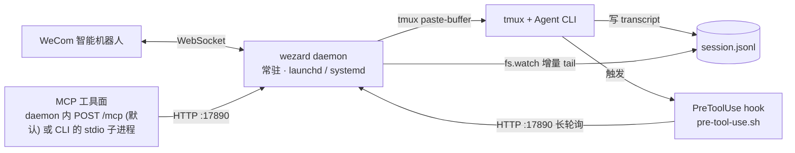
```mermaid
flowchart LR
    wecom["WeCom 智能机器人"] <-- WebSocket --> daemon["wezard daemon<br/>常驻 · launchd / systemd"]
    hook["PreToolUse hook<br/>pre-tool-use.sh"] -- "HTTP :17890 长轮询" --> daemon
    mcp["MCP 工具面<br/>daemon 内 POST /mcp (默认) 或 CLI 的 stdio 子进程"] -- "HTTP :17890" --> daemon
    daemon -- "tmux paste-buffer" --> cli["tmux + Agent CLI"]
    cli -- "写 transcript" --> jsonl[("session.jsonl")]
    daemon -- "fs.watch 增量 tail" --> jsonl
    cli -- 触发 --> hook
```

---

## 消息是怎么同步的

**审批流**（工具调用审批都走这条）。hook 的 curl `--max-time` 必须严格大于 `longPollSec`，否则人还没点、hook 已经自己回了 `ask`：

图 2｜一次工具调用从阻塞到放行

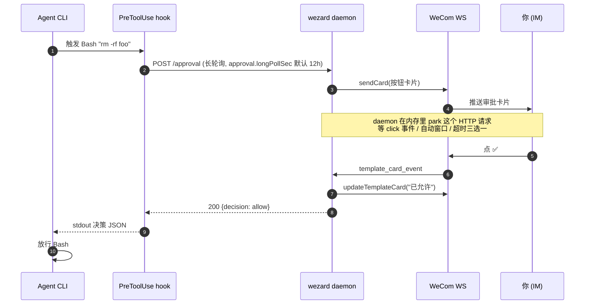
```mermaid
sequenceDiagram
    autonumber
    participant CC as Agent CLI
    participant Hook as PreToolUse hook
    participant D as wezard daemon
    participant WS as WeCom WS
    participant U as 你 (IM)

    CC->>Hook: 触发 Bash "rm -rf foo"
    Hook->>D: POST /approval (长轮询, approval.longPollSec 默认 12h)
    D->>WS: sendCard(按钮卡片)
    WS->>U: 推送审批卡片
    Note over D,U: daemon 在内存里 park 这个 HTTP 请求<br/>等 click 事件 / 自动窗口 / 超时三选一
    U->>WS: 点 ✅
    WS->>D: template_card_event
    D->>WS: updateTemplateCard("已允许")
    D-->>Hook: 200 {decision: allow}
    Hook-->>CC: stdout 决策 JSON
    CC->>CC: 放行 Bash
```

**镜像流**（IM ↔ tmux 双向）：

图 3｜一条 IM 消息进 CLI、再经 room 工具回到 IM

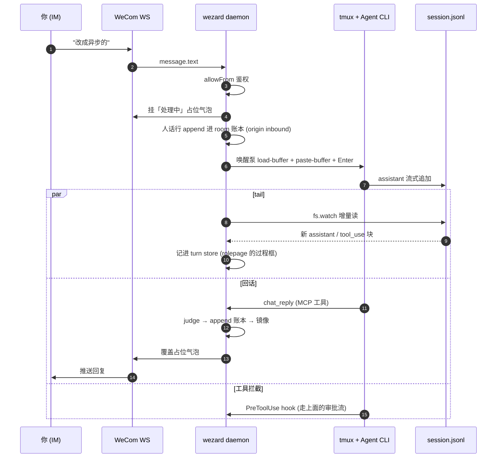
```mermaid
sequenceDiagram
    autonumber
    participant U as 你 (IM)
    participant WS as WeCom WS
    participant D as wezard daemon
    participant T as tmux + Agent CLI
    participant J as session.jsonl

    U->>WS: "改成异步的"
    WS->>D: message.text
    D->>D: allowFrom 鉴权
    D->>WS: 挂「处理中」占位气泡
    D->>D: 人话行 append 进 room 账本 (origin inbound)
    D->>T: 唤醒泵 load-buffer + paste-buffer + Enter
    T->>J: assistant 流式追加
    par tail
        D->>J: fs.watch 增量读
        J-->>D: 新 assistant / tool_use 块
        D->>D: 记进 turn store (rolepage 的过程框)
    and 回话
        T->>D: chat_reply (MCP 工具)
        D->>D: judge → append 账本 → 镜像
        D->>WS: 覆盖占位气泡
        WS->>U: 推送回复
    and 工具拦截
        T->>D: PreToolUse hook (走上面的审批流)
    end
```

两条流的共同要点：

- 审批是**长轮询 + 内存 park**，没有 webhook、不依赖外网回调；
- 镜像是**单向 paste + 单向 tail**：IM→tmux 走粘贴键（由 room 的唤醒泵投）；tmux 一侧只被读——读 jsonl 记进 turn store；话回到 IM 走的是 wizard 自己调的 room 工具（`chat_reply` / `chat_say`），终句不会自己进群。两条管道独立、互不阻塞。

---

## 多会话路由（`.name` · 新群引导 · 多 CLI）

一个 wizard 有两个身份，各管一件事：

| | 形态 | 管什么 |
| --- | --- | --- |
| **会话 key** | `user:<id>` / `chat:<id>` + 可选 `#slot` | 内部路由与落盘：pane、jsonl、cwd 都挂在它上面。base 部分就是它的 **home 群** |
| **名字** | `.name`，全局唯一，存在 `wizards.json` | 人和模型看得见、写得出的唯一地址 |

存量已有聊天名的默认会话（无 slot）取聊天名，其余取 slot id；撞名由 `pickName` 加 `-N`（大小写不敏感）；新群的管家由[新群引导](README.md#新群引导与名字)落定，自动取一个中性英文名。名字惰性落定——`settleName` 在第一次被问到时 claim，`settleAll` 在 boot 时按「默认会话先挑、其余按出生先后」把名册一次补齐，老记录（名字还跟着聊天走的那一代）就在这里迁完。**改名只改名册，不动 key**：pane、jsonl、历史都不受影响。

路由全部发生在 daemon 侧，tmux pane 无感知：

图 4｜一条入站消息如何落到某一个 wizard

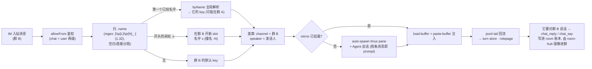
```mermaid
flowchart LR
    msg["IM 入站消息<br/>(群 B)"] --> auth["allowFrom 鉴权<br/>(chat + user 两级)"]
    auth --> scan["扫 .name<br/>(regex: [\\p{L}\\p{N}_-]{1,32},<br/>空白/首尾分隔)"]
    scan -- "第一个已知名字" --> byname["byName 全局解析<br/>→ 它的 key (可能在群 A)"]
    scan -- "开头的未知 .x" --> fresh["在群 B 开新 slot<br/>名字 x (撞名 -N)"]
    scan -- "无" --> base["群 B 的默认 key"]
    byname --> stamp["盖章: channel = 群 B<br/>speaker = 发话人"]
    fresh --> stamp
    base --> stamp
    stamp --> exist{"mirror 已挂载?"}
    exist -- 否 --> spawn["auto-spawn tmux pane<br/>+ Agent 会话 (首条消息即 prompt)"]
    exist -- 是 --> paste["load-buffer + paste-buffer 注入"]
    spawn --> paste
    paste --> tail["jsonl tail 回流<br/>→ turn store · rolepage"]
    tail -.-> reply["它要对群 B 说话 → chat_reply / chat_say<br/>写进 room 账本, 由 room-hub 镜像进群"]
```

关键规则：

- **名字全局可达，回复落在发话的 room**：人在群 B 里 `.fix`，而 `.fix` 的 home 是群 A——这句话以人话行写进群 B 的账本并唤醒 `.fix`（它随这条消息以 `mention` 方式成为群 B 的成员），`.fix` 用 `chat_reply({re})` 交代，落点就是那条消息所在的群 B。本轮 `recordTurnStart` 同时在 turn 记录里记下 `channel = 群 B`，rolepage 据此归档；一轮的终句本身**谁也送不到**，只进 turn 记录。在 home 群说话、没点名，道理相同。
- **只有开头的未知名字会造人**：句中一个没人叫的 `.x`（`a.ts`、`.gitignore`）原样透传，只有消息开头的那个才在本聊天开一个新 slot。名称只按全局名册解析；新建 slot 避开已有身份占用，不再按旧同名 slot 回退唤醒会话。
- **引用即路由**：出站气泡使用当前 `.name:`、反引号署名或链接头，由 `parseTagHeader` 反解；当前 `✦` footer 通过稳定 role key 识别发话方。引用一条气泡 = 跟那个 wizard 说话；旧 `#tag`、emoji/箭头头部及旧本地 slot 回退不再识别。
- **工作区是身份的属性**：`set_workspace` 只把新目录记成身份的 `pendingCwd`，不再驱动交接；此后新开的会话 / 分身落在该目录，在跑的那个 wizard 待当前任务收尾后 `handoff` 自己才带着简报在新目录重开（没有活 pane 时直接在新目录起）。
- **聊天名只剩显示标签**：群不再起名（`/name`、`/chats` 与按工作区自动补名的写入侧已整体下线，见 `daemon/chat-name.ts` 的冻结说明）；存量已命名的群保留为纯显示标签，`chatNameOf` 照读，`chatBaseOf` 仍能把存量名解析回 principal，仅此而已。`notify` 往哪个群发、`spawn_wizard({chat})` 把 home 设在哪个群，一律以聊天的 principal（`chat:…` / `user:…`）标识。
- **多 CLI 并存**：会话身份就是 jsonl 路径，daemon 由路径反推写它的 CLI，`--resume` 二进制、jsonl schema、project-dir 编码全部由此派生；新 pane 统一取 `wrc.defaultCli`，当前 `/new` 不再按单次参数选择 CLI；原生 clone 的后端约束仍按父 transcript 处理。

---

## wizard 网络：身份、感知、分派、编排

一个绑定了聊天的会话就是一个 **wizard**。它要协作，就得知道自己是谁、记得住跨会话的东西、知道网络里还有谁，还要有一套把活分出去再收回来的原语。每样各有各的通路，共同的约束只有一条——**不许多花轮次**：身份作为首条消息的 preamble 进来，名册变动搭顺风车，对方的 `chat_reply` 作为新的一轮把发话方叫醒，没有一样是靠「先问一句」换来的。

| 小节 | 解决的问题 | 落在哪 |
| --- | --- | --- |
| [身份](#身份宪章快照与后端注入) | 它是谁，`/clear` 之后还记不记得 | `wizard.ts` |
| [记忆](#记忆三个作用域共享的那两份只有一个写入者) | 跨会话、跨 wizard 共享的那些约定 | `wizard-memory.ts` · `memory-steward.ts` |
| [分身](#分身fork-上下文不是新开一个) | 公共材料读一遍，分出 N 路 | `mirror-bridge.ts` |
| [感知](#感知快照--增量) | 名册只会越来越假 | `notices.ts` · `peers.ts` |
| [分派](#分派默认-wizard-是这个群的管家) | 没点名的活该给谁、用哪一档模型 | `route.ts` · `steward-guard.ts` |
| [编排](#编排控制流留在发起方) | owner 维护的多 plan DAG、消息关联与提醒 | `plans.ts` · `plan-http.ts` · `plan-reminders.ts` |
| [room 账本](#room-账本沟通完成与唤醒) | 沟通、完成与唤醒，跨重启不丢 | `shared/room.ts` · `rooms.ts` · `room-hub.ts` · `room-watchdog.ts` |
| [交接](#交接换会话不换身份) | 上下文大了怎么原地重开 | `handoff.ts` |

### 身份：宪章快照与后端注入

身份（全局名字、工作区、职责、记忆、家谱、工具清单、编排剧本、怎么通过 room 说话的规矩）由 `wizard.ts` 的 `renderCharter` 从注册表渲染。Claude/CodeBuddy 通过 `charterPending` 在首条非 slash 注入前放入 preamble，确认提交后清标记；`/new`、`/clear`、交接与上下文切断按需重新武装。Codex 使用当前调用的 `developer_instructions`。不再用 `--append-system-prompt` 固定旧宪章。注册表是一份写穿 json（`~/.wezard/wizards.json`），由 `bindWizardStore` 绑成进程内单例，IM 侧的 `/peers` 也读得到。

图 5｜charter 按当前后端注入，清上下文后重新武装

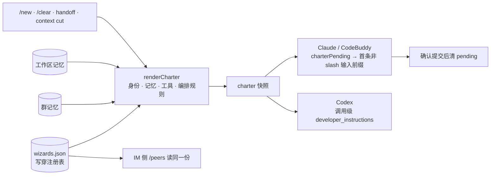
```mermaid
flowchart LR
    reg[("wizards.json<br/>写穿注册表")] --> render["renderCharter<br/>身份 · 记忆 · 工具 · 编排规则"]
    cm[("群记忆")] --> render
    wm[("工作区记忆")] --> render
    render --> file["charter 快照"]
    file --> pre["Claude / CodeBuddy<br/>charterPending → 首条非 slash 输入前缀"]
    file --> native["Codex<br/>调用级 developer_instructions"]
    pre --> ack["确认提交后清 pending"]
    cut["/new · /clear · handoff · context cut"] --> render
    reg --> peers["IM 侧 /peers 读同一份"]
```

### 记忆：三个作用域，共享的那两份只有一个写入者

`wizard_remember({scope})` 写三种记忆，区别不在存哪儿，而在**谁能写**：

| scope | 存在哪 | 生效 |
| --- | --- | --- |
| `self`（默认） | 它自己的名册记录（`wizards.json`） | 当场 |
| `chat` | `~/.wezard/memory/chats/<home>.md` | 提议，等整理者合并 |
| `workspace` | `~/.wezard/memory/workspaces/<cwd 编码>.md` | 提议，等整理者合并 |

自己的记忆跟着自己走，直写即可。可很多东西不属于某一个 wizard——「这个群里人习惯先出方案再动手」属于这个群，「这个仓库没有测试、reload 要先 build」属于这个工作区。这两份是**共享**的 markdown，任何以那个群为 home、或在那个目录下出生的 wizard 都把它们读进 charter，于是新来的不必被人再教一遍。是 md 而不是 json：人也会直接打开改。

共享的那两份**不直写**。`wizard_remember({scope})` 只往同名收件箱（`memory/inbox/<chats|workspaces>/<key>.jsonl`）追加一行 json 提议（`{at, by, note?, forget?}`）——一行一条、追加写，几十个 wizard 并发投也不会互相覆盖。直接追加的老路在几十个 wizard 同写一份文件时只会越来越长、互相矛盾，而每个新 wizard 出生都要把它整份吃下。

图 6｜共享记忆的单写入者：提议进收件箱，整理者合并进 md

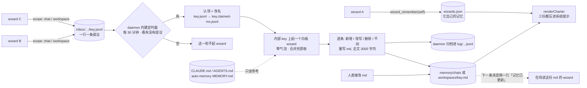
```mermaid
flowchart LR
    w1["wizard A"] -- "wizard_remember(self)" --> reg[("wizards.json<br/>它自己的记忆")]
    w2["wizard B"] -- "scope: chat / workspace" --> inbox[("inbox/…/key.jsonl<br/>一行一条提议")]
    w3["wizard C"] -- "scope: chat / workspace" --> inbox
    inbox --> gate{"daemon 内建定时器<br/>每 30 分钟 · 看有没有提议"}
    gate -- "空" --> skip["这一轮不起 wizard"]
    gate -- "有" --> claim["认领 = 改名<br/>key.jsonl → key.claimed-ms.jsonl"]
    claim --> fresh["内部 key 上起一个白板 wizard<br/>零气泡 · 合并完即收"]
    refs[("CLAUDE.md / AGENTS.md<br/>auto-memory MEMORY.md")] -. 只读参考 .-> fresh
    fresh --> merge["逐条: 新增 / 改写 / 删除 / 不动<br/>重写 md, 全文 3000 字内"]
    merge --> md[("memory/chats 或 workspaces/key.md")]
    merge --> arch[("daemon 归档进 log/…jsonl")]
    md -. "下一条消息捎一行「记忆已更新」" .-> live["在场读这份 md 的 wizard"]
    human["人直接改 md"] --> md
    reg --> charter["renderCharter<br/>三份都压进系统提示"]
    md --> charter
```

**整理者既不是常驻 wizard，也不是一条定时任务**，是 daemon 的内建定时器（`memory-steward.ts`，每 30 分钟，开机后 1 分钟先跑一轮）。它看收件箱有没有提议，有才在一个**不属于任何聊天**的内部 key 上起一个白板 wizard 去合并，合并完即收。整理不放进管家的上下文——管家的上下文只留给名册和分派；这是 Letta 把 sleep-time agent 与主 agent 分开的同一个理由：在线的那个不该被后台活拖慢。不走 `tasks.ts` 是因为它不是谁排的日程：任务会出现在 `list_tasks` 和日程里、放枪要发 ⏰ 气泡、执行体住在某个群里，而整理是 daemon 自己的家务，不该惊动任何群——全程零气泡，结果只留在执行体的 rolepage 和审计日志里。老版本写下的 `memory-steward.task.mjs` 开机时改名为 `.retired` 停用，免得两路并跑。

- **认领 = 改名**（`x.jsonl` → `x.claimed-<ms>.jsonl`）：认领之后新来的提议落进一个新的 `x.jsonl` 等下一轮，不会和正在合并的那批搅在一起。整理者中途死掉留下的认领超过一小时再认一次——按**文件名里的时刻**判，不按 mtime（改名不动 mtime）。
- **合并规则**：逐条决定新增 / 改写（新的更准，或推翻了旧的）/ 删除（`forget` 命中，或已被推翻、过时）/ 不动（重复、只是某次任务的临时状态，或参考文件里已经写了）；重写 md，每条一行，相近的合并，全文 3000 字以内，人手写的内容与格式保留。收工后由 daemon 把收件箱归档进 `log/` 再删——执行体只动 md。
- **参考源只读**：该工作区的 `CLAUDE.md` / `CODEBUDDY.md` / `AGENTS.md` / `.claude/CLAUDE.md` 与各 backend 的 auto-memory `MEMORY.md` 一并交给执行体。已写在那里的不再收；与之矛盾的提议不进 md，记作冲突——参考文件是人写的，优先。workspace 提议记下 `cwd`，提议者收工后仍找得到参考源。
- **合并后告诉在场的**：宪章是出生快照，改了 md 活着的 wizard 也看不到。真有改动时，pane 活着且读这份 md 的 wizard 下一条消息尾巴上捎一行「记忆已更新，全文见 …」。
- **宪章里每份共享记忆截到 4000 字**（`CHARTER_MEMORY_MAX`），超了只截头并指路全文——压短是整理者的活，不是渲染器的。

读写失败一律吞掉：记忆是锦上添花，读不到就当没有，写不进就回报失败，都不该拖垮一次 spawn。

### 分身：fork 上下文，不是新开一个

`MirrorBridge.cloneSession` 走 `--resume <父 sid> --fork-session`：CLI 把父亲的 transcript 复制一份再往下写，孩子开局就带着父亲读过的一切，父亲毫发无损。**「公共材料读一遍，再分出 N 路」靠的就是这个。** 两条不变式：

- `--fork-session` 是强制的——少了它，第二个 pane 会追加进父亲的 jsonl，两个聊天当场串线；
- fork 出来的 transcript 只在那个 pane **收到第一条消息**时才出现，所以分身的开场白就是触发器，attach 会等这个 fork；等不到就杀掉 pane，绝不退而绑到父亲的 sid 上。

图 7｜带与不带 `--fork-session` 的分歧

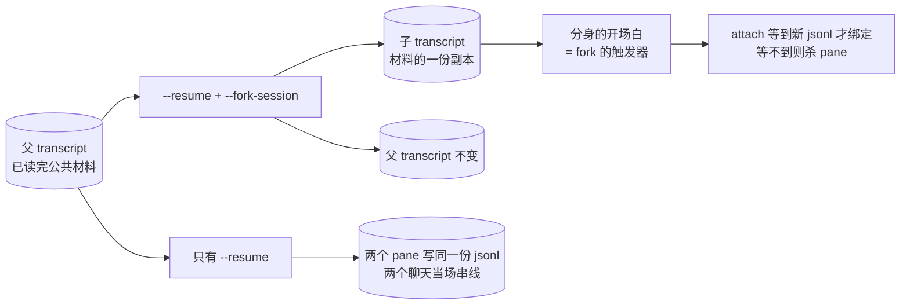
```mermaid
flowchart LR
    parent[("父 transcript<br/>已读完公共材料")]
    parent --> ok["--resume + --fork-session"]
    parent --> bad["只有 --resume"]
    ok --> child[("子 transcript<br/>材料的一份副本")]
    ok --> keep[("父 transcript 不变")]
    child --> first["分身的开场白<br/>= fork 的触发器"]
    first --> attach["attach 等到新 jsonl 才绑定<br/>等不到则杀 pane"]
    bad --> cross[("两个 pane 写同一份 jsonl<br/>两个聊天当场串线")]
```

### 感知：快照 + 增量

charter 里那份名册是 spawn 那一刻的快照，只会越来越假；而「每次协作前先查一次名册」要花一轮，于是实际上没人查。所以补上另一半：

图 8｜名册变动怎么搭顺风车进到别人耳朵里

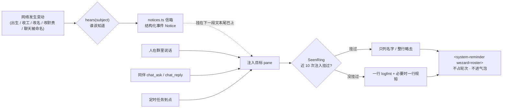
```mermaid
flowchart LR
    ev["网络发生变动<br/>(出生 / 收工 / 改名 / 改职责 / 聊天被命名)"] --> hears{"hears(subject)<br/>谁该知道"}
    hears --> box["notices.ts 信箱<br/>结构化事件 Notice"]
    box -.挂在下一段文本尾巴上.-> inj
    human["人在群里说话"] --> inj["注入目标 pane"]
    peer["同伴 chat_ask / chat_reply"] --> inj
    cron["定时任务到点"] --> inj
    inj --> seen{"SeenRing<br/>近 10 次注入挂过?"}
    seen -- "挂过" --> short["只列名字 / 整行略去"]
    seen -- "没挂过" --> full["一行 logfmt + 必要时一行规矩"]
    short --> sr["&lt;system-reminder wezard=roster&gt;<br/>不占轮次 · 不进气泡"]
    full --> sr
```

- **事件是结构化的**（`Notice`），渲染成一行 logfmt：`born .x by=.p clone job=… cwd=…` / `ended` / `renamed` / `job` / `chat` / `note`。工作区与收件人相同就不提；两次注入之间生了又收掉的净值为零不报；同一位收掉的一批分身并成一行 `ended .a .b .c …(+N) by=.p`。
- **谁该知道**由纯函数 `hears(subject)` 按注册表定：没有 parent 且写了职责的长住 wizard，告诉同群全体；有 parent 的只告诉直属 parent，不上溯家谱；既无 parent 也没写职责的（还没自我介绍的会话）谁也不告诉，写下职责那一刻才算登场。回归测试那一批临时分身因此不再刷别人。
- **去重窗口**：每个 pane 记着「近 10 次注入挂过哪些提示」（`SeenRing`，落盘 `~/.wezard/notice-seen.json` 扛 reload；换 sid、`/clear`、压缩、新宪章即清零）。窗口里介绍过的 wizard 只列名字，同一行变动不再重复，每段的使用规矩只在窗口里没给过时挂一行。一条点名 + 十几行分身生收的尾巴由约 810 tok 压到约 125 tok。
- **群况快照**（`mode="full"`）：只报变动的话，管家和长住 wizard 几乎收不到什么。所以长住 wizard（没有 parent 的）在近 10 次注入里没拿到过群况时，尾巴上挂一份 CSV 群况表 `name,state,job`——管家、长住有职责的、管家生的、收件人自己生的；忙闲取注册表，不抓 pane。交接 / `/clear` 后的头一条必带。
- **点名**（`wezard="mention"`）：消息里点到的 `.x` 每个一行 `.x job=… [chat=…] [cwd=…]`，窗口内再点同一个只剩名字。

每条 reminder 的事实都写在开标签属性上（`wezard=envelope|mention|roster|…`、`kind` / `from` / `chat` / `scope`），正文只给模型读——改措辞不会破坏解析（`shared/reminder.ts` 的 `parseEnvelope`）。投递即清空信箱：那一次注入失败这几行就丢了。通知是提示，真相永远可以 `wizard_roster` 问到——为一行提示做可靠投递不值当。

`wizard_roster` 自己则是一张**索引**而不是一份转储：服务端按 `query`（名字/职责/地址子串）、`cwd`（工作区反查）、`chat`、`alive` 过滤，默认只回最相关的一页（自己 → 活着的 → 最近动过的），附 `total` / `matched` / `more` 让调用方知道自己看的是不是全部。三百个会话一次吐出来，等于找不到人。

### 分派：默认 wizard 是这个群的管家

聊天的默认会话（`WizardBrief.steward`）是这个群的**管家**：人没点名说的话都落到它这儿，点了 `.name` 的直达那个 wizard，不经过它。`renderCharter` 只给它多压一段「我是这个群的管家」，所以管家不是另一种进程，只是多了一段职责。

它的活是**分派**，不是亲手干——上下文留给名册和来龙去脉，别被大段代码和文件塞满。一两句能答完的（问进度、问谁在干什么、闲聊）自己答；要读很多代码、改文件、跑很久的活，哪怕它自己做得了也转出去：它一忙，这个群里没点名的话就都排在它后面。

主路径是一步 `delegate({task, name, description})`：查候选 → 给默认决定 → 以管家的名义投成一条 `chat_ask`（对方只能用 `chat_reply` 交代），回包写明决定、理由、件号与落到的模型。管家照办，或显式推翻——`to` 点名、`spawn:true` 硬要新的、`force` 越过冷门控、`tier` 换档。只想看证据自己判断时调 `route_candidates({task})`，拿到的是同一张表。

**`route.ts` 把这件事拆成能算的事实与必须判断的权衡。** 候选表只摆事实；`decide` 再把同一套事实收成一个默认决定——管家判断失准也不至于派错的那一半。

图 9｜候选表算到哪一步为止，剩下的交给管家

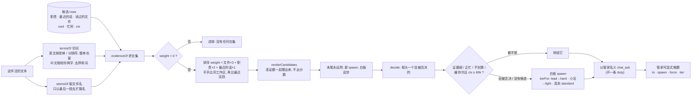
```mermaid
flowchart LR
    task["这件活的文本"] --> terms["termsOf 切词<br/>英文按驼峰 / 分隔符, 整串也留<br/>中文取相邻两字, 去停用词"]
    task --> stems["stemsOf 取文件名<br/>只认最后一段去扩展名"]
    rows[("候选 rows<br/>职责 · 最近的话 · 读过的文件<br/>cwd · 忙闲 · ctx")] --> ev["evidenceOf 求交集"]
    terms --> ev
    stems --> ev
    ev --> filt{"weight &gt; 0 ?"}
    filt -- "否" --> drop["滤掉: 没有任何交集"]
    filt -- "是" --> sort["排序 weight = 文件×3 + 职责×2 + 最近的话×1<br/>平手比同工作区, 再比最近活跃"]
    sort --> render["renderCandidates<br/>连证据一起摆出来, 不出分数"]
    render --> last["末尾永远附: 新 spawn, 白板起步"]
    last --> decide["decide: 取头一个没被否决的"]
    decide --> veto{"证据弱 / 正忙 / 不划算 /<br/>缓存冷且 ctx ≥ 60k ?"}
    veto -- "都不是" --> exist["转给它"]
    veto -- "全被否决 / 没有候选" --> spawn["白板 spawn<br/>tierFor: lead→hard · 小活→light · 其余 standard"]
    exist --> tell["以管家名义 chat_ask<br/>(开一条 duty)"]
    spawn --> tell
    tell --> judge["管家可显式推翻<br/>to · spawn · force · tier"]
```

- **能算的**：职责 / 最近的话与这件活的词面交集；它上下文里读过的文件被这件活点到；在不在同一个工作区、忙不忙、`ctx` 多大、缓存冷没冷。
- **文件只认整个文件名被点到**：目录名（`daemon/`、`web/`）几乎每个文件都带，文件名里的半截词（`role-render` 的 `render`）又太常见——撞上它们说明不了它读过这一个。
- **排序只是让最有证据的先被看到**：文件命中（它真读过）> 职责 > 最近的话，同工作区只用来打破平手。权重为 0 的直接滤掉。
- **每个候选附一行代价**：缓存冷热（TTL 读自它 transcript 实际写入的档位，起点是最近一次请求的开始，见[冷热判定](#缓存冷热判定路由冷门控)）、唤醒要重写多少缓存（对比白板 spawn 起步约 25k 的倍数）、往后每轮背着的 ctx。证据弱又贵（缓存冷且 ctx ≥60k，或热但 ≥150k）的标 ⚠「不划算，建议白板 spawn」；看着是小活（一句话 / 样式 / 单点修改 / 简单查询）的表头点明。
- **末尾永远留着「新 spawn」**：它是没有好候选时的默认，所以表空了也不必特判。

`decide` 的否决按顺序判：**证据弱**（没读过点到的文件，职责也没撞上两个以上的词）→ **正忙** → **不划算**（上一条的 ⚠）→ **缓存冷且 ctx ≥60k**（`force` 可越过）。头一个没被否决的就是它；全被否决就白板 spawn，理由里写前几个为什么不行。spawn 的默认档由 `tierFor` 定，两头的 `mini` / `ultra` 只由调用方显式给。

留给管家的恰好是算不出来的那两件，推翻默认决定时用得上：

| 判断 | 依据 |
| --- | --- |
| **相关性** | 表里的交集是不是真的同一件事。字面沾边不算；文件命中比词面重叠可信。 |
| **接着用这段上下文划不划算** | 收益是它省掉的重读（要重读的材料越多越划算）；代价是唤醒时的缓存重写，以及 `ctx` 越大往后每一轮都背着整段历史——更贵、更慢、更容易被旧话题带偏、离交接越近。 |

**冷门控**：这笔账不只管家要算——`decide` 的最后一道否决就是它：缓存已冷且 ctx ≥60k 的候选默认不转，`force:true` 越过（只越过这一道，不放宽相关性）。冷热与倍数与候选表同一把尺（`wakeCostOf`），roster 的忙闲列也按同一口径标冷。

**档位**（`models.backends.<backend>.tiers`，由轻到重；表中为 Claude 系缺省）：

| 档 | 缺省 | 用途 |
| --- | --- | --- |
| `mini` | haiku · low | 机械一步，照单执行 |
| `light` | sonnet · medium | 跑腿：查找、搬运、跑命令 |
| `standard` | sonnet · medium | 常规实现 |
| `hard` | opus · high | 要判断：设计、排障、审查 |
| `ultra` | opus · max | 最难的架构取舍、疑难排障、关键评审 |

`spawn_wizard` / `clone_wizard` / `delegate` 都收 `tier`，显式 model / effort 压过档位，返回里每项写明来源（`explicit` / `tier` / `inherit`）；CLI 统一取 `wrc.defaultCli`。模型名能确切对上本机 transcript 里真答过的 id 时直接 `--model <id> --effort <档>` 启动，省掉 `/model` 选择器那一来回。Codex 使用独立档位，缺省模型留空交给 CLI，effort 依次是 low / medium / medium / high / xhigh。管家唯一档位来源是 `models.router`（缺省 `standard`），首建、`/new`、交接与冷恢复均按实际后端的档位表解析；已在跑的会话不自动换模型。旧顶层 `models.tiers`、steward 覆盖和档位内 `cli` 不再参与解析。

**复杂的活交给 lead**。管家用 `delegate({lead:true, task})` 将整件任务交给 lead；lead 维护自己的 plan，逐阶段安排 explorer、coder 与独立 reviewer，读回结果并验收后再推进 DAG。范围清楚、低风险 coding 默认 `light`；reviewer 从白板起步，按风险选 `light` / `standard` / `hard`。`renderLeadPlaybook` 随派活信封说明这些职责，不再开工单或预建后续执行队伍。

**手闸**（`steward-guard.ts`）：宪章说分派，管家实际上常常自己埋头干——一忙，群里没点名的话就全排在它后面。守护进程在 PreToolUse 判定链的最前面拦它（排在 matcher、allowRules、⏱ 窗口、`skipAll` 之前，拦的不是危险而是越位）：`Edit` / `Write` / `MultiEdit` / `NotebookEdit` / `Agent` / `Task` 一律拒（Bash 写文件同拦）；读代码（Read / Grep / Glob 与 cat / grep / git show 等只读命令）放行、不计数；其余跑命令每轮最多 `chatPolicy.<群>.stewardBudget` 次（缺省 4，`-1` = 关），超了拒；wezard MCP 与 ToolSearch 这类元工具不计。deny 的 reason 直接写改道说明：去 `delegate`。

### 编排：控制流留在发起方

Wezard Teams 将复杂任务保存为 **owner 自己维护的可变 DAG**。一个 wizard 可以并行拥有多个 plan；每个 plan 只有一个 owner，其他 wizard 只能读取。daemon 提供持久化、结构校验、查询与提醒，任务拆分、派发、验收和状态推进由 owner 显式完成。

图 10｜owner 逐阶段更新 plan 与安排协作

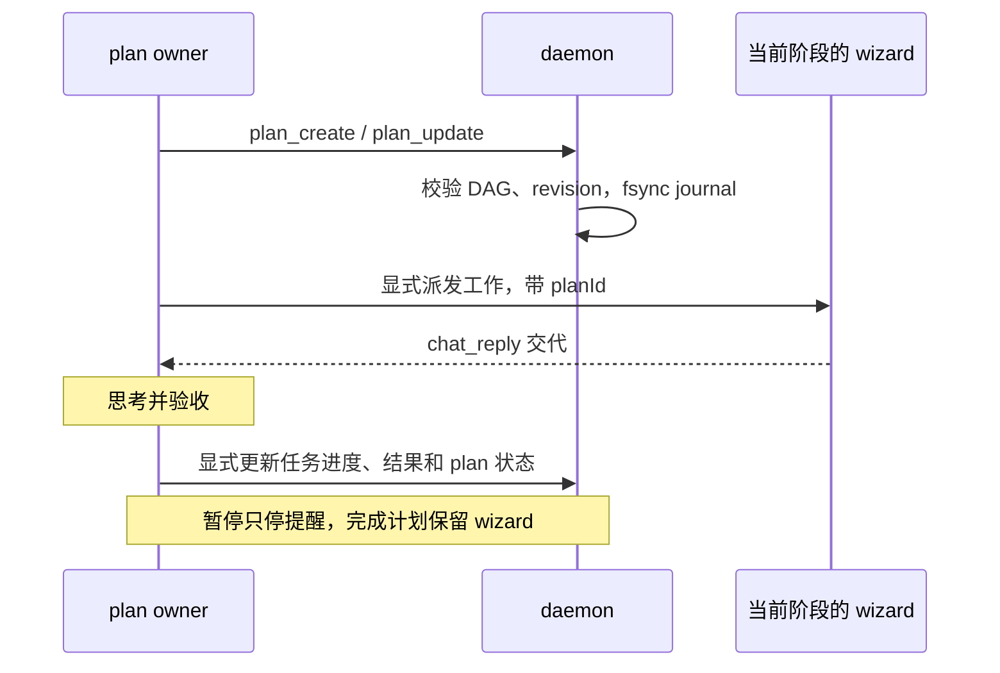
```mermaid
sequenceDiagram
    participant W as plan owner
    participant D as daemon
    participant K as 当前阶段的 wizard
    W->>D: plan_create / plan_update
    D->>D: 校验 DAG、revision，fsync journal
    W->>K: 显式派发工作，带 planId
    K-->>W: chat_reply 交代
    Note over W: 思考并验收
    W->>D: 显式更新任务进度、结果和 plan 状态
    Note over W,D: 暂停只停提醒，完成计划保留 wizard
```

#### 数据与接口

`shared/plan.ts` 定义 `PlanRecord`、`PlanInput`、`PlanUpdate` 与校验器。plan 保存 id、owner、title、description、tasks、state、reason、revision、创建/更新时间，以及创建时的回复上下文 origin 和内部提醒标记。每个 task 保存 id、title、description、dependsOn、status、progress、result；不绑定 executor 或 attempt。

| MCP 工具 | HTTP 路由（POST） | 契约 |
| --- | --- | --- |
| `plan_create` | `/plans/create` | 创建调用者自己的 active plan，revision 从 1 开始；可先建空 DAG。可选 requestId 在 owner 内幂等，同 id 不同内容返回 409 |
| `plan_get` | `/plans/get` | 按 planId 只读获取完整 DAG；读取限制在同一 bot |
| `plan_list` | `/plans/list` | 默认列自己的 plans；可按 wizard name 只读查询同一 bot 的其他 owner |
| `plan_update` | `/plans/update` | 仅 owner 可写，revision 必须等于当前版本；tasks 替换整份 DAG。接受的更新使 revision 加一 |

计划状态为 `active`、`paused`、`completed`、`canceled`；任务状态为 `pending`、`in_progress`、`completed`、`canceled`。校验拒绝重复节点、缺失依赖、自依赖与环；将任务推进到进行中或完成时，它的前置任务必须已完成。plan 只有在全部任务完成或取消后才能标为 completed；completed/canceled 是终态，之后不再更新。owner 用 `plan_update` 显式暂停、恢复、完成或取消，取消独立于完成。

`daemon/plan-http.ts` 读取绑定 pane 优先、sessionId 次之的调用身份；拒绝 target-only 与冲突 target。创建还要求 owner 仍在注册表中且未进入退役。MCP 使用 `PlanUpdateSchema.innerType().shape` 暴露字段，HTTP 的 `safeParse` 保留业务 refine 校验。

#### 持久化与故障隔离

`daemon/plans.ts` 的 `loadPlans(cfg.wrc.mirror.plansFile)` 读写追加式 JSONL journal，默认 `~/.wezard/plans.jsonl`。create、update、reminded 均先写 journal 并 fsync，再发布内存状态；提醒标记单独落盘，不改变 revision。回放验证 owner、origin、版本与状态，已验证的完整行可恢复，末尾不完整写入才截断。坏的完整历史、初始化失败或写入失败使 store 不健康，计划读写与退役检查返回 503，不把部分回放或空集合当成计划事实，也不覆写坏 journal；普通 receiver 服务仍可运行。世界投影仅在 store 健康时读取 plans。

origin 由创建入口记录 channel 与 asker，用于提醒后的回复上下文；它不建立 plan 关联，也不计作 plan 的欠账。

#### 逐输入关联与提醒

- 为某个 plan 派活时，`chat_ask` / `delegate` 显式带 `planId`，它记在那条 duty 行上，只做关联记录——daemon 不据此推进 DAG、不替 owner 验收。
- `planId` 只参与计划提醒，不改变 duty 的处理人、唤醒或关账规则。
- `daemon/plan-reminders.ts` 默认每 30 秒检查 active plans：owner 正忙、正在交接，或 owner 名下仍有带这个 `planId` 的未关 duty（`planHasOutstandingDebt` 读 room 账本的 `openDuties`）时暂不提醒；别人派给 owner 的 duty 不算它的外派欠账。
- token 由 plan id、revision 和关联消息 id 集合生成。入队前再次同步校验 plan 状态、版本、欠账、owner 是否空闲与是否在交接；暂停、结束或版本变化使旧提醒失效。暂停不挡普通消息或协作。
- 提醒本身是一条 `trigger` 行：不镜像进群、只叫醒 owner；去重靠 `plans.reminded` 里持久化的 token，这个标记不改变 revision。

#### 管理树与生命周期

spawn/clone 的 parent 始终是调用者；跨 cwd/chat 创建、从其他 wizard fork 上下文也一样，forkOf 只记录上下文来源。wizard 可以直接横向沟通与返修，随后回到自己的主流程交付；管理归属仍按直属 parent。结束身份只允许本人或直属 parent，忘记 parent 前先处理直属子 wizard。

交付后默认保留 wizard，结束 plan 也不自动收队。pane 数量超限时只收 pane，保留身份、会话绑定、plans 与 receiver 状态。任何逻辑退役路径都要检查未结束 plan；active/paused plan 阻止身份删除。退役集合与创建入口共同封住异步 killPane 期间新建 plan 的竞态，自动 runner 清理、releaseSlot 与记忆整理者清理也遵守同一保护。

旧 jobs、workflow nodes/plans runner、graph 执行器及相应 MCP/HTTP 入口已删除；没有旧 runner 兼容入口或数据迁移。`jobsFile`、`receiptsFile` 不再是配置项。`delegate` 请求中的 job/node/role/workflow/graph/detached 等退役字段明确拒绝。关系图仍保留，通用等待 helper 迁到 `daemon/wait-idle.ts`。

### room 账本：沟通、完成与唤醒

wizard 之间、人和 wizard 之间所有的话都进同一种东西：**room**。`shared/room.ts` 是无 IO 的纯核心（行类型、fold、`judge`、唤醒与镜像规则、id 派生），`daemon/rooms.ts` 落盘，`daemon/room-hub.ts` 是**唯一的 append 口子**加唤醒泵（契约定稿见 [docs/room/contract.md](docs/room/contract.md)）。一条总原则：**完成信号、出处、发言权都是账本行上的显式字段**，不从 transcript、终句或信封里推断。

| room | id | 传输 |
| --- | --- | --- |
| 企微群 / 单聊 / 频道帖子 / 微信 | 聊天的 base principal 原样（`chat:…` / `user:…`，含 `~bot`） | 绑定：`msg` 行镜像进企微 |
| 两个 wizard | `dm:` + 两个实例**稳定 uid** 排序后 `|` 拼接（同一对唯一；名字与 target 绝不进 id） | 不绑定，只在 rolepage |
| 三人以上临时 | `adhoc:` + 8 位 hex，只能 `room_open` 显式开 | 不绑定 |

- **账本**：一个 room 一份 `<stateDir>/rooms/<id>.jsonl`（`roomsDirOf` 是唯一推导，谁都不许再本地 `join` 一个 rooms 出来），每次 append 同步 fsync。撕裂的尾行丢弃，中段坏行使这个 room 拒绝读写（503）——账本是完成与发言的唯一事实，宁停不错。状态是行的 fold，内存里随 append 增量推进。
- **行**：`open` / `name` / `join` / `leave` / `seen` / `move` / `watch` 与 `msg`；`msg` 的 `kind` 有 `say` / `ask` / `task` / `reply` / `file` / `join-req` / `system` / `trigger`，作者是 `human` / `wizard`（id 为实例 uid，改名不变）/ `daemon`，`origin` 是 `inbound` / `tool` / `daemon` / `migrate`。
- **append 前的判定（`judge`）**：成员资格（发言权）、谁能写 `status`（只有这条 duty 的处理人或人）、覆盖检查、10 分钟内同键去重、该唤醒谁、room 的唤醒预算（10 分钟窗口，从账本算，重启不丢）。被拒的发言不成行。
- **duty**：`chat_ask` / `task` 对每个被点名者开一条 duty（key `<msgId>@<slot>`）。只有处理人的 `chat_reply` 带 `done` / `passed` / `canceled` 能关账，写进那一行的 `closes`；`need` / `progress` / `error` 不关。`chat_say` / `notify` 不开 duty。交接 = 拉接手方进来再自己 `room_leave`；成员离开时它名下未关的 duty 由 daemon 逐条写 `canceled` 并唤醒提问者。`after` 让一条 duty 等前置的 duty 都 `done` 之后才叫醒对方。
- **唤醒（`wakeTargets`）**：被点名的；`re` 的作者（回包叫醒提问者，`progress` 例外）；绑定 room 里没点名的人话落给 **host**（加入序最小的 wizard 成员，读时求值，不落盘）；`room_watch` 订阅者只在人话和带终态的 reply 时也被叫醒。其余成员只推进 `seen` 游标，下次被叫醒时随信封补上。
- **唤醒泵不持有队列**：「谁该被叫、给它看什么」每次都从账本现算——有 `wake∋uid` 且 `seq` 在它的 `seen` 之后的行就是待唤醒。投递成功才写 `seen`；不确定就不推游标，下次重投同一批并标「可能已读过」，所以 reload、交接、pane 重生都丢不了话。忙着的活 pane 等它这一轮结束再投；`interrupt:true`（只有直属 parent、room 的 host 或人能用，计入回合预算）先 Esc 再投，被打断那一轮的 duty 不关，下次按游标重投；冷会话不算忙，贴进去会让它重生。注入头是 `【room 名】(room id)` + 未读行（触发行全文，其余从新到旧装到预算）+「你要交代：…」。
- **轮终要交代**：被唤醒处理的 duty 在这一轮结束时仍没 `chat_reply`（任何 status 都算交代），提醒一次——带 Stop hook 的后端（`hooks/stop.sh`，实测认 `decision:"block"` 的那些）在 CLI 要结束时把提醒提前到轮内，其余在轮终兜底；再闲下来仍没交代，给提问者写一条系统行。`room-watchdog.ts` 兜「漏了 turn_end / pane 意外消失」：首轮只建基线，pane 不存在要连续两次扫描都确认才写 `canceled` 并唤醒提问者，tmux 调用失败的轮次整体跳过。
- **镜像规则**：一行进企微 ⇔ room 绑定了传输 ∧ 是 `msg` ∧ `origin` 不是 `inbound` / `migrate` ∧ `kind` 不是 `trigger`，没有别的例外。人话的占位气泡由第一条 `re` 它且带正文的 reply 覆盖。**终句没有任何路由语义**：`mirror-bridge` 只把它记进 turn store，不出站、不关账。
- **turn 的 `channel`**：每一轮 turn 记录仍带一个 `channel`——这一轮的输入是在哪个聊天说的（`""` = wizard 之间的私聊轮）。它只用来给 rolepage 归档，以及让服务于这一轮的后续注入（审批恢复、交接简报）沿用同一个频道；它不再决定任何回复发到哪儿。
- **迁移**：`cli/migrate-rooms.ts` 经 `shared/room-migrate.ts` 把旧的路由账 / 聊天记录折成账本行，幂等（消息行带确定键 `mig:<sha8>`，结构行从现有状态判定，第二次跑必定 0 行），源文件只读；旧 `routes.jsonl` 只由 `shared/legacy-routes.ts` 只读折叠，不参与运行时。

**频道（topic）**是企微的另一种传输：`daemon/channel.ts` 在 SDK 丢掉 `topic_event` 之前接住「频道里 @ 了机器人」，翻成普通文本交给 inbound；没被 @ 的新帖先交给每个 bot 的**判官**（只读最近几条消息的轻量 wizard，只回 JSON `{respond, reason}`），`respond` 才把原帖交给主 wizard。每个频道一个管家（`channel-posts.ts` 把帖子 base 配上频道），`channel-store.ts` 为每个频道存一份有界的本地缓存，`read_channel` 先读缓存、不够再回填 / 搜索。

### 交接：换会话，不换身份

`handoff` 把工作压成一份简报，换一个全新会话接着干：**同一个 target、同一个名字，新的 sid、新的 pane**。不传 `name` = 交接自己（带 `brief`），传 `name` = 替那个 wizard 交接（`focus`）。

**交接不是压缩**：判断线是 `min(200k, 模型窗口的七成)`（`handoffAt`，`wizard_whoami` 的 `handoffSuggested`），而不是等快满——大 ctx 每一轮都在付钱，缓存一冷还要整段重写。越线后下一条注入捎一次提醒（每段会话一次），宪章要它在手上这摊告一段落、或往后的活不再依赖前面的材料时交接。窗口按它实际跑的模型查一张最小表（`[1m]` 与 Claude 5 家族 = 1M，haiku = 200k，认不出 = 200k）。简报贴回新会话成功后追加到 `~/.wezard/memory/episodes/<name>.jsonl`。身份、plans、日程、名册信箱都挂在 target / 名字上，换会话碰不到它们。会断的是那些隐含着「这个会话」的东西：

- **交接前欠着的 duty**：它们记在 room 账本上，不在 transcript 里，换会话碰不到——被切断的那一轮的 duty 不关，新会话被唤醒时按 `seen` 游标重投；
- **重开那几秒的一切注入**：pane 是死的，此刻投进来的话要么被当成「发话方已经不在」丢掉，要么 resume 回旧 sid，要么抢在简报前面成了新会话的开场白；
- **交接本身**：旧实现是一段纯内存的 async，reload 落在「杀了旧 pane、还没贴回简报」之间，新会话就空着醒来，简报没了。

所以 `handoff.ts` 做三件事：交接期间立一道闸、把每一步的阶段落盘、在新会话恢复时对账（`~/.wezard/handoffs.json`）。闸是进程级单例——人话入口 `inbound` 在 mirror 块之前就装好了，拿不到实例；启动恢复时先建立交接闸再恢复，免得旧会话抢先动作。

图 12｜四个 stage，每一步先落盘再动手

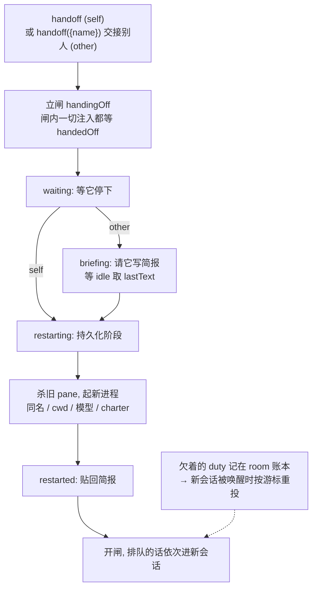
```mermaid
flowchart TD
    entry["handoff (self)<br/>或 handoff({name}) 交接别人 (other)"] --> gate["立闸 handingOff<br/>闸内一切注入都等 handedOff"]
    gate --> waiting["waiting: 等它停下"]
    waiting -- "self" --> restarting["restarting: 持久化阶段"]
    waiting -- "other" --> briefing["briefing: 请它写简报<br/>等 idle 取 lastText"]
    briefing --> restarting
    restarting --> kill["杀旧 pane, 起新进程<br/>同名 / cwd / 模型 / charter"]
    kill --> restarted["restarted: 贴回简报"]
    restarted --> release["开闸, 排队的话依次进新会话"]
    owed["欠着的 duty 记在 room 账本<br/>→ 新会话被唤醒时按游标重投"] -.-> release
```

- **`stage` 落盘**，boot 时从断点接着做。reload 落在重开中途时靠 sid 分辨：`sid` 已经换了就是做完了，别再杀一次新会话。
- **没等到 idle 就不能重开**——那会丢掉这次还在生成的简报。
- **交接恢复不靠旧 transcript**：handoff 记录阶段与新旧 sid；欠着的 duty 与没投出去的话都在 room 账本里，新会话起来后由唤醒泵按 `seen` 游标接着投。简报输入沿用交接时的频道。
- **失败只告诉它自己**：下一条进它会话的话尾巴上捎带一行，生命周期事件不进群。

### rolepage：把 room 账本与 turn 记录折成一个 wizard 的 IM

名字全局唯一以后，wizard 不属于某个聊天：它在好几个 room 里被人叫、跟好几个同伴对话。rolepage 换成**一个 role 的视角**，把两份各有位置、谁也不替代谁的数据合起来看：

- **room 账本**是「说了什么」——一行一条，出处、完成、发言权都写在行上（`shared/room-view.ts` 折成快照 / 历史 / 视图，给 `room_read` 与 rolepage 共用）；
- **turn 记录**是「怎么做的」——一轮的工具调用、CLI 原话、用量只在轮次里（`detail-store`，`shared/role-view.ts` / `role-render.ts` 折叠）。

wizard 详情以轮次为主干：一轮拆成入（问的那句）与出（这一轮的回复），出的一侧画成气泡 + 过程框，账本行挂在产出它的那一轮上，没有对应轮次的仍独立成行。

图 13｜一轮 turn 拆成两条消息，账本行挂在产出它的那一轮上

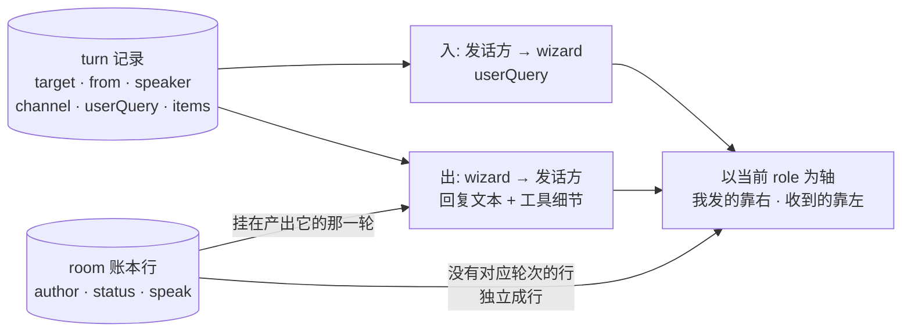
```mermaid
flowchart LR
    turn[("turn 记录<br/>target · from · speaker<br/>channel · userQuery · items")] --> inm["入: 发话方 → wizard<br/>userQuery"]
    turn --> outm["出: wizard → 发话方<br/>回复文本 + 工具细节"]
    ledger[("room 账本行<br/>author · status · speak")] -- "挂在产出它的那一轮" --> outm
    inm --> view["以当前 role 为轴<br/>我发的靠右 · 收到的靠左"]
    outm --> view
    ledger -- "没有对应轮次的行<br/>独立成行" --> view
```

- **role**：wizard 就是它的 target key；人是 `human:<userid>`（不用 `user:<id>`——那正是「与这个人的单聊」里默认 wizard 的 target，字面相同会变成自己对自己说）；定时任务是 `task:<id>`，只发不收，不能切成视角。
- **发话方**：同伴（`from.kind=peer`）/ 定时任务（`task`）/ 人（`speaker`；老记录没有就记作「人」）。
- **侧栏**：群聊与单聊；群下展开成对子项（当前 role 与群里另一个 role 在这个群里的往来），「往来 / 全部」开关切到全部时再列出群里与它无往来的 role（淡色，点开是那个 role 在群里的全部记录）。侧栏可切成**关系图**：一棵树把家谱与对话画在一起，卡片就是会话项——排序、时刻、预览、未读、选中、忙闲共用同一份实现（`glanceOfTalk` / `convWindowOf` / `theirsOf`），改一边就是改两边。
- **两个独立视角**：**页面视角** `role`（名片、侧栏、标题、关系图中心）只由点头像、名字及其装饰切；**详情视角** `viewpoint`（URL 参数）只管详情区里谁靠右，由点卡片 / 会话项的其余地方、移交行、各种提示行以及气泡对面的空白设。详情区里的任何一行都不切页面视角——否则读着读着整页就换了主人。
- **未读**：会话项右边的红点只数**点开这一项看得到的**——服务端 `pendingOf` 按窗口、看的 role 与开口水位算出带消息 id 的可能未读，客户端减去已上屏的。名字旁的他人未读是**切到那个 role 之后它看得到的全部未读**（服务端 `unreadByRole` 按页面未读基线给每个 role 一份与侧栏同口径的账，随摘要下发 `peerUnread`）。已读全局只一份 `SEEN`（消息 id → 上屏时刻），片段在可见详情区上屏才记，与哪个视角、侧栏还是关系图无关，记下即两边重画。
- **计划视图**：通过「计划 / 日程」入口只读展示 `WorldFacts.plans` 中当前 owner 的计划，含状态、任务进度、依赖标题和暂停原因；有 plans 而无日程时入口也可见。世界刷新与摘要使用一致的计划事实，active/paused owner 的已登记身份及管理祖先不因近期消息裁剪而消失。sameBot 过滤计划 owner，公共投影不暴露内部 reminder 标记；编辑通过 owner 的 plan API 完成。
- **签名与出处**：消息出处、完成状态来自账本行（`author` / `status`），不是从终句推出来的；`parseEnvelope` 读回的信封只负责认「这一行是谁、在哪个群说的」。
- **忙闲**：空闲 / 执行中 / **等人点**（停在 daemon 发出的审批卡、提问卡上，紫色；取 daemon 的 pending，按审批认卡的同一口径归到 wizard）/ 已关闭。审批长轮询期间 pane 照样在转圈，不单列这一态就和真在干活分不出来。
- **用量条**：页脚两条（当前视角、窗口对端）——模型简名与 effort（取 transcript assistant 行上的 `effort`，没有才用绑定里的，都没有不显示）、估算费用（`shared/model-prices.ts` 是 LiteLLM 价格表的快照，认不出的模型不猜价、费用前加「≥」）、轮次、工具调用、API 请求、上下文（最近一轮主会话最后一次调用送入的 input + 缓存）、cache read / input / cache write / output 分布。
- **名片与日程**：身份、cwd、创建时间；同名下多个 session（`/clear`、`/new`、交接轮换）出切换器；「日程」列它名下（`owner`）的定时任务。
- **消息头**：多方会话（群、整个 chat）的名字行带这一轮的模型 / ctx / 耗时，两个 role 之间的对话只留时刻与耗时；同伴派来的那句带发话方发出它那一轮的账；进行中的一轮按开始时刻每秒走表。`<system-reminder>` 收成一个 `<reminder>` 标签，点开看原文。
- **路由**（`shared/chat-http.ts`，daemon 与独立 svr 共用）：`GET /role` 是单页壳，`/chat/app.css` · `/chat/app.js` · `/chat/vendor.js` 是随包静态资源；数据走 `/api/world`（rooms + wizard / 人节点 + 家谱图层 + plans / 日程，带 ETag）、`/api/room`（一个 room 的快照 + `before` / `limit` 历史分页）、`/api/wizard`（名片 + 它说的和指向它的 / 全部消息）、`/api/turn` 与 `/api/tool`（一条消息的过程框，工具正文展开时才取）、`/api/charter`（出生时的宪章）、`/api/search`（⌘K：room 名 / 成员 / 消息正文）。独立 svr 没有 room 读者时 room 视图退化成只有图与成员。`?id=` 是一条不可猜的记录 id，它就是凭据；页面的核心动作是顺着消息走到对端，而对端可能住在任何 room，所以**任一有效票据可以看全部 role**（单用户部署下的取舍：名册本来就对每个 wizard 敞开）。要把正文严格关在一个群里的部署，不该对外暴露这些路由。链接里的 `role=` 用 target key 而不是名字，改名后旧链接照样能开。

---

## 配置：说人话改，放权要人点

wizard 读写配置只有两个工具，都由 `ConfigSchema`（zod）驱动，不维护第二份字段清单：

- **`config_get({path?})` 渐进披露**：不给 path 列各节一行说明；给了就列这一层子项的类型、当前值、默认值、说明，标出 ✋（改动要人确认）、↻（需 reload）、*（不同于默认）。说明取自字段的 `.describe()`，✋ / ↻ 由 `shared/config-meta.ts` 的 `knob` 标在 schema 上、沿树继承。`models` 下附各档模型的本周 / 今日用量；`chatPolicy.<聊天名>` 先换成它指向的 principal 再查。
- **`config_set({path, value, op: set|add|remove|unset, dryRun})`**：整份配置（叠上 secrets）过 zod 才写，经 `config-writer` 落盘保留注释；`dryRun` 回改前改后与 jsonc 行级 diff；热生效项写完即装进活的 cfg。

分级的界线是「放权」——谁能驱动本机、审批怎么判、跑哪个二进制带什么参数：

| 级别 | 路径 | 怎么改 |
| --- | --- | --- |
| 不可读写 | `bot.*`、认领口令、`secrets.json` 里出现的路径 | —— |
| 放权项 ✋ | `wrc.allowFrom`、`approval.*`、`claudeBin` / `cliBackends` / `extraArgs`、`sync`、监听与外送地址、`defaultChat` | 守护进程**自己**推确认卡，人点了才落盘——不经 hook，`danger.skipAll` 也压不过；卡在请求里等 4 分钟，之后回 pending，迟到的确认照常落盘并捎给调用方 |
| 其余 | 模型档位、`chatPolicy.*`、mirror 的各项开关… | 直接写 |

**改配置可能改宪章**：宪章是出生快照，改了配置活着的 wizard 看不到。`config_set` 落盘前后各渲染一遍有会话的 wizard 的宪章，按 `## ` 段比对——不靠字段清单，任何进宪章的配置都覆盖（自认是出生快照的档位行不比）。受影响的在回包里点名，调用方自己受影响就直说这一轮收尾后 `handoff`，其余各挂一条提醒随下一条消息到。人 `/name`、`name_chat`、自动补名这些聊天名写入点走同一个 `guardCharter`。

**写敏感状态的路由要口令**：`/config/set`、`/claim/start`、`/claim/reset`、`/tasks/schedule` 只认带 `x-wezard-token` 头、值等于 `~/.wezard/daemon-token`（0600，daemon 开机生成）的请求；wezard 自己的 MCP server 与 CLI 每次现读它，本机别的进程直接 curl 一律 403。PreToolUse hook 对 wezard CLI 的免审也只认整条命令就是一次只读子命令、不含 shell 元字符。

**默认摘掉的工具（`wrc.extraArgs`）**：wizard 首轮上下文里有一批它从不调用的工具，schema 每个会话白占、每次请求都要缓存读一遍。默认值用 `--disallowedTools` 把它们从工具定义里整个摘掉（不是只拒调用），交互式首轮实测 44 451 → 26 485 token：

| 摘掉的 | 省 | 近 400 个会话的调用 |
| --- | --- | --- |
| `Artifact` | 11.3k | 3 |
| `Workflow` / `SendFeedback` / `ScheduleWakeup` | 合计 5.6k | 0 |

- claude.ai 远程连接器 (Gmail / Drive / Docs 等) 不再靠 `--disallowedTools` 摘, 而是启动行带 `ENABLE_CLAUDEAI_MCP_SERVERS=false` 整个不连。
- 不用 `--strict-mcp-config`：它连用户配的 MCP（lisct 等）一起丢掉，而 Chrome 的那段系统提示照旧在。Chrome 整套（`--no-chrome`，省 2.4k）没摘：weclaude 的 wizard 用它验 rolepage。`ListAgents` / `ReportFindings`（/code-review 用）、binote、wezard、lisct MCP 都在用，留着。
- 想恢复某个工具：显式写 `wrc.extraArgs` 会**整份覆盖**默认值、不合并——把默认那串抄过去、删掉那一项再 `config_set`（放权项，要人点卡）；写 `[]` 就全恢复。只对新起的 pane 生效，`--resume` 续上的会话可能沿用它录下的工具表。
- `extraArgs` 对所有 CLI 后端都追加：codebuddy / claude-internal 是否认 `--disallowedTools=` 这种写法**未验证**，用这两个后端的机器先试一个 pane。

---

## 缓存冷热判定（路由冷门控）

**冷热判定**（路由 `route_candidates` / `delegate` 与 roster 的忙闲列，`route.wakeCostOf`）：TTL 由 `peers.cacheTtlSec` 读最近一次分档写入（`cache_creation.ephemeral_1h/5m` → 3600 / 300 秒，读不到按 300 秒兜底）；起点由 `peers.cacheTouchMs` 读最近一次已应答请求的**开始**时刻（它前面那行 user / tool_result），读不到才退回 mtime。mtime 是响应写完的时刻，实测比请求开始晚 p50 5 秒、p99 59 秒、最长 396 秒，还会被不碰缓存的元数据行推动；在 TTL 边界附近，用它会把已经冷了的判成热。

---

## 企业微信文档

企业微信文档 / 智能表格统一走官方 skill（按会话经 `shared/session-skills.ts` 注入 `<stateDir>/skills/*`）。wezard 不再自带文档 MCP 桥：`wecom_doc_*` 工具与 `/wedoc/*` 路由已删除。
